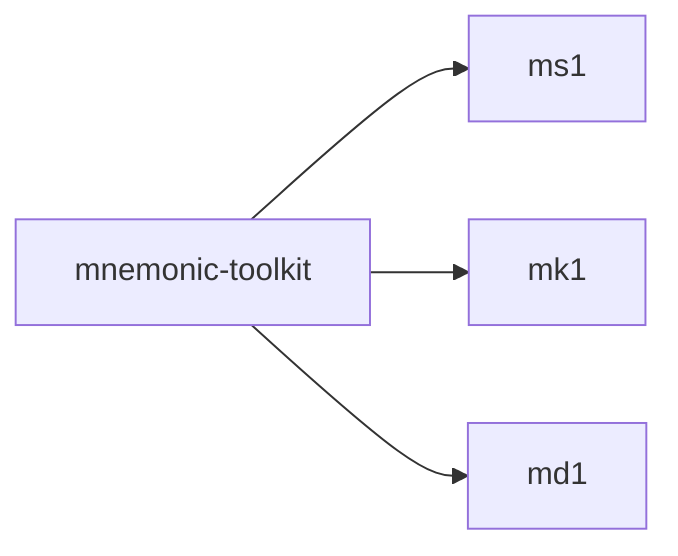

# Authoring conventions — `mnemonic-gui` user manual

Read this file before authoring any chapter under `src/`. The lint
script enforces several of these conventions; chapters that violate
them will fail `make lint` and block merge.

This manual mirrors the GUI's information architecture per
`/home/bcg/.claude/plans/eager-giggling-castle.md`. Each tab → chapter,
each subcommand → section, each dropdown → `## Outline` link list.
Bidirectional anchor parity with `mnemonic-gui`'s SubcommandSchema is
lint-enforced.

## Heading levels

The pandoc PDF render uses `--top-level-division=chapter`. Each `src/**/*.md`
file is one chapter, and its top-level heading must be `H1` (a single `#`).
Within a chapter, `H2` (`##`) is a section, `H3` (`###`) is a subsection,
`H4` (`####`) is a variant-level entry. v1.0 uses 4 levels because
dropdown variants need their own anchors for help-icon deep-linking.

The markdown render concatenates files in lexicographic order. The
`src/00-frontmatter.md` opens the manual; the rest order naturally by
their `NN-` prefix.

## Chapter shape (load-bearing for help-icon deep-linking)

Every subcommand section MUST follow this structure. **Note the
explicit `{#anchor-id}` after each heading** — pandoc's auto-anchor
algorithm only uses the heading TEXT (so `## --from` would become
`id="from"`, NOT `id="mnemonic-convert-from"`). To get nested anchors
the GUI's help icons can link to, authors MUST write explicit IDs:

```markdown
## `mnemonic convert` {#mnemonic-convert}

<one-paragraph plain-English summary>

### Outline {#mnemonic-convert-outline}

- [`--from`](#mnemonic-convert-from) — value to convert
- [`--to`](#mnemonic-convert-to) — target encoding(s)
- [`--passphrase`](#mnemonic-convert-passphrase) — BIP-39 passphrase
- ...

### `--from` {#mnemonic-convert-from}

<flag body: type, required, default, conditional partner if any,
secret advisory if applicable, worked example>

#### Outline {#mnemonic-convert-from-outline}

- [`phrase`](#mnemonic-convert-from-phrase) — BIP-39 mnemonic
- [`entropy`](#mnemonic-convert-from-entropy) — raw hex entropy
- ...

##### `phrase` {#mnemonic-convert-from-phrase}

<variant body>
```

The `### Outline` is REQUIRED for every subcommand with ≥ 2 flags.
The `#### Outline` is REQUIRED for every dropdown / NodeValueComposite
flag with ≥ 2 variants. `tests/lint.sh::outline-coverage` enforces
this; missing outlines fail CI.

**Anchor IDs MUST follow the formal contract** in
`/home/bcg/.claude/plans/eager-giggling-castle.md` §2.2:

- `anchor(subcommand)` = `<tab>-<subcommand-kebab>` (e.g., `mnemonic-convert`)
- `anchor(flag)` = `<anchor(subcommand)>-<flag-without-dashes>` (e.g., `mnemonic-convert-from`)
- `anchor(variant)` = `<anchor(flag)>-<variant-kebab>` (e.g., `mnemonic-convert-from-phrase`)
- `anchor(outline)` = `<anchor(parent)>-outline`

`tests/lint.sh::gui-schema-coverage` derives expected IDs from
`mnemonic-gui/src/schema/*.rs` and asserts every expected ID exists
in the rendered HTML (and vice versa — orphans fail too).

## The two-track convention

Newcomer-friendly background goes inside fenced `:::primer` divs.
Power-user prose lives at the chapter top level.

````markdown
:::primer
A short paragraph (≤80 words) explaining just enough background for
this chapter's main flow. Power users skip these. For a deep dive see
[Appendix B](#appendix-b-bip-39-entropy-primer).
:::
````

The primer-box Lua filter renders these as:

- **PDF:** `mdframed` boxed sidebar with grey background, hairline border.
- **Markdown:** blockquote with bold "**Background.**" prefix.

For dangerous warnings (notably the canonical-test-seed admonition),
use `:::danger` instead. Same syntax; different colours and prefix
("**DANGER.**").

## Index markers

Insert `\index{TERM}` immediately after a term's first definitional
use in any chapter. *Same line as the term.* No newline between term
and marker. Example:

```markdown
The m-format constellation\index{m-format constellation} is a family of four sibling
formats…
```

The markdown render strips `\index{}` markers via the
`strip-latex-from-md.lua` filter. The PDF render keeps them and
`makeindex` builds a page-numbered alphabetical index.

**Every `\index{TERM}` must have a matching row** in
`src/90-appendices/99-index-table.md`. The bidirectional consistency
check in `tests/lint.sh` verifies both directions: a missing row OR a
missing source-side marker fails the lint with a direction-specific
diagnostic.

When you add a new index marker:

1. Pick a `TERM`. Use the form authors will recognise (e.g. `BIP-32`,
   `policy_id_stub`, not `bip 32` or `Policy ID Stub`). Lowercase
   common nouns; preserve case for proper-noun-style identifiers.
2. Add `\index{TERM}` after the term's first definitional use.
3. Add a row to `99-index-table.md`:

   ```markdown
   | `TERM` | [Section title](#section-anchor) |
   ```

   Section anchors come from pandoc's slug rules: lowercase, drop
   non-alphanumerics (em-dashes included), replace runs of whitespace
   with a single `-`. So `# Appendix B — BIP-39 entropy primer`
   slugs to `appendix-b-bip-39-entropy-primer` (single hyphen).

Do not place `\index{}` markers inside fenced code blocks (the
strip-latex filter would still strip them but readers would see the
construction in the source view).

## Worked-example seed (DANGER)

Every example uses the canonical BIP-39 test vector
`abandon abandon abandon abandon abandon abandon abandon abandon abandon abandon abandon about`.
Every chapter that introduces or first uses this seed *must* open
with a `:::danger` admonition restating that the seed is public and
swept.

Example:

````markdown
:::danger
The phrase `abandon abandon abandon … about` is the canonical BIP-39
test vector. It is **public**: any wallet derived from it has been
swept by chain watchers. **Never engrave it. Never fund it.** It is
used here only to keep examples reproducible against pinned test
vectors.
:::
````

Once a chapter has used the admonition, subsequent invocations of
the seed in the same chapter do not need to repeat it.

## Glossary

Every acronym or m-format-specific term used anywhere in the manual
must have an entry in `src/90-appendices/91-glossary.md`. A subset
of these is enforced by `glossary-coverage` in `tests/lint.sh` (the
hot list). Add to the lint hot list if a term you've added becomes
foundational (used in 3+ chapters).

Glossary entries are single-paragraph H2 sections. Order them
alphabetically.

## Cross-chapter references

Use markdown links: `[chapter title](#chapter-slug)`. Pandoc
generates the slug from the heading; for unstable headings, give an
explicit ID:

```markdown
## Some heading {#stable-id-here}
```

The `lychee --offline` lint check (Phase 8 forward) verifies all
internal links resolve.

## Tables

Use pipe tables. Every chapter is encouraged to use at least one
table — the user explicitly requested table-heavy content. Decision
trees and CLI flag references particularly benefit from tables.

## Mermaid diagrams

Use fenced ` ```mermaid ` blocks for diagrams. The `mermaid-filter`
pandoc filter converts them to SVG for the PDF render. For the
markdown render, GitHub renders mermaid blocks natively.

Example:

````markdown

````

## Voice and length

- **Terse.** Repository preference: `feedback_terse_code`.
- Active voice; second person ("you") for instructions.
- Each chapter targets 2–4 PDF pages; comparing/contrasting chapters
  particularly. Two specific chapters (`54-mformat-vs-others.md`
  and `57-coredesc-vs-bip388.md`) have a documented density-watch
  in Phase 6 — flag your reviewer if you spill past 4 pages.

## Lint pre-commit

Before committing chapter changes, run:

```sh
make lint
```

Six checks: markdownlint-cli2, cspell, lychee `--offline`,
**gui-schema-coverage** (replaces flag-coverage; reads
`mnemonic-gui/src/schema/*.rs` and asserts every Subcommand /
Flag / Dropdown variant / NodeValueComposite node has a matching
anchor), **outline-coverage** (per the Chapter Shape rule above),
glossary-coverage. The full
toolchain may not be installed locally; missing tools are warned
and skipped, but **CI runs all six** and a missing tool is not an
excuse on a PR.
