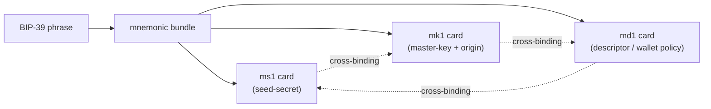

# The bundle / card / slot mental model

The m-format constellation produces, from a single BIP-39 mnemonic
phrase, a **bundle** of three engravable cards:

- **`ms1`**\index{ms1} — the seed-secret card. Carries the BIP-39
  entropy (12 or 24 words rendered as a bech32-style string).
- **`mk1`**\index{mk1} — the master-key card. Carries the BIP-32
  *origin* (master fingerprint + derivation path) and the resulting
  account-level extended public key (`xpub`).
- **`md1`**\index{md1} — the descriptor card. Carries the wallet's
  spending rule as a BIP-388 wallet policy (template + bound key
  references).

These three cards together describe one wallet completely. The
GUI's `mnemonic bundle` subcommand emits all three at once, with
cross-card binding metadata so a partial bundle can be detected as
a bundle-loss event rather than a silent key drift.

## Why three cards, not one

A single-card backup leaves no recovery path if the engraving is
damaged or the bearer cannot solve the derivation puzzle. The
three-card design factors three independently-useful artifacts;
the recovery semantics are best understood per CARD-SUBSET, not
per single card:

| Cards held | Recovery outcome | Notes |
|---|---|---|
| `ms1` only | Full recovery (re-derive `mk1` + `md1`) | Single-sig; assumes you remember the template and derivation choices. Multisig also needs cosigners' `ms1`s. |
| `mk1` + `md1` (no `ms1`) | Watch-only wallet | Track funds, see addresses; cannot spend. `mk1` alone is insufficient — you also need `md1` to know the descriptor template and script type. |
| `mk1` only | Nothing useful | Without `md1` the descriptor template is unknown; without `ms1` the seed is unrecoverable. |
| `md1` only | Nothing useful | Descriptor template without keys is just a script-shape. |
| `ms1` + `md1` (no `mk1`) | Full recovery | Re-derive `mk1` from `ms1` and the descriptor's derivation path. |
| `ms1` + `mk1` (no `md1`) | Full single-sig; multisig requires re-deriving `md1` | Re-emit `md1` from any descriptor-aware wallet. |
| No cards | Wallet bricked | The constellation is a backup, not a vault. |

A user who loses **`ms1`** but keeps `mk1` + `md1` can still see
their funds (no spending). A user who loses **`mk1`** but keeps
`ms1` can re-derive it. A user who loses **`md1`** but keeps
`ms1` + `mk1` can re-emit it from any descriptor-aware wallet. The
detailed recovery walkthroughs are in the CLI manual's `35-recovery-paths`
chapter; the table above is the operational summary.

## Slots — the multisig path

Multisig wallets need *multiple* `mk1` cards (one per cosigner). The
toolkit's `--slot` repeating flag is the mechanism that says "this
xpub goes in slot 0", "this fingerprint goes in slot 1", etc. The
GUI's **slot editor** is a per-row table at the bottom of any
slot-aware form (`bundle`, `verify-bundle`, `export-wallet`).

Each slot row carries:

- An **index** (`@0`, `@1`, ... up to `@N`).
- A **subkey** dropdown (`xpub`, `fingerprint`, `path`,
  `compressed-key`, `taproot-internal-key`, etc.).
- A **value** text field whose meaning depends on the subkey choice.

A 2-of-3 multisig bundle uses three slots (one per cosigner), each
of which contributes an `xpub` or a `fingerprint+path` pair.
[§30-tour](#first-launch-walkthrough) walks through filling a slot
table for a single-sig demo; the per-subcommand chapter for
`mnemonic bundle` covers multisig slots in detail.

:::primer
*Why not just a row of text fields per cosigner?* Because some
cosigners contribute different *kinds* of public information:
some give you a full `xpub` (output of `mk derive`), some give you
only a `fingerprint + path` (because their hardware wallet won't
emit an xpub at that path), and some have a `taproot-internal-key`
to bind separately. The slot grammar is the toolkit's way of
making all of these uniform; the GUI's slot editor surfaces the
subkey choice as a dropdown so you don't have to memorise the
spelling of `compressed-key` vs `taproot-internal-key`.
:::

## Cross-card binding

Each card carries a short reference to the other two — a
**cross-binding**\index{cross-binding} field (the CLI manual calls
this the `policy_id_stub` mechanism in detail; see its
`30-workflows` chapters). This means a *partial bundle*
(say, `ms1` and `md1` without `mk1`) can be detected as such by any
of the verify subcommands (`mnemonic verify-bundle`, `md verify`,
`ms vectors`). The GUI does not introduce a new binding mechanism;
it relies on the toolkit's emission paths to produce a valid bundle
and on `verify-bundle` to detect drift.
