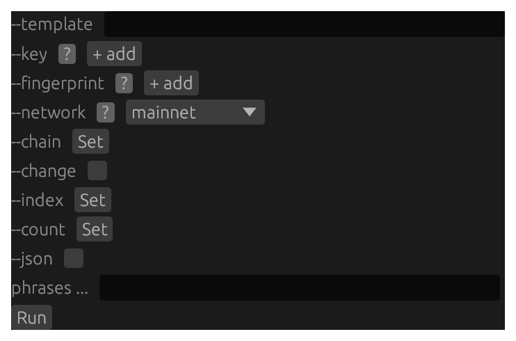
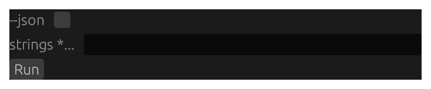
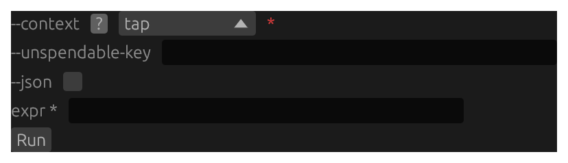
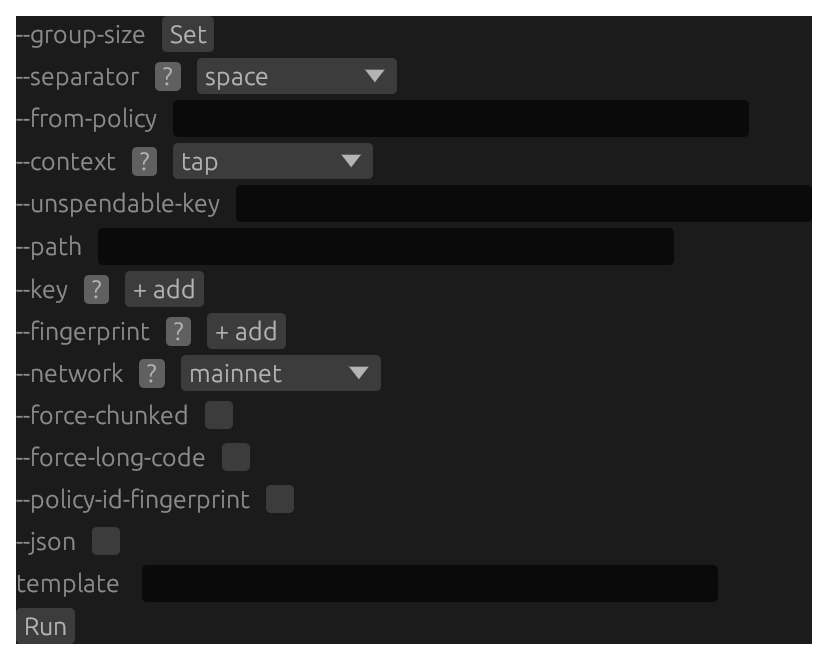
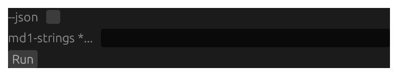
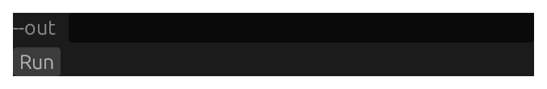
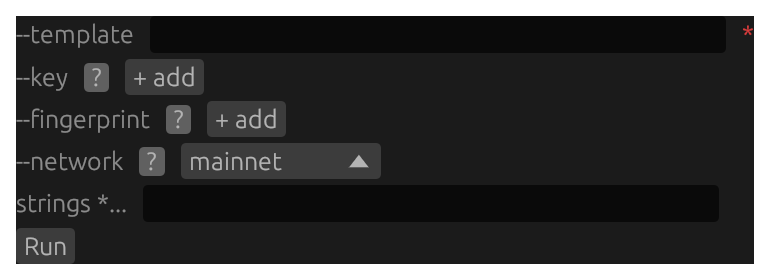

# `md` GUI forms {#gui-forms-md}

Screenshots and structural form renders for all 10 subcommands on the **`md`** tab. See the [GUI Forms reference overview](#gui-forms-reference) for how to read a screenshot and a render and what `<masked>`, `(required)`, and `[disabled]` mean. Each form's prose, per-flag reference, and worked example live in its own subcommand chapter, reached from the `> **GUI form:**` cross-link there.

## `md address` {#gui-form-md-address}



Structural render of the `md address` form — every flag and positional with its control kind and on-load default value (secret fields masked).

```{.text include="gui/md-address.gui"}
(structural form render — generated from the pinned renderer at build time)
```

## `md bytecode` {#gui-form-md-bytecode}



Structural render of the `md bytecode` form — every flag and positional with its control kind and on-load default value (secret fields masked).

```{.text include="gui/md-bytecode.gui"}
(structural form render — generated from the pinned renderer at build time)
```

## `md compile` {#gui-form-md-compile}



Structural render of the `md compile` form — every flag and positional with its control kind and on-load default value (secret fields masked).

```{.text include="gui/md-compile.gui"}
(structural form render — generated from the pinned renderer at build time)
```

## `md decode` {#gui-form-md-decode}


Structural render of the `md decode` form — every flag and positional with its control kind and on-load default value (secret fields masked).

```{.text include="gui/md-decode.gui"}
(structural form render — generated from the pinned renderer at build time)
```

## `md encode` {#gui-form-md-encode}



Structural render of the `md encode` form — every flag and positional with its control kind and on-load default value (secret fields masked).

```{.text include="gui/md-encode.gui"}
(structural form render — generated from the pinned renderer at build time)
```

## `md gen-man` {#gui-form-md-gen-man}


Structural render of the `md gen-man` form — every flag and positional with its control kind and on-load default value (secret fields masked).

```{.text include="gui/md-gen-man.gui"}
(structural form render — generated from the pinned renderer at build time)
```

## `md inspect` {#gui-form-md-inspect}



Structural render of the `md inspect` form — every flag and positional with its control kind and on-load default value (secret fields masked).

```{.text include="gui/md-inspect.gui"}
(structural form render — generated from the pinned renderer at build time)
```

## `md repair` {#gui-form-md-repair}


Structural render of the `md repair` form — every flag and positional with its control kind and on-load default value (secret fields masked).

```{.text include="gui/md-repair.gui"}
(structural form render — generated from the pinned renderer at build time)
```

## `md vectors` {#gui-form-md-vectors}



Structural render of the `md vectors` form — every flag and positional with its control kind and on-load default value (secret fields masked).

```{.text include="gui/md-vectors.gui"}
(structural form render — generated from the pinned renderer at build time)
```

## `md verify` {#gui-form-md-verify}



Structural render of the `md verify` form — every flag and positional with its control kind and on-load default value (secret fields masked).

```{.text include="gui/md-verify.gui"}
(structural form render — generated from the pinned renderer at build time)
```
