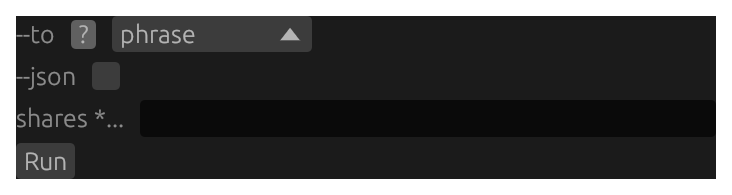
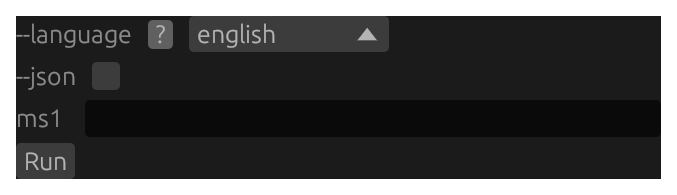
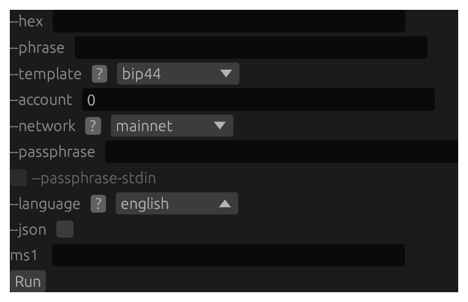
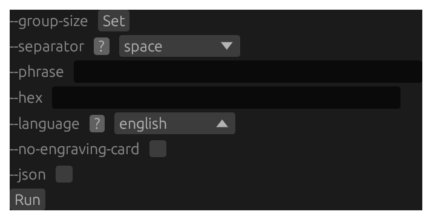
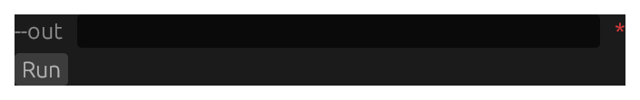
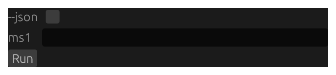
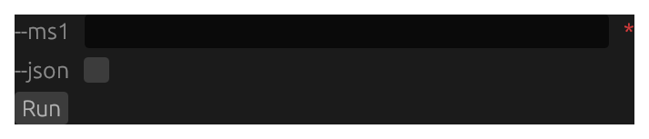
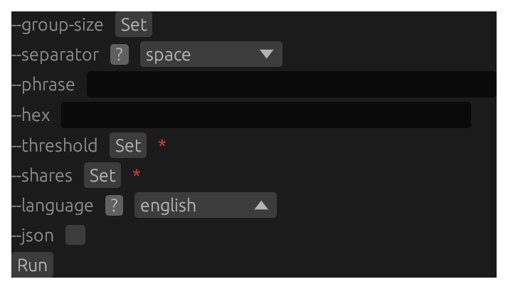
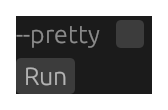
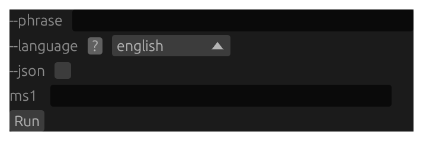

# `ms` GUI forms {#gui-forms-ms}

Screenshots and structural form renders for all 10 subcommands on the **`ms`** tab. See the [GUI Forms reference overview](#gui-forms-reference) for how to read a screenshot and a render and what `<masked>`, `(required)`, and `[disabled]` mean. Each form's prose, per-flag reference, and worked example live in its own subcommand chapter, reached from the `> **GUI form:**` cross-link there.

## `ms combine` {#gui-form-ms-combine}



Structural render of the `ms combine` form — every flag and positional with its control kind and on-load default value (secret fields masked).

```{.text include="gui/ms-combine.gui"}
(structural form render — generated from the pinned renderer at build time)
```

## `ms decode` {#gui-form-ms-decode}



Structural render of the `ms decode` form — every flag and positional with its control kind and on-load default value (secret fields masked).

```{.text include="gui/ms-decode.gui"}
(structural form render — generated from the pinned renderer at build time)
```

## `ms derive` {#gui-form-ms-derive}



Structural render of the `ms derive` form — every flag and positional with its control kind and on-load default value (secret fields masked).

```{.text include="gui/ms-derive.gui"}
(structural form render — generated from the pinned renderer at build time)
```

## `ms encode` {#gui-form-ms-encode}



Structural render of the `ms encode` form — every flag and positional with its control kind and on-load default value (secret fields masked).

```{.text include="gui/ms-encode.gui"}
(structural form render — generated from the pinned renderer at build time)
```

## `ms gen-man` {#gui-form-ms-gen-man}



Structural render of the `ms gen-man` form — every flag and positional with its control kind and on-load default value (secret fields masked).

```{.text include="gui/ms-gen-man.gui"}
(structural form render — generated from the pinned renderer at build time)
```

## `ms inspect` {#gui-form-ms-inspect}



Structural render of the `ms inspect` form — every flag and positional with its control kind and on-load default value (secret fields masked).

```{.text include="gui/ms-inspect.gui"}
(structural form render — generated from the pinned renderer at build time)
```

## `ms repair` {#gui-form-ms-repair}



Structural render of the `ms repair` form — every flag and positional with its control kind and on-load default value (secret fields masked).

```{.text include="gui/ms-repair.gui"}
(structural form render — generated from the pinned renderer at build time)
```

## `ms split` {#gui-form-ms-split}



Structural render of the `ms split` form — every flag and positional with its control kind and on-load default value (secret fields masked).

```{.text include="gui/ms-split.gui"}
(structural form render — generated from the pinned renderer at build time)
```

## `ms vectors` {#gui-form-ms-vectors}



Structural render of the `ms vectors` form — every flag and positional with its control kind and on-load default value (secret fields masked).

```{.text include="gui/ms-vectors.gui"}
(structural form render — generated from the pinned renderer at build time)
```

## `ms verify` {#gui-form-ms-verify}



Structural render of the `ms verify` form — every flag and positional with its control kind and on-load default value (secret fields masked).

```{.text include="gui/ms-verify.gui"}
(structural form render — generated from the pinned renderer at build time)
```
