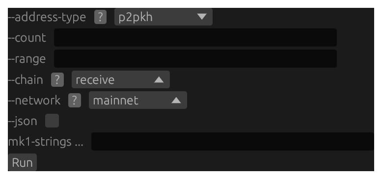
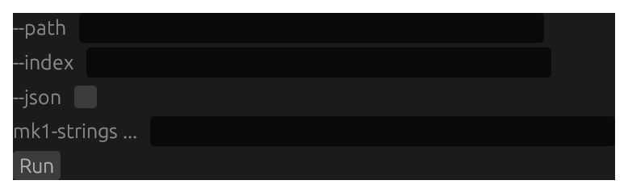
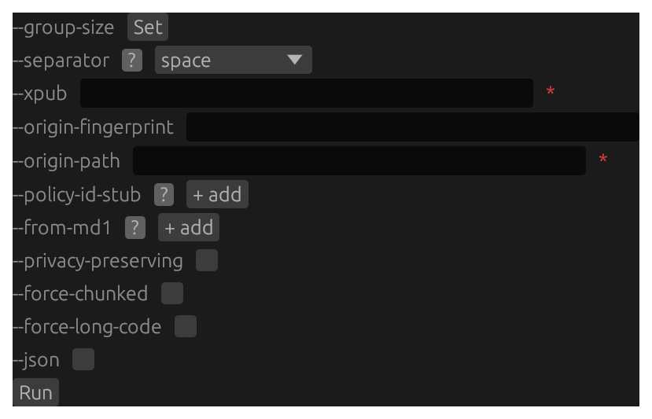
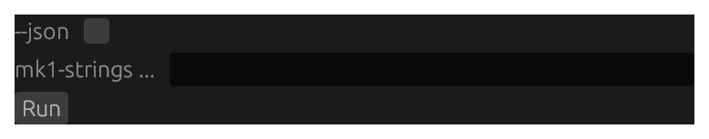
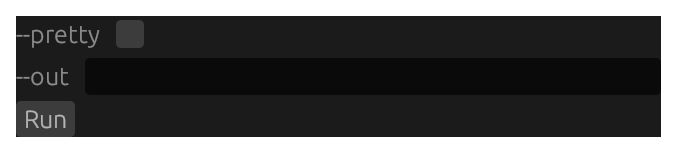
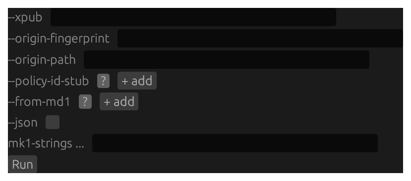

# `mk` GUI forms {#gui-forms-mk}

Screenshots and structural form renders for all 9 subcommands on the **`mk`** tab. See the [GUI Forms reference overview](#gui-forms-reference) for how to read a screenshot and a render and what `<masked>`, `(required)`, and `[disabled]` mean. Each form's prose, per-flag reference, and worked example live in its own subcommand chapter, reached from the `> **GUI form:**` cross-link there.

## `mk address` {#gui-form-mk-address}



Structural render of the `mk address` form — every flag and positional with its control kind and on-load default value (secret fields masked).

```{.text include="gui/mk-address.gui"}
(structural form render — generated from the pinned renderer at build time)
```

## `mk decode` {#gui-form-mk-decode}


Structural render of the `mk decode` form — every flag and positional with its control kind and on-load default value (secret fields masked).

```{.text include="gui/mk-decode.gui"}
(structural form render — generated from the pinned renderer at build time)
```

## `mk derive` {#gui-form-mk-derive}



Structural render of the `mk derive` form — every flag and positional with its control kind and on-load default value (secret fields masked).

```{.text include="gui/mk-derive.gui"}
(structural form render — generated from the pinned renderer at build time)
```

## `mk encode` {#gui-form-mk-encode}



Structural render of the `mk encode` form — every flag and positional with its control kind and on-load default value (secret fields masked).

```{.text include="gui/mk-encode.gui"}
(structural form render — generated from the pinned renderer at build time)
```

## `mk gen-man` {#gui-form-mk-gen-man}


Structural render of the `mk gen-man` form — every flag and positional with its control kind and on-load default value (secret fields masked).

```{.text include="gui/mk-gen-man.gui"}
(structural form render — generated from the pinned renderer at build time)
```

## `mk inspect` {#gui-form-mk-inspect}



Structural render of the `mk inspect` form — every flag and positional with its control kind and on-load default value (secret fields masked).

```{.text include="gui/mk-inspect.gui"}
(structural form render — generated from the pinned renderer at build time)
```

## `mk repair` {#gui-form-mk-repair}


Structural render of the `mk repair` form — every flag and positional with its control kind and on-load default value (secret fields masked).

```{.text include="gui/mk-repair.gui"}
(structural form render — generated from the pinned renderer at build time)
```

## `mk vectors` {#gui-form-mk-vectors}



Structural render of the `mk vectors` form — every flag and positional with its control kind and on-load default value (secret fields masked).

```{.text include="gui/mk-vectors.gui"}
(structural form render — generated from the pinned renderer at build time)
```

## `mk verify` {#gui-form-mk-verify}



Structural render of the `mk verify` form — every flag and positional with its control kind and on-load default value (secret fields masked).

```{.text include="gui/mk-verify.gui"}
(structural form render — generated from the pinned renderer at build time)
```
