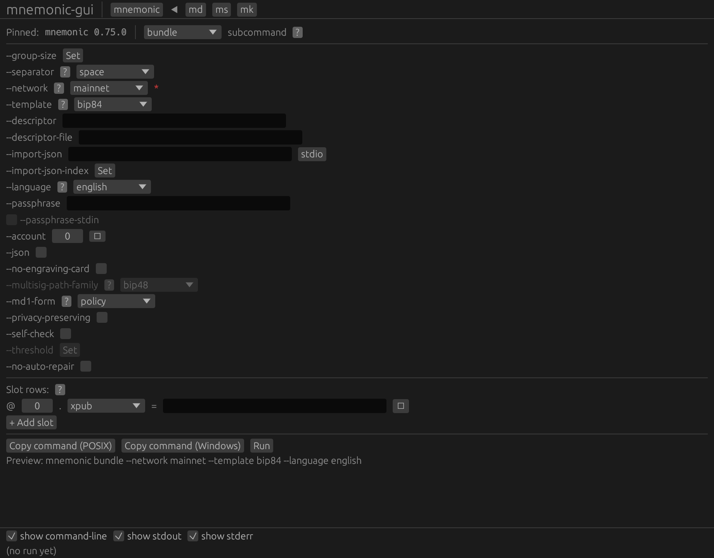

# Orientation

This chapter teaches you how to read the rest of the book: the anatomy
of the application window, the two screenshots you get per step, why
the outputs are reproducible, and how the GUI keeps your seed off the
screen. Read it once; the journeys assume it.

## The whole window

Every screenshot in this book is the **whole application window** — no
operating-system title bar, no window-manager chrome (the harness that
captures these shots renders the app's own frame only, so what you see
below the top heading is exactly what the app draws). The window has
four regions, top to bottom:

- **The tab strip.** A `mnemonic-gui` heading, then one button per
  constellation CLI: `mnemonic`, `md`, `ms`, `mk`. The active tab is
  marked with `◀`. Every journey in this book stays on the `mnemonic`
  tab. A CLI missing from your `$PATH` would render greyed out; in this
  book all four are present.
- **The subcommand row.** A `Pinned: mnemonic 0.75.0` label, the
  **subcommand** ComboBox (the drop-down that selects `bundle`,
  `convert`, `export-wallet`, `restore`, and so on), and a `?`
  help-icon that deep-links into the reference manual.
- **The form.** One row per flag of the selected subcommand, top to
  bottom: text inputs, drop-downs, checkboxes, numeric `Set` fields,
  composite `--from` selectors, and — for subcommands that accept
  `--slot` — a repeating **Slot rows** block with a `+ Add slot`
  button. Below the form sits the action bar — **Copy command
  (POSIX)**, **Copy command (Windows)**, **Run** — and an always-on
  `Preview:` line showing the exact argument vector the app will run.
- **The output panel.** Three checkboxes — `show command-line`, `show
  stdout`, `show stderr` — and, until you click **Run**, the message
  `(no run yet)`.

The orientation shot at the end of this chapter is the fresh
application on launch, sitting on the `mnemonic` tab with `bundle`
selected. This is the **demo-seed baseline**: the form arrives
pre-filled with `--network mainnet`, `--template bip84`, `--language
english`, `--account 0`, and one empty Xpub slot row — the reproducible
starting state every capture in this book begins from. Journey 1
mutates exactly this form.

## Two shots per step

Each shot-bearing step shows the window at two (sometimes three)
moments:

1. **The filled form** — the fields the step fills, before you click
   **Run**. This is what you type.
2. **The confirm modal** — *for secret-bearing steps only.* Any form
   carrying a seed phrase raises a "Confirm secret-bearing run" modal
   before it spawns anything; the shot shows the masked argument list
   you are about to run. To keep the book lean, only two steps keep
   their modal shot (Journey 1's single-sig bundle and Journey 2's
   all-seeds bundle); every other secret step still passes through the
   same modal, it just is not photographed twice.
3. **The populated output panel** — after **Run** completes. The
   command line, exit code, standard output, and standard error, filled
   in by a real run of the pinned CLI.

Below each populated-panel shot the book reproduces the **full**
captured output as three text blocks — standard output, standard error
(when non-empty), and the exit code. Read those blocks for the exact
bytes; read the screenshot for what the panel looks like in the app.

## Why the outputs are reproducible

The book pins a single **tier**: the `Pinned: mnemonic 0.75.0` line you
see in every shot is the version of the command-line tool the GUI
spawns. The capture harness refuses to render or run a single step
unless every spawned CLI reports that exact version — a wrong-tier
machine cannot produce honest-looking pages. Every journey command is a
pure function of its fixed, public inputs (no random numbers, no
timestamps, no wall-clock), so the same inputs always yield the same
cards, descriptors, and addresses. That is why the fingerprints and
descriptors in this book match `Examples.pdf` byte for byte where they
describe the same wallet.

## The output panel clips; the transcript does not

The output panel scrolls. Its standard-output area is capped at a fixed
height, so a long result (a full card set, a 12-key descriptor) shows a
**top slice** in the screenshot with a scrollbar — that is correct, not
a defect; it is what the app shows at that window size. The complete,
untruncated output always accompanies the shot as the transcript text
blocks below it. Likewise the form itself scrolls inside the window
when a subcommand has more fields than fit; each form shot is captured
at a scroll offset that keeps the fields the step fills on screen. When
you want the full geometry of a form, the reference manual's GUI-Forms
gallery renders each form in one un-clipped image.

## Your seed never appears

The three demo phrases are public, so this book prints their derived
material freely. Your own seed is different: the GUI is built to keep it
off the screen. Watch for four masking surfaces, all visible in the
Journey 1 shots:

- **Masked fields.** A seed typed into a phrase slot or a `--from
  phrase=` composite renders as `••••` in the input box, never as
  words.
- **The masked preview.** The `Preview:` line shows the argument vector
  with the secret replaced by `••••` (for example `… --slot ••••`).
- **The confirm modal.** The "Confirm secret-bearing run" dialog lists
  the argument vector — again with the secret shown only as `••••` —
  and makes you click **Run** a second time before anything spawns. The
  **Copy command** buttons for such a form are relabelled *"— reveals
  secret"* so you cannot copy an unmasked command line by reflex.
- **The masked argv echo (the `argv:` line).** After a run, the output
  panel's command-line line echoes the argument vector the app
  actually ran — with the secret still masked as `••••`.

That last surface deserves a word, because it looks like the command
"lost" your seed. It did not. The masked `--slot ••••` (or `--from
••••`) in the panel is proof that the **real** phrase was accepted and
passed to the tool: the run succeeded, the cards came out, the
fingerprint is correct — the app simply refuses to *print* the secret
back to you. A real invocation on your own machine is identical to what
the panel shows, minus the masking. (One consequence, flagged again in
Journey 2: because the GUI passes a phrase as an argument, the tool
emits its own "secret material on argv" warning — a hint to prefer
piping the seed on standard input, which the shell examples in
`Examples.pdf` do.)

## What the panel's `argv:` line really contains

The `Preview:` line and the post-run `argv:` line show the app's **real
argument vector**, including flags the form fills in for you as
defaults. So a run may echo `--network mainnet --language english
--template …` even when you only touched one field — those are the
form's materialised defaults, not something you typed. The shell
examples in `Examples.pdf` write the shortest command that works and
omit such defaults; the GUI is explicit about them. When a journey's
`argv:` line carries more tokens than the matching `Examples.pdf`
command, that is why — the wallet is the same; the command is spelled
out in full.

## Version skew

This book pins its own tier and does **not** promise byte-parity with
`Examples.pdf`, which is branded against an older `mnemonic` version.
Journey *shape* — which subcommand, which fields, which teaching
moments — is stable; output *bytes* are whatever the pinned tier
produces, and the fingerprints and descriptors match because the same
public seeds drive both books. If you run a **newer** `mnemonic-gui`
than the one this book pins, the window may look or read slightly
differently; trust your installed app's own `Pinned:` line and `?`
help over these fixed pages.

## The orientation step

The single step in this chapter, shown above, runs nothing: it is the
launch window, the `(no run yet)` panel, and the demo-seed baseline the
journeys build on. Turn the page to Journey 1 to fill it in.

## The launch window {#tut-ch0-00-orientation}

The launch window on the `mnemonic` tab, `bundle` selected — the
demo-seed baseline described above, captured before any field is
touched. The form already carries `--network mainnet`, `--template
bip84`, `--language english`, and `--account 0`; the `Preview:` line
reads `mnemonic bundle --network mainnet --template bip84 --language
english`; the output panel shows `(no run yet)`. Journey 1 starts here.

