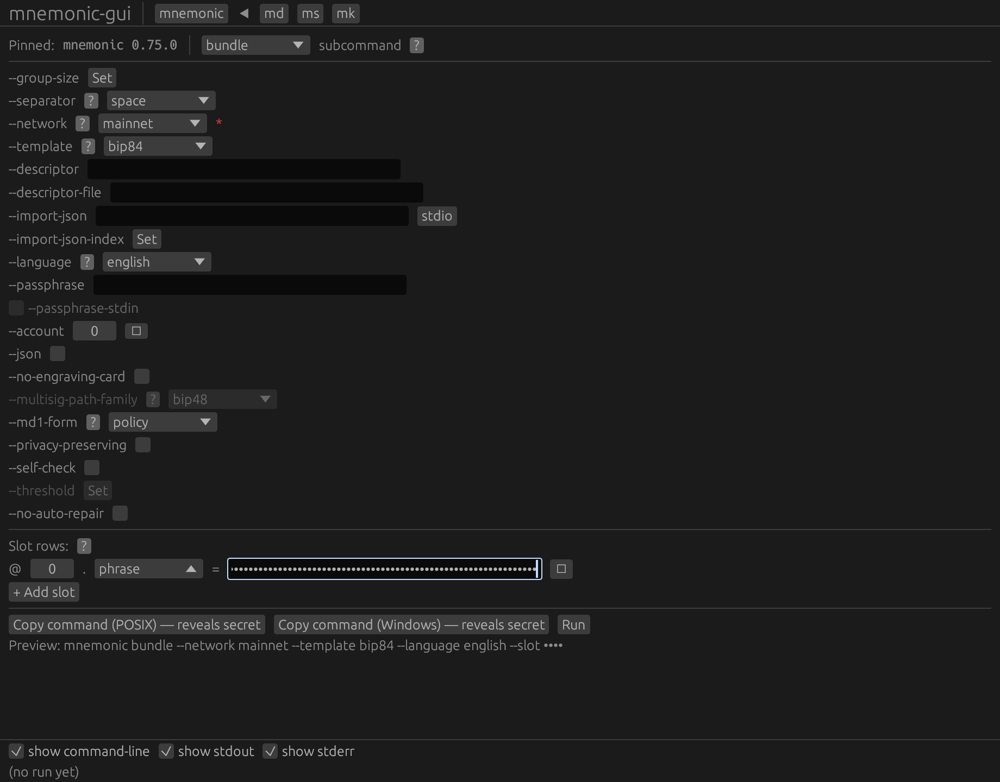
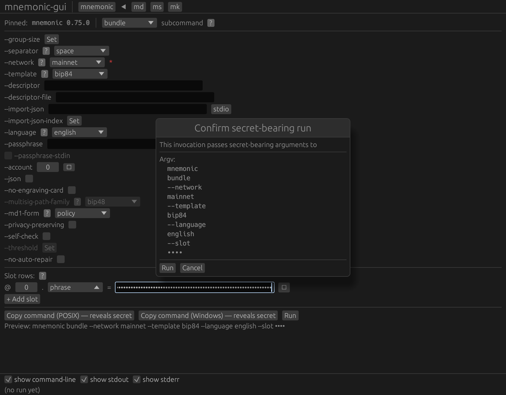
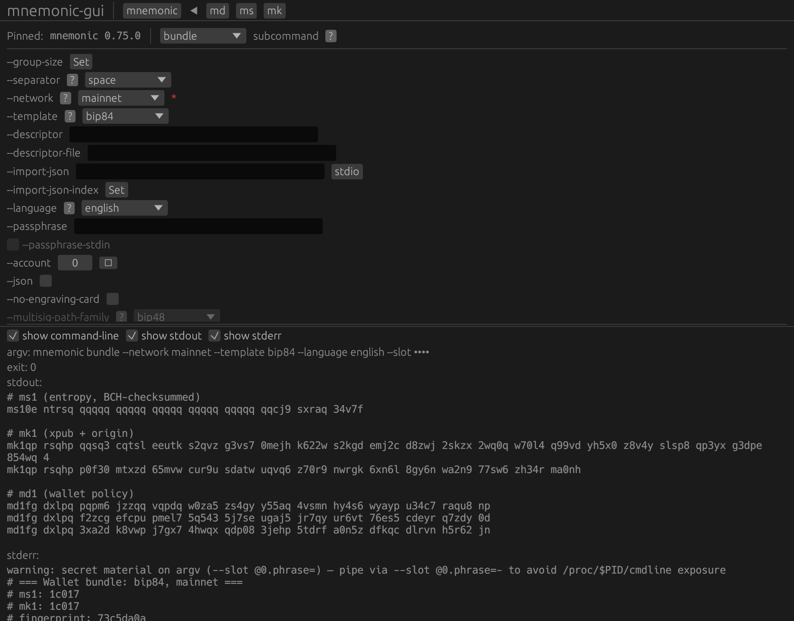

# Journey 1 — Single-signature card set

The first journey is the simplest: turn one seed phrase into a
native-segwit (BIP-84, `m/84'/0'/0'`) **single-signature** three-card
engraving set. One form, one **Run**, three cards — an `ms1` entropy
card, an `mk1` xpub card, and an `md1` policy card — printed ready to
punch into steel. This is `Examples.pdf` section 2, driven from the
demo-seed baseline the orientation chapter left us on.

> The seed used here — `abandon abandon … about` — is a **public**
> BIP-39 test vector. Any wallet derived from it is swept. Never
> engrave it; never fund it.

## Bundle the single-signature card set {#tut-j1-01-bundle-single-sig}

Start from the demo-seed baseline: the `bundle` form already carries
`--network mainnet` and `--template bip84` (the native-segwit
single-sig template — the alternatives are `bip44`, `bip49`, and
`bip86`). The only change is the seed. In the **Slot rows** block, flip
the single row's subkey drop-down from `xpub` to `phrase` and type the
demo phrase into its value box; the box masks it as `••••`, and the
`Preview:` line updates to `… --slot ••••`. The filled form is below.

Clicking **Run** does not spawn immediately — the form carries a
secret, so the **"Confirm secret-bearing run"** modal appears (second
shot). It lists the exact argument vector, with the phrase shown only as
`••••`, and the **Copy command** buttons are relabelled *"— reveals
secret"*. Confirm with the modal's **Run**.

The populated panel (third shot) carries the three engraving cards on
standard output: `ms1` (the BIP-39 entropy, BCH-checksummed), `mk1`
(the account xpub plus its origin), and `md1` (the wallet policy). Each
card is printed twice — once unbroken, once grouped into five-character
blocks; the **grouped form is what you punch or engrave**. Standard
error carries the human-readable engraving panel (fingerprint
`73c5da0a`, origin path `m/84'/0'/0'`, template `bip84`), a
`secret material on argv` warning, and the `stdout carries private key
material (can spend)` warning — a reminder that this card set is the
*spendable* backup and belongs on steel, offline. The masked `--slot
••••` in the `argv:` line is proof the real phrase was accepted; your
own run is identical bar the masking.







**Output (stdout):**

```{.text include="tutorial/tut-j1-01-bundle-single-sig.stdout.txt"}
(captured transcript — included at build time)
```

**Standard error (stderr):**

```{.text include="tutorial/tut-j1-01-bundle-single-sig.stderr.txt"}
(captured transcript — included at build time)
```

**Exit code:**

```{.text include="tutorial/tut-j1-01-bundle-single-sig.exit.txt"}
(captured transcript — included at build time)
```
