# Journey 2 — Two-of-three multisignature

A real multisig never lets one machine see more than one seed. This
journey builds a **2-of-3** `wsh(sortedmulti(...))` the safe way: each
cosigner derives only their own **public** fingerprint and account xpub
from their own seed (on their own device), and a coordinator combines
the three public keys into one watch-only wallet. We drive all three
`convert` derivations here for illustration, assemble the descriptor,
canonicalise it, read its first address, and engrave the shared
watch-only card set. A closing pair of steps shows the *convenient,
less-safe* alternative — one machine holding all three seeds — and a
restore from the shared `md1` card alone. This is `Examples.pdf`
sections 3 and 3.4.

> The three demo seeds and their fingerprints (`73c5da0a`,
> `b8688df1`, `28645006`) are **public** test vectors. Never engrave
> them; never fund them.

Two mechanics recur below and are worth naming once. **Unlocking the
descriptor field:** `export-wallet` and `bundle` will not accept a
literal descriptor while a **Template** is selected (a template and a
hand-written descriptor are mutually exclusive inputs). Selecting the
Template drop-down's **`(none)`** entry clears it and enables the
**`--descriptor`** text box — an honest "clear Template to unlock
Descriptor" moment you will see at every canonicalise, BSMS, and
engrave step. **Materialised defaults:** the panel's `argv:` line
spells out flags the form fills for you (`--network mainnet`,
`--language english`, and so on) even when you did not touch them; the
wallet is identical to the shorter `Examples.pdf` command, just written
in full.

## Convert the fingerprint {#tut-j2-02-convert-fingerprint}

On cosigner 0's device, `convert` derives that cosigner's BIP-87
multisig **fingerprint** from their seed alone. Select **Convert
(between formats)**, set the composite **`--from`** selector to
`phrase` and type the demo phrase (masked `••••` by default; the
filled-form shot below holds the composite's **reveal** so you can
read the public phrase), choose **`--to`** `fingerprint`, and set
**`--template`** `wsh-sortedmulti` (which implies the `m/87'/0'/0'`
path). The filled form is below; the run panel returns
`fingerprint: 73c5da0a`.

Note the standard-error line: because the GUI passes the phrase as an
argument, the tool prints a `secret material on argv (--from phrase=)`
warning and suggests piping on standard input instead. `Examples.pdf`
uses that safer stdin idiom (`< seed0.txt`) and so shows no warning; the
wallet output — the fingerprint — is identical either way. The phrase is
masked everywhere on screen except where you deliberately reveal it — the
confirm modal and the `argv:` echo stay `••••` regardless; only the
*warning* differs.

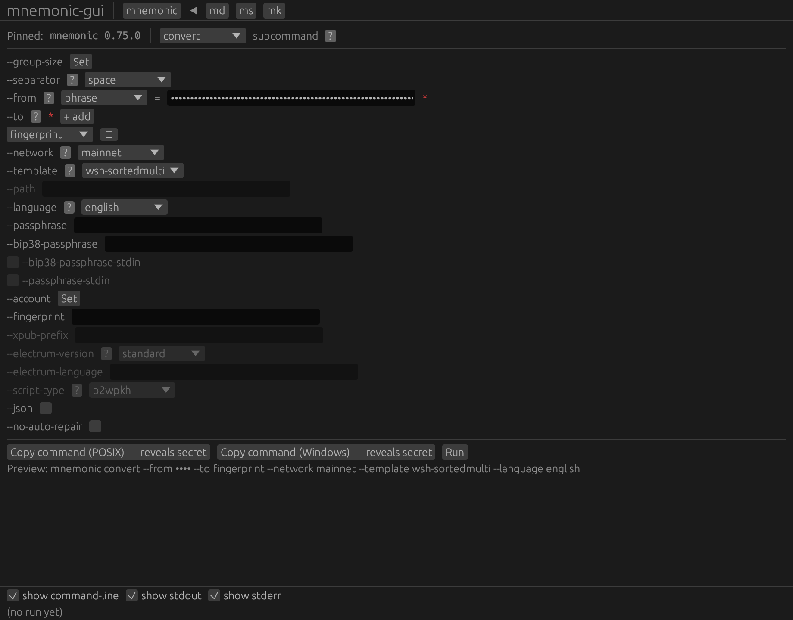

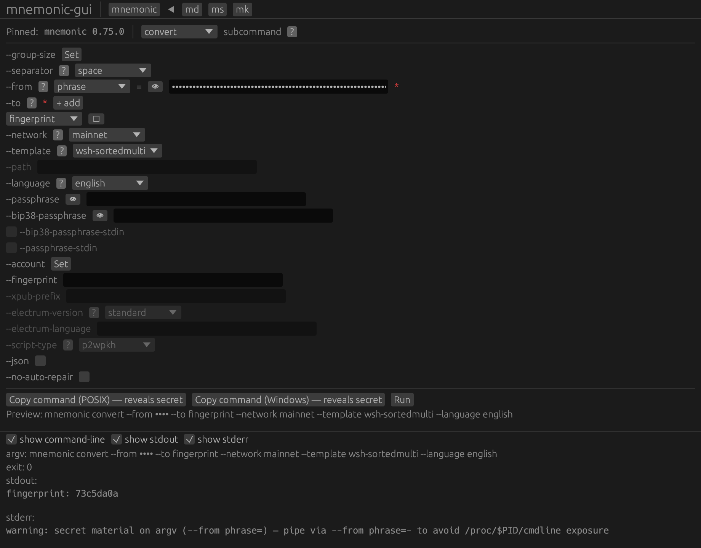

**Output (stdout):**

```{.text include="tutorial/tut-j2-02-convert-fingerprint.stdout.txt"}
(captured transcript — included at build time)
```

**Standard error (stderr):**

```{.text include="tutorial/tut-j2-02-convert-fingerprint.stderr.txt"}
(captured transcript — included at build time)
```

**Exit code:**

```{.text include="tutorial/tut-j2-02-convert-fingerprint.exit.txt"}
(captured transcript — included at build time)
```

## Convert the xpub {#tut-j2-03-convert-xpub}

Same form, same seed (the **`--from`** phrase field is revealed in the
shot again, as in the previous step), **`--to`** set to `xpub`: this
returns cosigner 0's account **public** key,
`xpub6DBjiYnc4ewKti13Q1L35…VqqzrXvicM`. Standard error repeats the
argv warning and adds `stdout is watch-only — public keys only, cannot
spend` — this xpub is safe to hand to the coordinator. In practice you
run these two `convert` steps on the air-gapped signing device and
carry out only the fingerprint and the xpub.

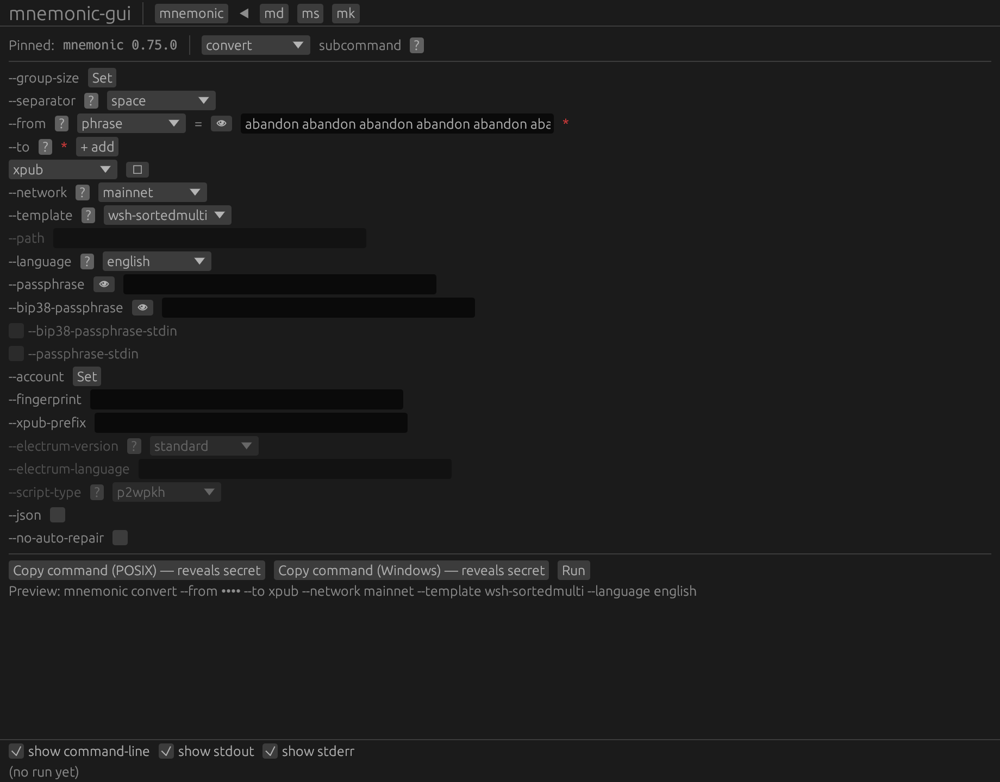

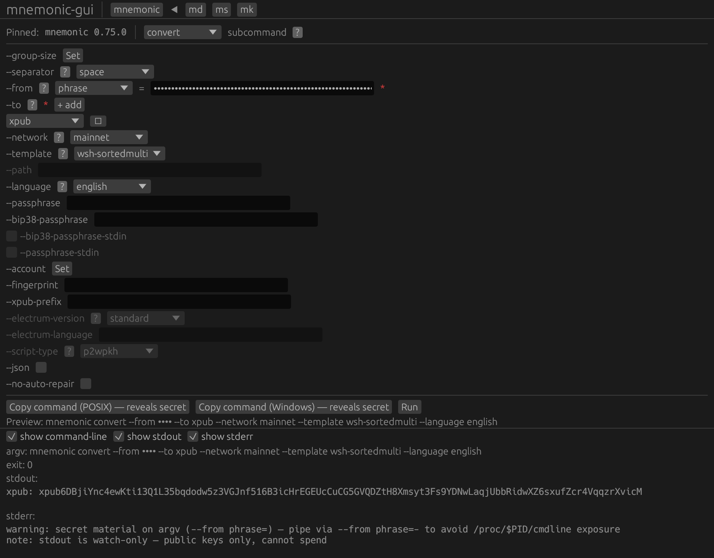

**Output (stdout):**

```{.text include="tutorial/tut-j2-03-convert-xpub.stdout.txt"}
(captured transcript — included at build time)
```

**Standard error (stderr):**

```{.text include="tutorial/tut-j2-03-convert-xpub.stderr.txt"}
(captured transcript — included at build time)
```

**Exit code:**

```{.text include="tutorial/tut-j2-03-convert-xpub.exit.txt"}
(captured transcript — included at build time)
```

## Canonicalise the descriptor {#tut-j2-04-canonicalise}

With all three cosigners' fingerprints and xpubs in hand, the
coordinator assembles the 2-of-3 descriptor
`wsh(sortedmulti(2,[73c5da0a/87'/0'/0']xpub…,[b8688df1/87'/0'/0']xpub…,[28645006/87'/0'/0']xpub…))`
and validates it with `export-wallet`. First the **`(none)`** unlock:
open the **Template** drop-down and select `(none)` — this clears the
template and enables the **`--descriptor`** box (a template and a
literal descriptor cannot both be set). Paste the assembled descriptor
there and set **`--format`** to `descriptor`. The filled form is below.

The panel returns the canonical descriptor with its BIP-380 checksum
appended: `…#4wup4at0`. This is the coordinator's authoritative wallet
string; every cosigner should verify each fingerprint in it against
their own records before trusting it.

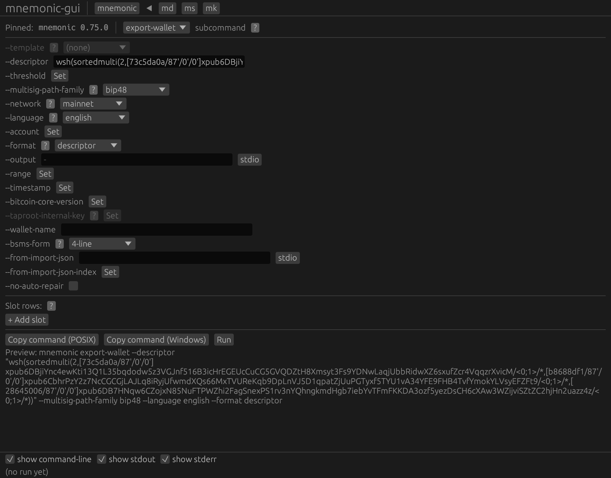

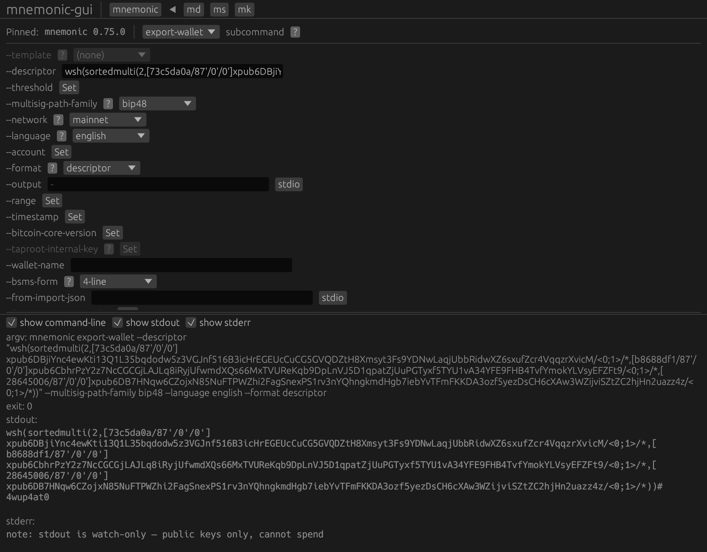

**Output (stdout):**

```{.text include="tutorial/tut-j2-04-canonicalise.stdout.txt"}
(captured transcript — included at build time)
```

**Standard error (stderr):**

```{.text include="tutorial/tut-j2-04-canonicalise.stderr.txt"}
(captured transcript — included at build time)
```

**Exit code:**

```{.text include="tutorial/tut-j2-04-canonicalise.exit.txt"}
(captured transcript — included at build time)
```

## Export the BSMS record {#tut-j2-05-bsms}

Re-run `export-wallet` on the same descriptor with **`--format`**
switched to `bsms` (the Template stays on `(none)`, the descriptor
stays pasted). The panel returns a **BSMS 1.0** record (BIP-129): the
canonical descriptor, the `/0/*,/1/*` external/change derivation, and
the wallet's **first receive address**,
`bc1qkssenl2m6t3aynza394sr9m86vt6md2v76kj52jun2xlwrdeaa4q84qtpl`. BSMS
is the interchange format Bitcoin Core, Sparrow, and Nunchuk accept for
importing a multisig; the first address lets every cosigner confirm
they built the same wallet.

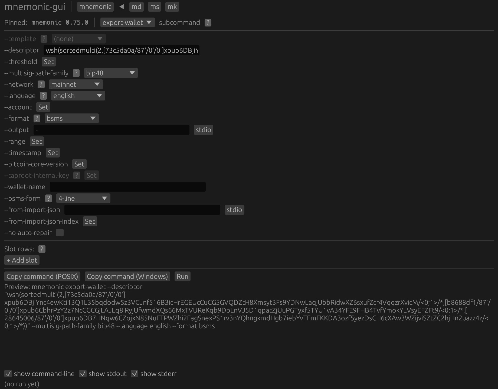

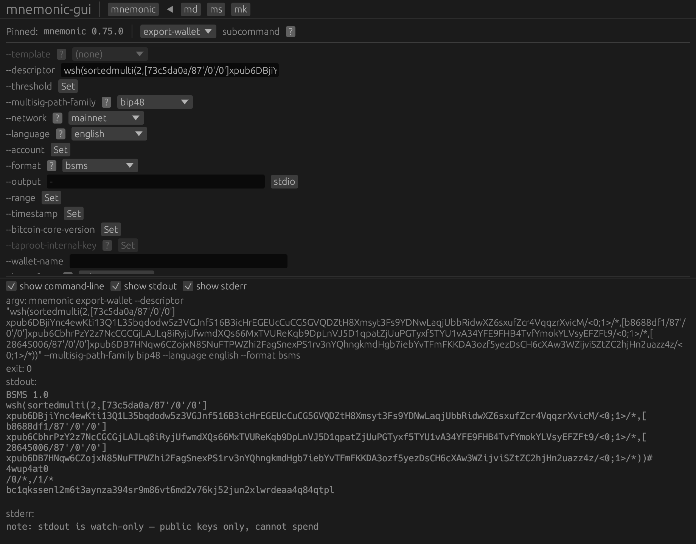

**Output (stdout):**

```{.text include="tutorial/tut-j2-05-bsms.stdout.txt"}
(captured transcript — included at build time)
```

**Standard error (stderr):**

```{.text include="tutorial/tut-j2-05-bsms.stderr.txt"}
(captured transcript — included at build time)
```

**Exit code:**

```{.text include="tutorial/tut-j2-05-bsms.exit.txt"}
(captured transcript — included at build time)
```

## Bundle the watch-only card set {#tut-j2-06-bundle-watch-only}

Now engrave the **shared** card set from the public descriptor. Switch
to `bundle` and paste the descriptor straight into its **`--descriptor`**
box (the form-to-form route the GUI uses in place of `--descriptor-file`).
The filled form is below.

Because only public xpubs were supplied, the panel prints a watch-only
set: the `ms1` entropy card is omitted (there is no secret to back up),
and you get one `mk1` card per cosigner plus the single shared `md1`
policy card. That `md1` card is the one every cosigner keeps a copy of;
each cosigner *additionally* backs up their own seed as a single-sig
`ms1` set (Journey 1). The engraving panel on standard error lists the
2-of-3 threshold and each cosigner's fingerprint and origin.

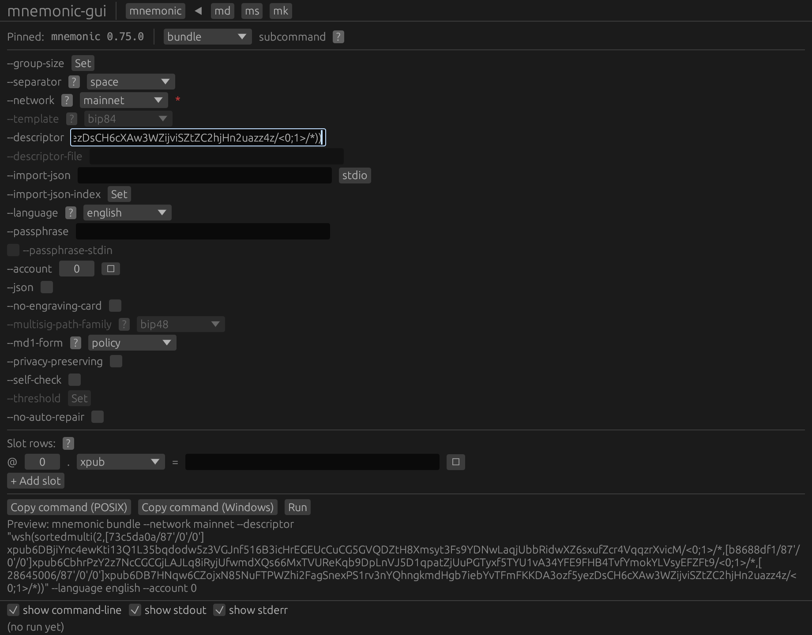

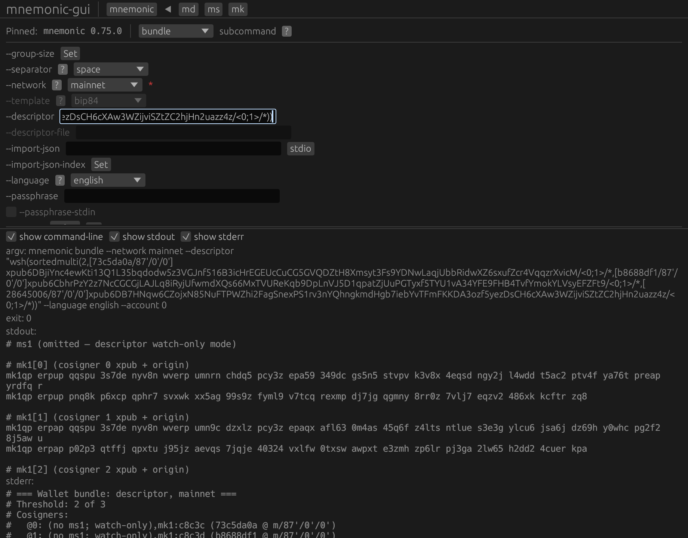

**Output (stdout):**

```{.text include="tutorial/tut-j2-06-bundle-watch-only.stdout.txt"}
(captured transcript — included at build time)
```

**Standard error (stderr):**

```{.text include="tutorial/tut-j2-06-bundle-watch-only.stderr.txt"}
(captured transcript — included at build time)
```

**Exit code:**

```{.text include="tutorial/tut-j2-06-bundle-watch-only.exit.txt"}
(captured transcript — included at build time)
```

## Bundle from all three seeds {#tut-j2-07-bundle-all-seeds}

If instead you hold all three seeds yourself, one `bundle` run can emit
the whole set. This is the **convenient but less-safe** path from
`Examples.pdf` section 3.4. On the `bundle` form set **`--template`**
`wsh-sortedmulti` and **`--multisig-path-family`** `bip87`, click
**`+ Add slot`** twice to reach three rows, set their `@N` indices to
`0`, `1`, `2`, and set **`--threshold`** to `2`. Then flip each row's
subkey to `phrase` and type the three demo seeds. In the filled-form
shot below the **last** row holds its **reveal** so you can read that
public seed; the other two rows stay masked `••••` — a live picture of
the single-revealed-field rule, where revealing one secret field
re-masks any other. The filled form is below.

Clicking **Run** raises the same "Confirm secret-bearing run" modal as
Journey 1 (three masked phrases this time); it runs through the confirm
path but, to keep the book lean, is not re-photographed. Because seeds
— not just xpubs — are supplied, the panel emits the **full secret card
set**: one `ms1` per cosigner alongside the `mk1` and shared `md1`
cards. Standard error carries one `secret material on argv` warning per
slot and the `can spend` warning — this is the spendable set. Only one
secret may arrive on standard input per run, so the truly safe path
remains the per-device flow above.

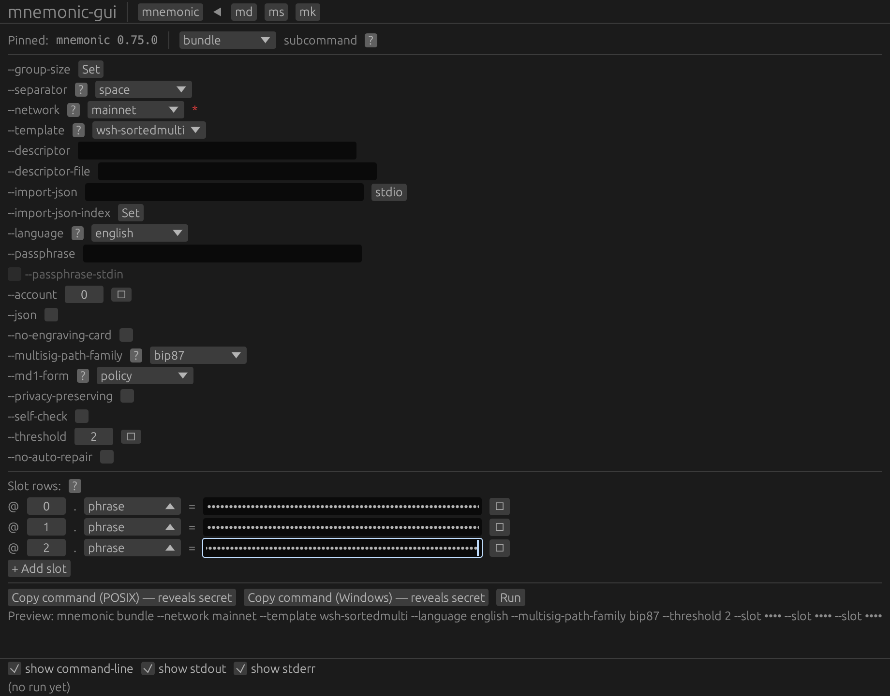

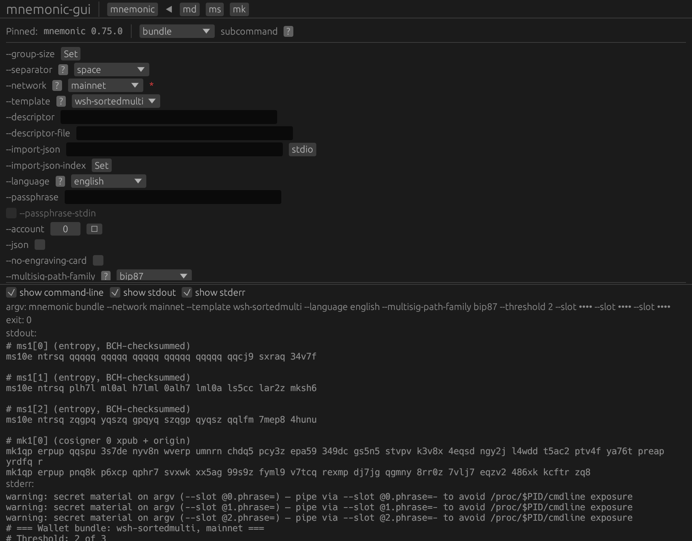

**Output (stdout):**

```{.text include="tutorial/tut-j2-07-bundle-all-seeds.stdout.txt"}
(captured transcript — included at build time)
```

**Standard error (stderr):**

```{.text include="tutorial/tut-j2-07-bundle-all-seeds.stderr.txt"}
(captured transcript — included at build time)
```

**Exit code:**

```{.text include="tutorial/tut-j2-07-bundle-all-seeds.exit.txt"}
(captured transcript — included at build time)
```

## Restore from the card {#tut-j2-08-restore}

Finally, prove the shared `md1` card alone rebuilds the wallet — no
seeds needed. Select **Restore (re-derive a wallet export from a
source)**. The `md1` chunks are chained automatically from the previous
`bundle --json` run and typed into the repeating **`--md1`** rows; the
**Template** drop-down is set to **`(none)`** — restoring from an `md1`
card needs no template (the card already carries the full policy), and
`(none)` cleanly clears the form's default `bip44`, which as a
*single-sig* template would be refused in `--md1` mode (exit 2). The
filled form is below.

The **`--format`** field materialises to its default, `bitcoin-core`,
so the panel's standard output is a ready-to-import `importdescriptors`
array (external `.../0/*` and change `.../1/*` requests); standard error
carries the restore summary — the descriptor, the **first receive
address** `bc1qkssenl2m6t3aynza394sr9m86vt6md2v76kj52jun2xlwrdeaa4q84qtpl`
(byte-for-byte the address from the BSMS step — same wallet), each
cosigner's fingerprint, and an `UNVERIFIED` reminder to cross-check
those fingerprints before importing. To emit a bare descriptor or the
text summary instead, change the **Format** drop-down (Journey 5 does
exactly that).

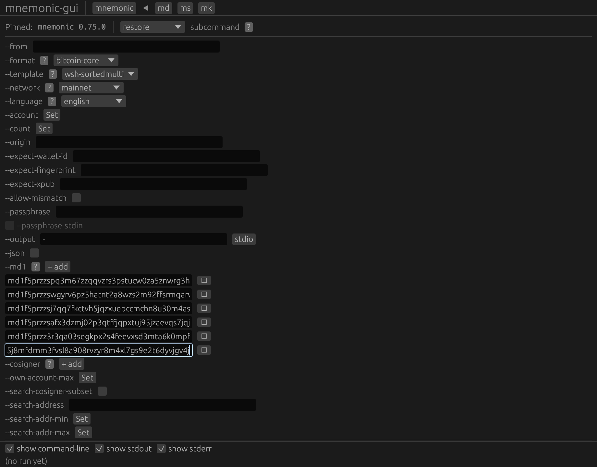

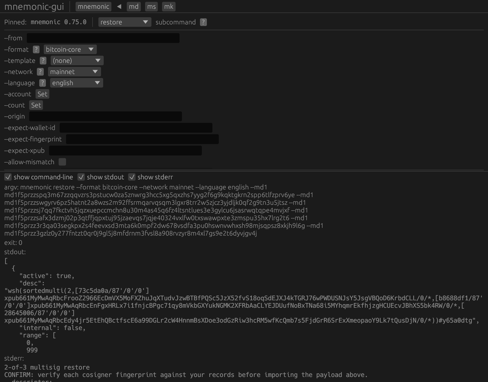

**Output (stdout):**

```{.text include="tutorial/tut-j2-08-restore.stdout.txt"}
(captured transcript — included at build time)
```

**Standard error (stderr):**

```{.text include="tutorial/tut-j2-08-restore.stderr.txt"}
(captured transcript — included at build time)
```

**Exit code:**

```{.text include="tutorial/tut-j2-08-restore.exit.txt"}
(captured transcript — included at build time)
```

## Device 1 — convert fingerprint {#tut-j2-dev1-convert-fingerprint}

Cosigner 1 runs the identical `convert` interaction on their own device
with their own seed. The transcript below is that run; it returns
`fingerprint: b8688df1`. There is no separate screenshot — the form and
gestures are exactly those of the convert-fingerprint step, only the
seed differs.

**Output (stdout):**

```{.text include="tutorial/tut-j2-dev1-convert-fingerprint.stdout.txt"}
(captured transcript — included at build time)
```

**Standard error (stderr):**

```{.text include="tutorial/tut-j2-dev1-convert-fingerprint.stderr.txt"}
(captured transcript — included at build time)
```

**Exit code:**

```{.text include="tutorial/tut-j2-dev1-convert-fingerprint.exit.txt"}
(captured transcript — included at build time)
```

## Device 1 — convert xpub {#tut-j2-dev1-convert-xpub}

Cosigner 1's account **public** key,
`xpub6CbhrPzY2z7NcCGCGjLAJLq8iRyjUfwmdXQs66MxTVUReKqb9DpLnVJ5D1qp…`,
derived the same way as the convert-xpub step. Transcript only.

**Output (stdout):**

```{.text include="tutorial/tut-j2-dev1-convert-xpub.stdout.txt"}
(captured transcript — included at build time)
```

**Standard error (stderr):**

```{.text include="tutorial/tut-j2-dev1-convert-xpub.stderr.txt"}
(captured transcript — included at build time)
```

**Exit code:**

```{.text include="tutorial/tut-j2-dev1-convert-xpub.exit.txt"}
(captured transcript — included at build time)
```

## Device 2 — convert fingerprint {#tut-j2-dev2-convert-fingerprint}

Cosigner 2, same interaction again — the transcript returns
`fingerprint: 28645006`. Transcript only.

**Output (stdout):**

```{.text include="tutorial/tut-j2-dev2-convert-fingerprint.stdout.txt"}
(captured transcript — included at build time)
```

**Standard error (stderr):**

```{.text include="tutorial/tut-j2-dev2-convert-fingerprint.stderr.txt"}
(captured transcript — included at build time)
```

**Exit code:**

```{.text include="tutorial/tut-j2-dev2-convert-fingerprint.exit.txt"}
(captured transcript — included at build time)
```

## Device 2 — convert xpub {#tut-j2-dev2-convert-xpub}

Cosigner 2's account **public** key,
`xpub6DB7HNqw6CZojxN85NuFTPWZhi2FagSnexPS1rv3nYQhngkmdHgb7iebYvTFm…`.
These three fingerprints and xpubs are exactly what the coordinator
combined at the canonicalise step. Transcript only.

**Output (stdout):**

```{.text include="tutorial/tut-j2-dev2-convert-xpub.stdout.txt"}
(captured transcript — included at build time)
```

**Standard error (stderr):**

```{.text include="tutorial/tut-j2-dev2-convert-xpub.stderr.txt"}
(captured transcript — included at build time)
```

**Exit code:**

```{.text include="tutorial/tut-j2-dev2-convert-xpub.exit.txt"}
(captured transcript — included at build time)
```

## Restore — feed the bundle JSON {#tut-j2-restore-feed-bundle-json}

This is the plumbing behind the restore step: a `bundle --descriptor … --json`
run whose JSON output carries the wallet's `md1` chunks. The harness
parses them out and feeds them into the restore form's `--md1` rows —
the point-and-click equivalent of `Examples.pdf`'s `jq -r ".md1[]" |
sed "s/^/--md1 /"` glue. Transcript only; the chunks are real
per-run output, not a fixture.

**Output (stdout):**

```{.text include="tutorial/tut-j2-restore-feed-bundle-json.stdout.txt"}
(captured transcript — included at build time)
```

**Standard error (stderr):**

```{.text include="tutorial/tut-j2-restore-feed-bundle-json.stderr.txt"}
(captured transcript — included at build time)
```

**Exit code:**

```{.text include="tutorial/tut-j2-restore-feed-bundle-json.exit.txt"}
(captured transcript — included at build time)
```
