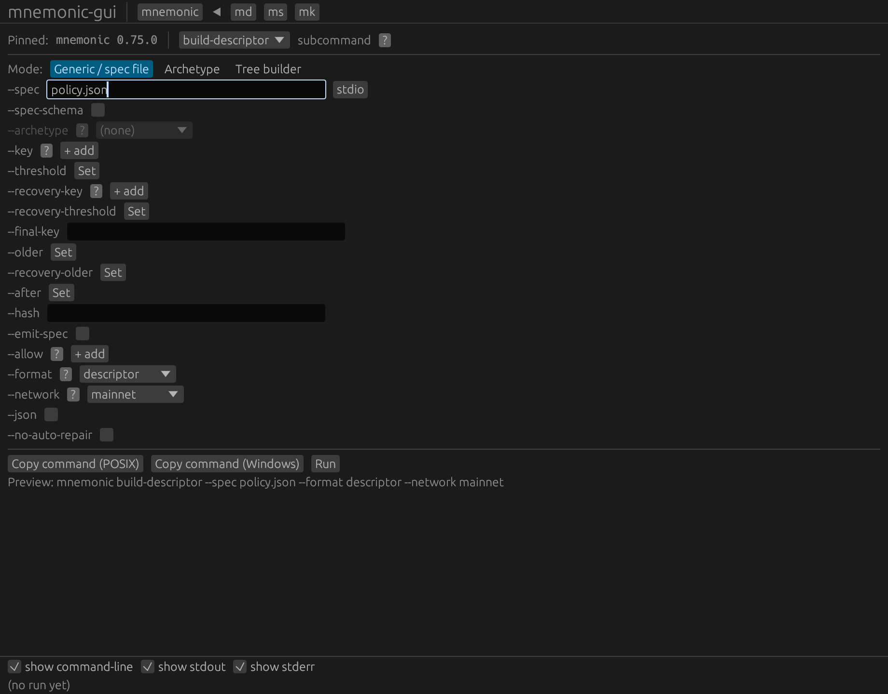
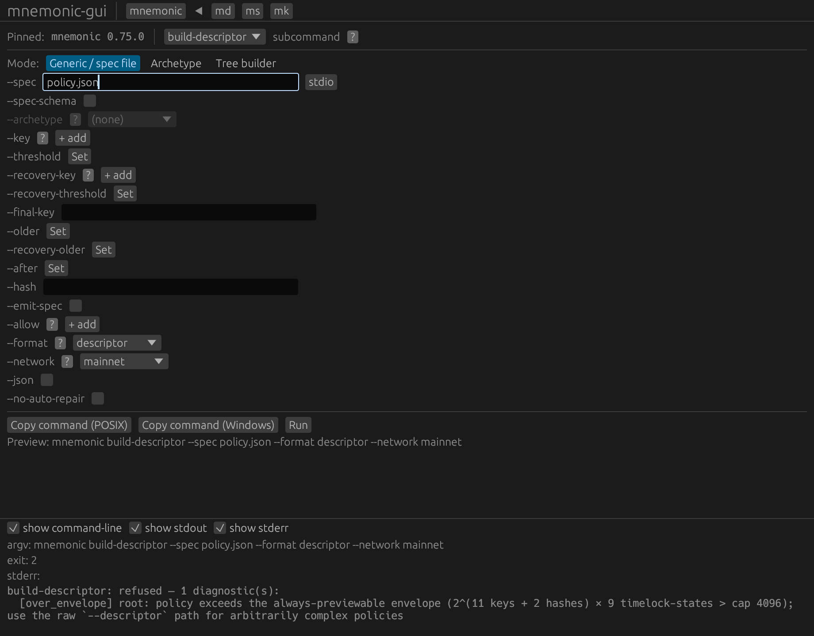
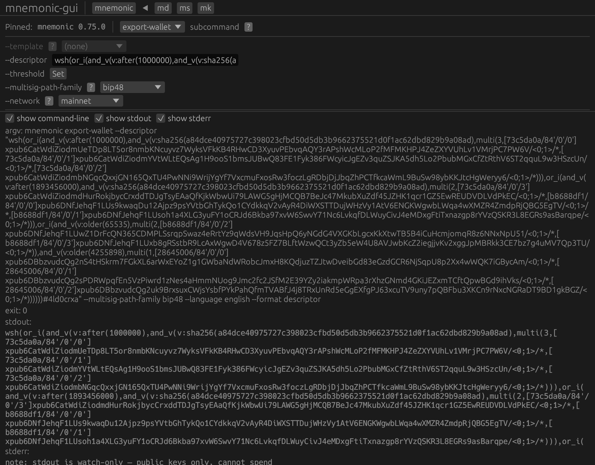
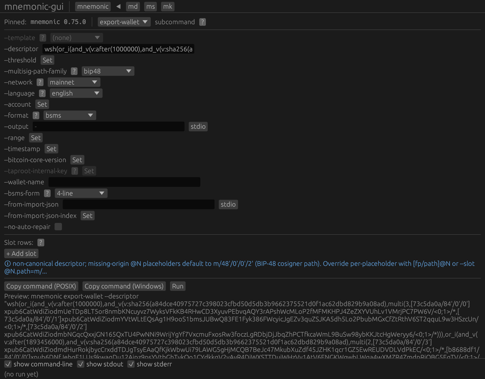
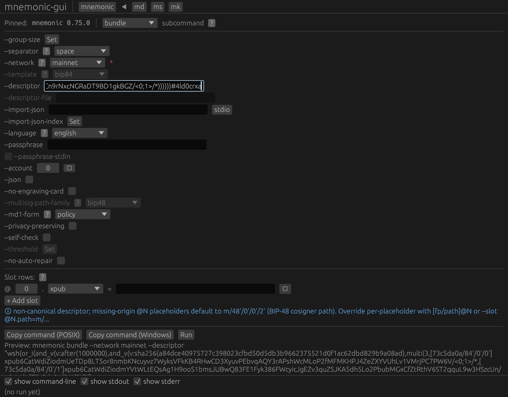
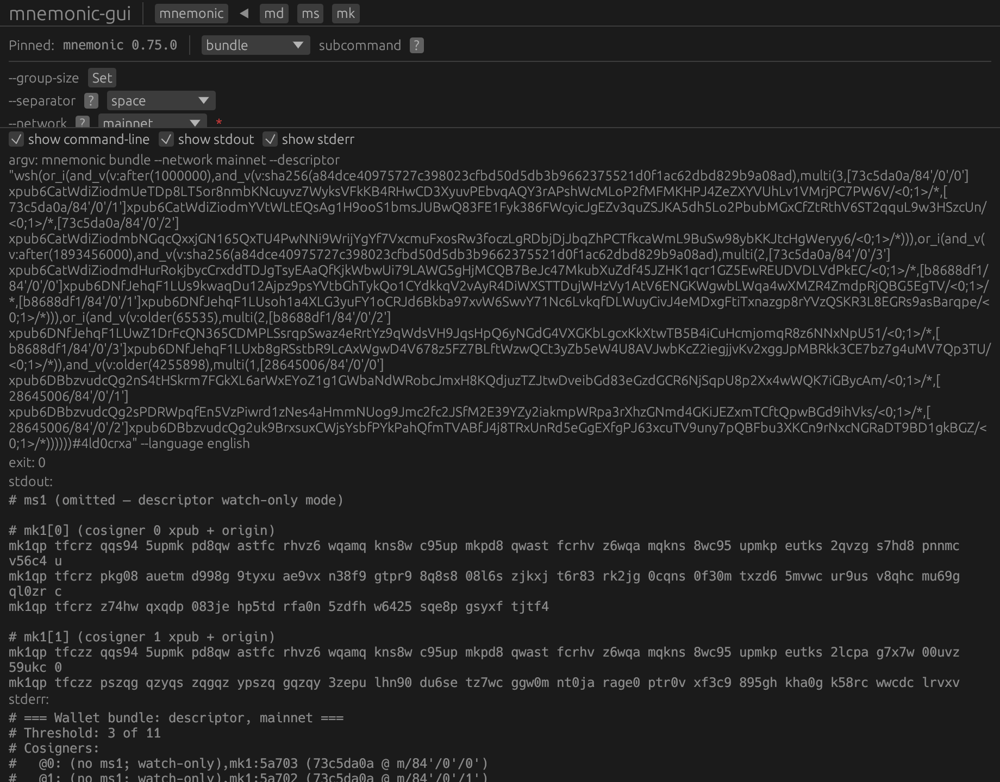
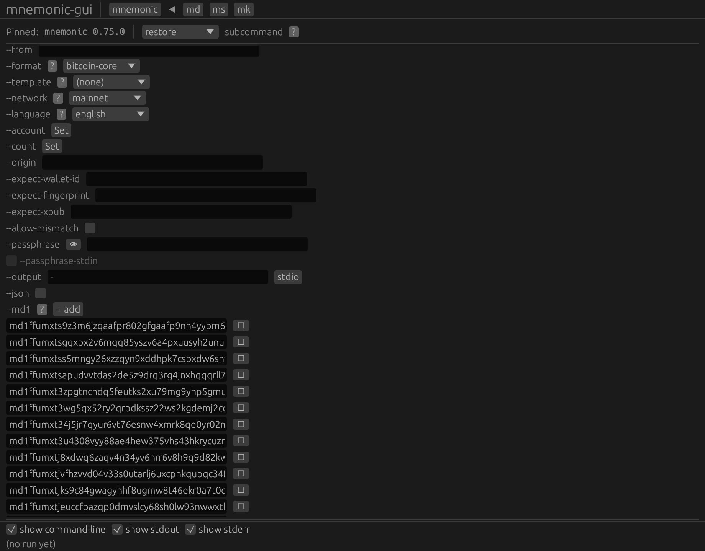
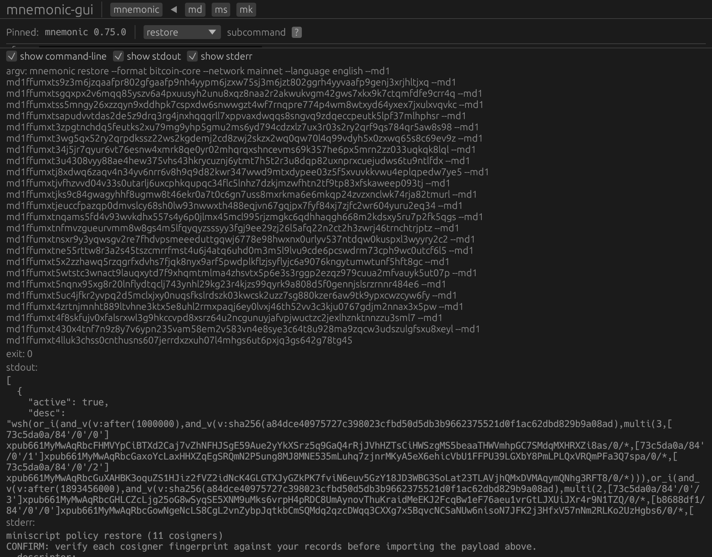

# Chapter 3 — Four-tier degrading vault (Journey 3)

This is the **pathological example**: a four-tier *degrading* vault
that deliberately exercises every corner of the descriptor engine. Each
tier uses its own distinct key set — **eleven distinct keys** in all
(no key reuse) — and the four tiers mix all four Bitcoin timelock
kinds. As locks mature, progressively easier spend conditions open:

| Tier | Spend condition | Timelock kind |
|---|---|---|
| 1 | 3-of-3 (K0,K1,K2) + secret word | absolute height — `after(1000000)` |
| 2 | 2-of-3 (K3,K4,K5) + secret word | absolute time — `after(1893456000)` |
| 3 | both K6 and K7 | relative blocks — `older(65535)` |
| 4 | any 1 of K8,K9,K10 | relative time — `older(4255898)` |

Absolute locks (`after`) count from the chain's height/clock; relative
locks (`older`) count from each coin's own confirmation. Tiers 1 and 2
additionally sit behind a shared **hashlock** on the secret word
`opensessame` (reusing a *hash* across tiers is safe — it is not a
key). This policy is far too large for the guided builder's
funds-safety preview, so the journey starts with that refusal and then
hands the raw descriptor straight to `export-wallet` and `bundle`. This
is `Examples.pdf` section 5.

> All keys here are **public** watch-only xpubs derived from the demo
> seeds; no secret is typed in this journey.

## 09 build descriptor refusal {#tut-j3-09-build-descriptor-refusal}

Start with the **guided builder** and watch it decline. `build-descriptor`
runs a satisfiability and cost preview that it deliberately **bounds**
for funds-safety; an eleven-key, four-branch policy blows past that
envelope. Select **Build Descriptor (policy-tree spec → wsh descriptor +
BIP-388)** and point its **`--spec`** field at the policy JSON
(`policy.json`). The filled form is below.

The run **refuses** with exit code 2 and one diagnostic on standard
error: `[over_envelope] root: policy exceeds the always-previewable
envelope (…> cap 4096); use the raw --descriptor path for arbitrarily
complex policies`. This is the intended teaching moment — the guided
builder is for policies *within* the preview envelope; for anything
larger you hand the raw descriptor straight to `export-wallet` and
`bundle`, which the rest of the journey does.





**Output (stdout):**

```{.text include="tutorial/tut-j3-09-build-descriptor-refusal.stdout.txt"}
(captured transcript — included at build time)
```

**Standard error (stderr):**

```{.text include="tutorial/tut-j3-09-build-descriptor-refusal.stderr.txt"}
(captured transcript — included at build time)
```

**Exit code:**

```{.text include="tutorial/tut-j3-09-build-descriptor-refusal.exit.txt"}
(captured transcript — included at build time)
```

## 10 canonicalise {#tut-j3-10-canonicalise}

Validate the hand-written vault descriptor with `export-wallet`.
Select the Template drop-down's **`(none)`** entry to unlock
**`--descriptor`**, load the four-tier `wsh(or_i(…))` descriptor, and
set **`--format`** `descriptor`. The filled form is below.

The panel returns the full canonical descriptor — every `after`/`older`
lock, the shared `sha256` hashlock, and all three `multi(...)`
thresholds across the four `or_i` branches — with checksum `…#4ld0crxa`.
Standard error confirms `watch-only — public keys only, cannot spend`.




**Output (stdout):**

```{.text include="tutorial/tut-j3-10-canonicalise.stdout.txt"}
(captured transcript — included at build time)
```

**Standard error (stderr):**

```{.text include="tutorial/tut-j3-10-canonicalise.stderr.txt"}
(captured transcript — included at build time)
```

**Exit code:**

```{.text include="tutorial/tut-j3-10-canonicalise.exit.txt"}
(captured transcript — included at build time)
```

## 11 bsms {#tut-j3-11-bsms}

Switch **`--format`** to `bsms` on the same descriptor. The panel
returns the BSMS 1.0 record and the vault's **first receive address**,
`bc1q4g7564xxd9hj68hqwu5e558cqafhsklerkr0asfzqp6puq74veesrp6qss`.
Remember this address — the restore step reproduces it exactly.




**Output (stdout):**

```{.text include="tutorial/tut-j3-11-bsms.stdout.txt"}
(captured transcript — included at build time)
```

**Standard error (stderr):**

```{.text include="tutorial/tut-j3-11-bsms.stderr.txt"}
(captured transcript — included at build time)
```

**Exit code:**

```{.text include="tutorial/tut-j3-11-bsms.exit.txt"}
(captured transcript — included at build time)
```

## 12 engrave {#tut-j3-12-engrave}

Because every one of the eleven keys is **distinct**, this is a valid
BIP-388 wallet policy, so `bundle` will engrave it (a key-reusing
policy would be refused). Paste the descriptor into `bundle`'s
**`--descriptor`** box. The filled form is below.

With only public xpubs supplied, the panel prints the watch-only set:
the `ms1` card omitted, one `mk1` card per cosigner (eleven of them),
and the single shared `md1` policy card that carries the whole
four-tier structure. The engraving panel on standard error lists all
eleven cosigners with their `84'/0'/N'` origins.





**Output (stdout):**

```{.text include="tutorial/tut-j3-12-engrave.stdout.txt"}
(captured transcript — included at build time)
```

**Standard error (stderr):**

```{.text include="tutorial/tut-j3-12-engrave.stderr.txt"}
(captured transcript — included at build time)
```

**Exit code:**

```{.text include="tutorial/tut-j3-12-engrave.exit.txt"}
(captured transcript — included at build time)
```

## 13 restore {#tut-j3-13-restore}

The round-trip proof. Restore the vault from its `md1` chunks alone
(chained from the previous `bundle --json` run into the **`--md1`**
rows; Template set to the wallet's `wsh-sortedmulti` family). The
filled form is below.

The panel reconstructs the descriptor and its **first receive
address** — `bc1q4g7564xxd9hj68hqwu5e558cqafhsklerkr0asfzqp6puq74veesrp6qss`,
identical to the BSMS address in step 11. That match is the proof: the
`md1` card set round-trips this entire eleven-key, four-branch policy
without loss. (The restore re-serialises each key as a depth-0
`xpub661My…` master, so the descriptor *string* differs from step 10
while the addresses are the same wallet.) Unlike the depth-2 Taproot
tree in Journey 4, this degrading-multisig policy restores on the
shipped binary with no experimental build.





**Output (stdout):**

```{.text include="tutorial/tut-j3-13-restore.stdout.txt"}
(captured transcript — included at build time)
```

**Standard error (stderr):**

```{.text include="tutorial/tut-j3-13-restore.stderr.txt"}
(captured transcript — included at build time)
```

**Exit code:**

```{.text include="tutorial/tut-j3-13-restore.exit.txt"}
(captured transcript — included at build time)
```

## restore feed bundle json {#tut-j3-restore-feed-bundle-json}

The plumbing behind step 13: the `bundle --descriptor … --json` run
whose `md1` array the restore consumes. Transcript only; the chunks are
real per-run output.

**Output (stdout):**

```{.text include="tutorial/tut-j3-restore-feed-bundle-json.stdout.txt"}
(captured transcript — included at build time)
```

**Standard error (stderr):**

```{.text include="tutorial/tut-j3-restore-feed-bundle-json.stderr.txt"}
(captured transcript — included at build time)
```

**Exit code:**

```{.text include="tutorial/tut-j3-restore-feed-bundle-json.exit.txt"}
(captured transcript — included at build time)
```
