# Journey 4 — Taproot twin

`wsh(...)` reveals the whole policy on every spend. **Taproot** gives a
cheap, private cooperative **key-path** spend and hides the fallbacks in
**script-tree leaves**, so a spend reveals only the leaf it uses. This
journey builds the Taproot twin of Journey 3's vault: the same four
timelock/hash/multisig tiers as fallbacks, plus a distinct cooperative
internal key `Kint`, using `multi_a` in place of `multi` — **twelve
distinct keys**. Along the way it teaches three refusals and two
comparisons: the depth-2 taptree the shipped binary declines, the
BSMS format Taproot cannot use, a `wsh`-vs-`tr` cost table, and a
NUMS-point Taproot multisig for wallets with no cooperative signer.
This is `Examples.pdf` section 6.

> All keys here are **public** watch-only xpubs; no secret is typed in
> this journey.

## Depth-2 refusal {#tut-j4-14-depth2-refusal}

The tidiest Taproot layout is one tier per leaf — four leaves — but
that is a **depth-2** taptree, and the shipped `rust-miniscript` pin
mis-formats depth-≥2 taptrees (the upstream PR-#953 bug), so the toolkit
refuses such a descriptor up front rather than emit a malformed one.
Select **Export Wallet (watch-only)**, take the Template drop-down's
**`(none)`** entry, and load the four-leaf `tr(…)` descriptor. The
filled form is below.

The run refuses with exit 2: `error: export-wallet script-type derive:
taptree branch must have 2 children, but found 1`. The fix, applied in
the next step, is a **depth-1** tree (two leaves) that packs two tiers
per leaf with `or_i`.

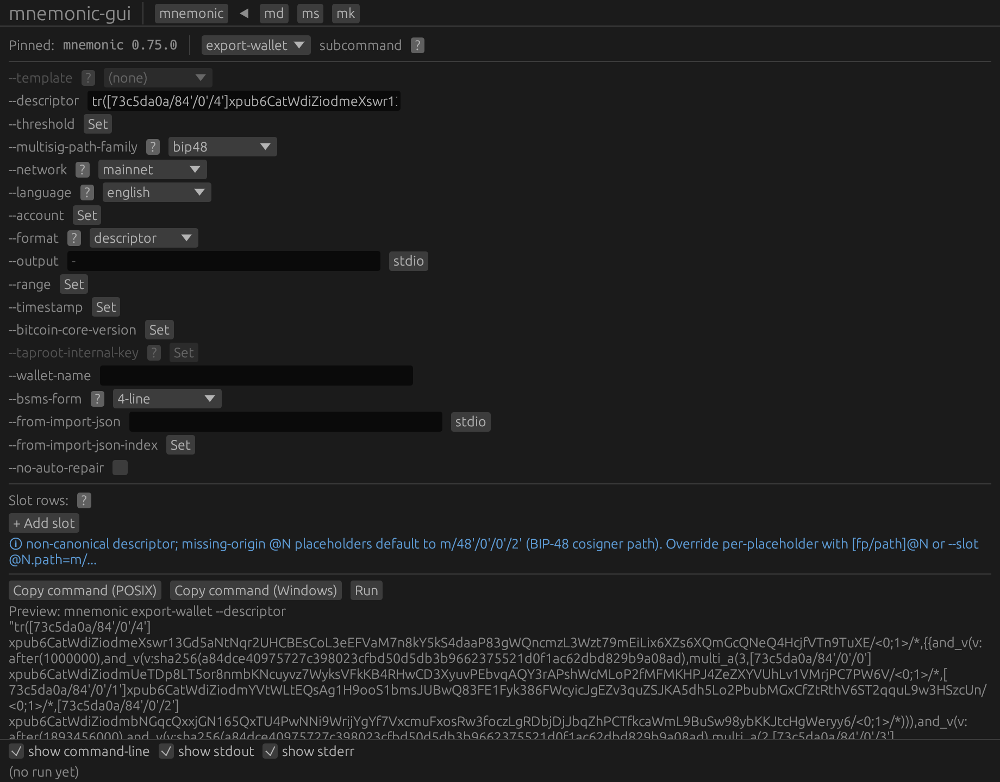

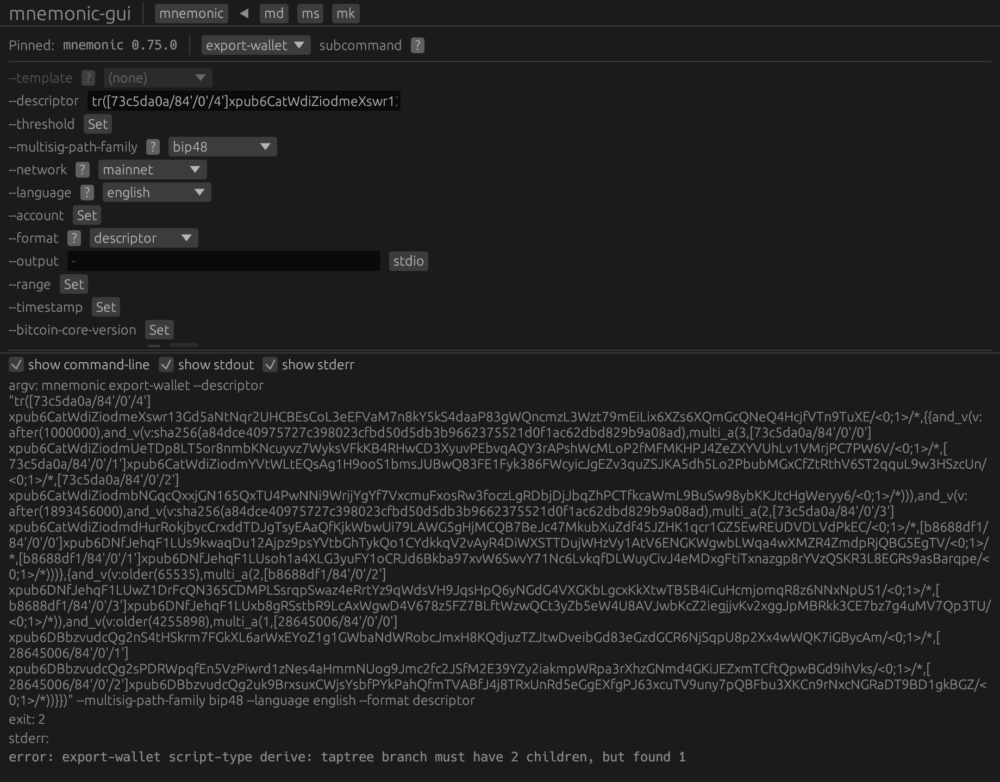

**Output (stdout):**

```{.text include="tutorial/tut-j4-14-depth2-refusal.stdout.txt"}
(captured transcript — included at build time)
```

**Standard error (stderr):**

```{.text include="tutorial/tut-j4-14-depth2-refusal.stderr.txt"}
(captured transcript — included at build time)
```

**Exit code:**

```{.text include="tutorial/tut-j4-14-depth2-refusal.exit.txt"}
(captured transcript — included at build time)
```

## Canonicalise the descriptor {#tut-j4-15-canonicalise}

The depth-1 Taproot descriptor validates. It keeps the same four tiers
but arranges them as two script leaves — Leaf A = tiers 1 or 2
(absolute-lock + hashlock), Leaf B = tiers 3 or 4 (relative-lock) —
under a real cooperative internal key `Kint` (`[73c5da0a/84'/0'/4']`).
Unlock **`--descriptor`** with the Template **`(none)`** entry, load the
`tr(Kint,{or_i(…),or_i(…)})` descriptor, and set **`--format`**
`descriptor`. The filled form is below.

The panel returns the canonical Taproot descriptor with checksum
`…#snerswx7`. The `Kint` key is the cooperative key-path (a spend using
it looks like single-sig — cheap and private); the two `or_i(...)`
blocks are the script-tree fallbacks; `multi_a` is Taproot's multisig
primitive, in place of `wsh`'s `multi`.


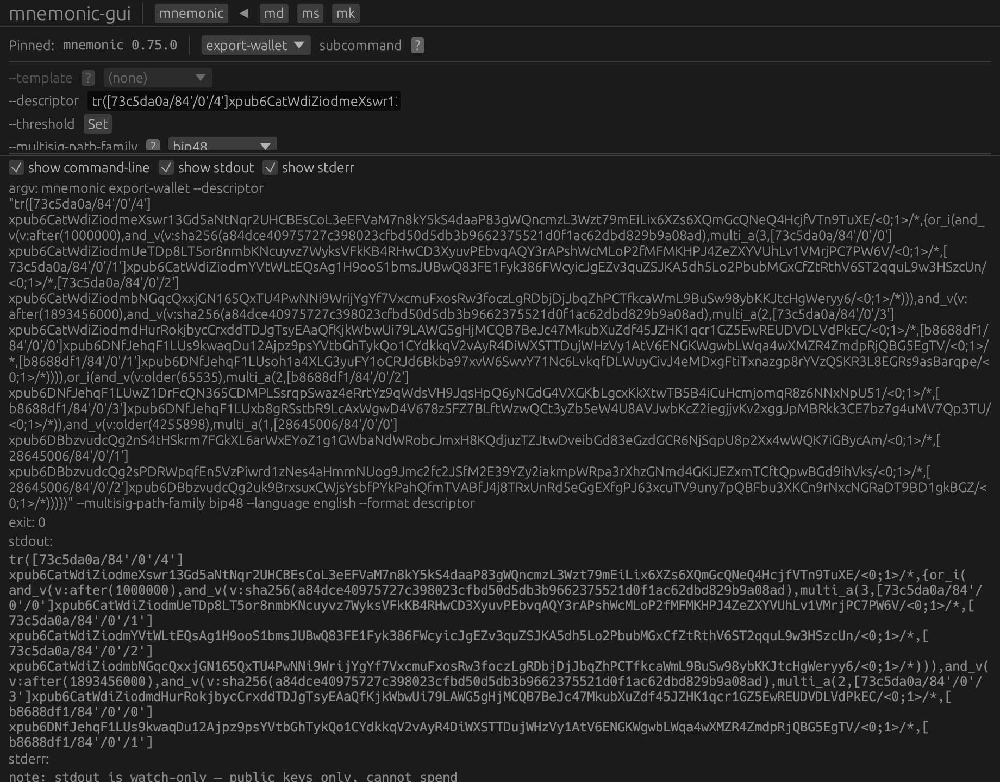

**Output (stdout):**

```{.text include="tutorial/tut-j4-15-canonicalise.stdout.txt"}
(captured transcript — included at build time)
```

**Standard error (stderr):**

```{.text include="tutorial/tut-j4-15-canonicalise.stderr.txt"}
(captured transcript — included at build time)
```

**Exit code:**

```{.text include="tutorial/tut-j4-15-canonicalise.exit.txt"}
(captured transcript — included at build time)
```

## Engrave the card set {#tut-j4-16-engrave}

Engrave the Taproot card set with `bundle --descriptor`. The filled
form is below. Every key is distinct, so it engraves; with only public
xpubs the result is watch-only (no `ms1`, one `mk1` per key, one shared
`md1`). The `md1` policy card carries the whole taptree.

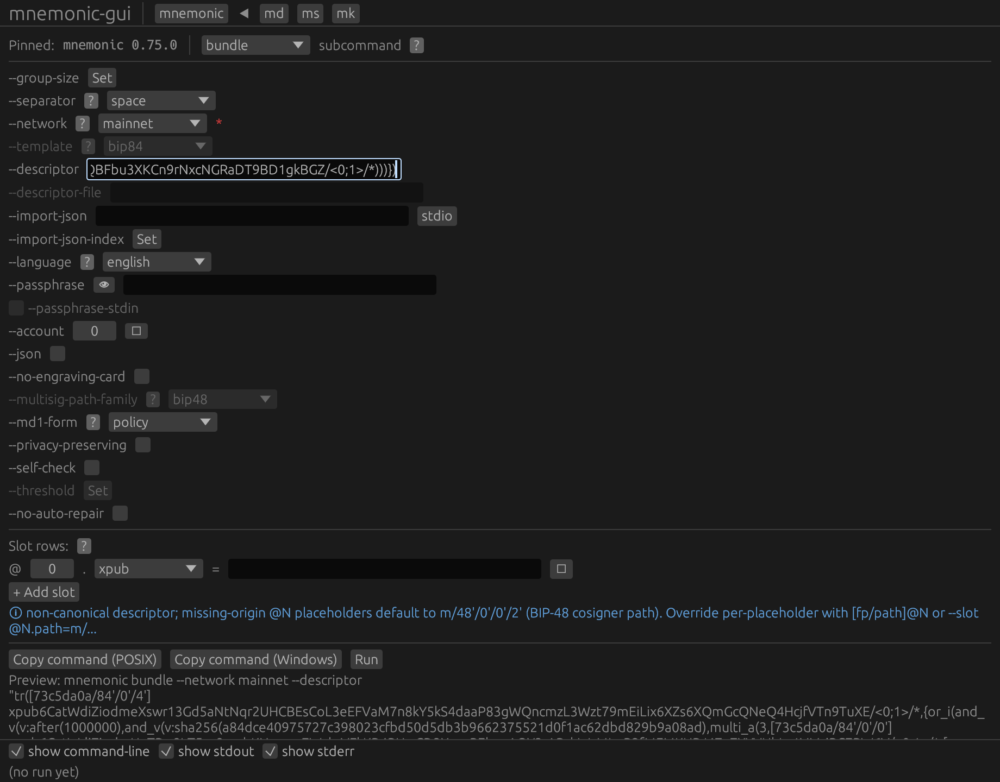

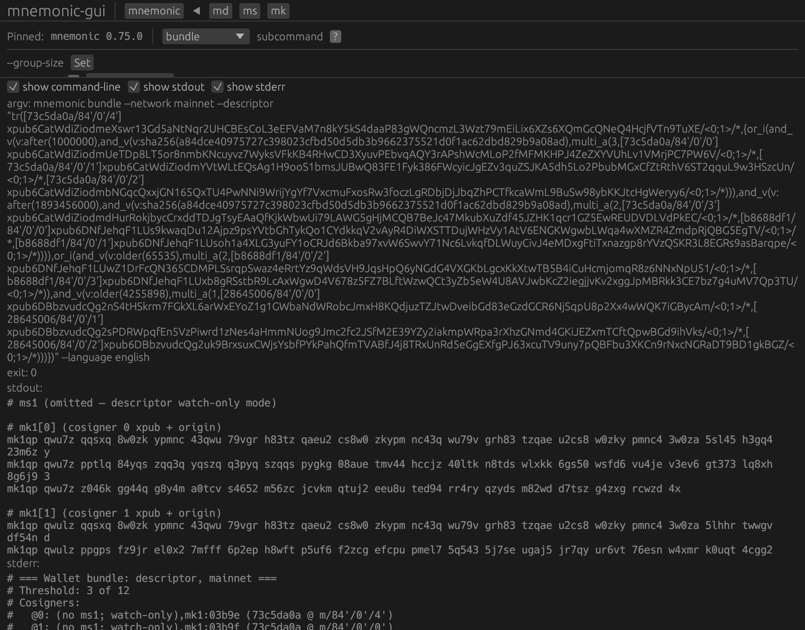

**Output (stdout):**

```{.text include="tutorial/tut-j4-16-engrave.stdout.txt"}
(captured transcript — included at build time)
```

**Standard error (stderr):**

```{.text include="tutorial/tut-j4-16-engrave.stderr.txt"}
(captured transcript — included at build time)
```

**Exit code:**

```{.text include="tutorial/tut-j4-16-engrave.exit.txt"}
(captured transcript — included at build time)
```

## Restore from the card {#tut-j4-17-restore}

Restore the Taproot vault from its `md1` chunks (Template set to
**`(none)`** — an `md1` restore needs no template, and `(none)` clears
the form's default single-sig `bip44`, which would be refused in `--md1`
mode; chunks chained from the previous `bundle --json` run). The filled
form is below.

The panel reconstructs the descriptor and its **first receive
address**, `bc1p9stcwz5597fmkxae9343k8edzkcvdczf9qp65r6p447pg0et82yqst3d2c`
(a `bc1p…` Taproot address). This round-trip also proves the **real
internal key** at the trunk reconstructs from the card — the non-NUMS
Taproot feature — not an unspendable stand-in.

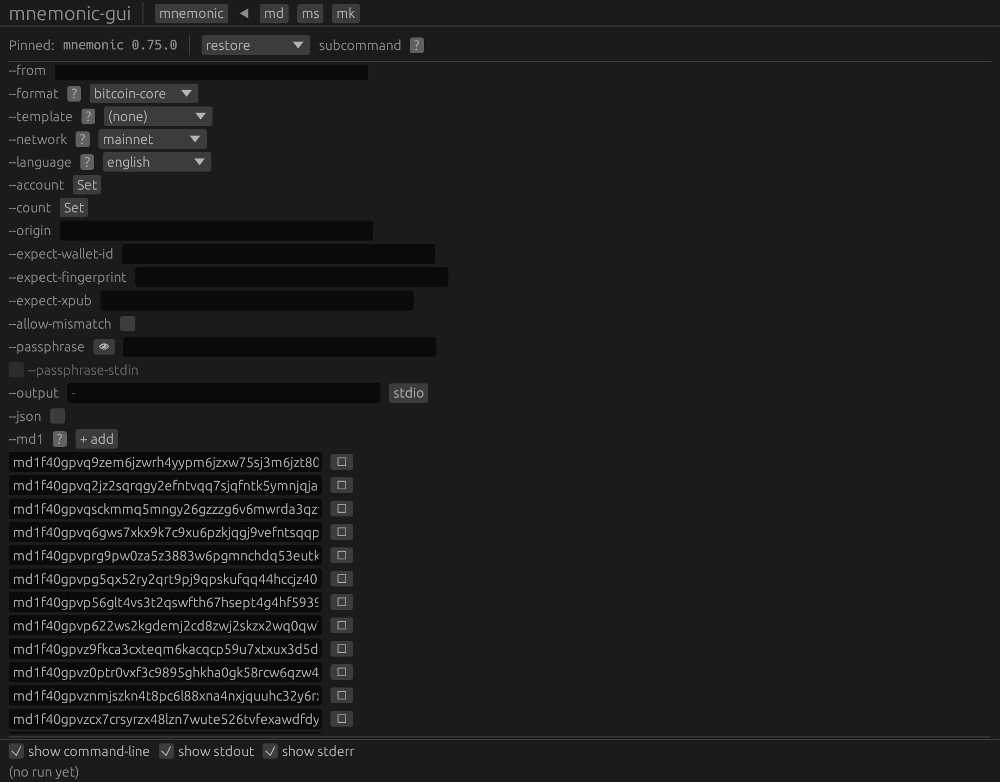

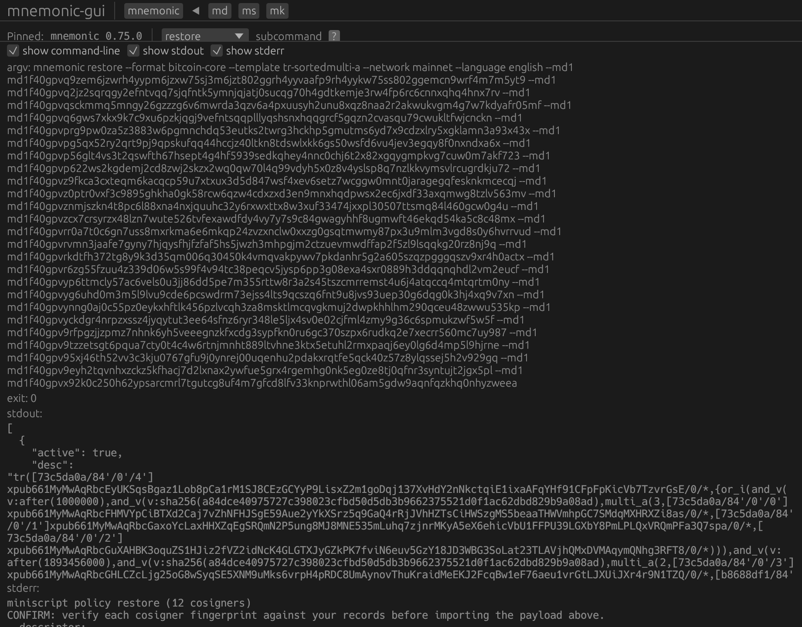

**Output (stdout):**

```{.text include="tutorial/tut-j4-17-restore.stdout.txt"}
(captured transcript — included at build time)
```

**Standard error (stderr):**

```{.text include="tutorial/tut-j4-17-restore.stderr.txt"}
(captured transcript — included at build time)
```

**Exit code:**

```{.text include="tutorial/tut-j4-17-restore.exit.txt"}
(captured transcript — included at build time)
```

## Export for Bitcoin Core {#tut-j4-18-core-export}

Export the same Taproot wallet for Bitcoin Core. On `export-wallet`,
Template **`(none)`**, load the depth-1 descriptor, set **`--format`**
`bitcoin-core`. The filled form is below. The panel's standard output is
the `importdescriptors` request array (external and change ranges), ready
to load into a blank Core descriptor wallet.


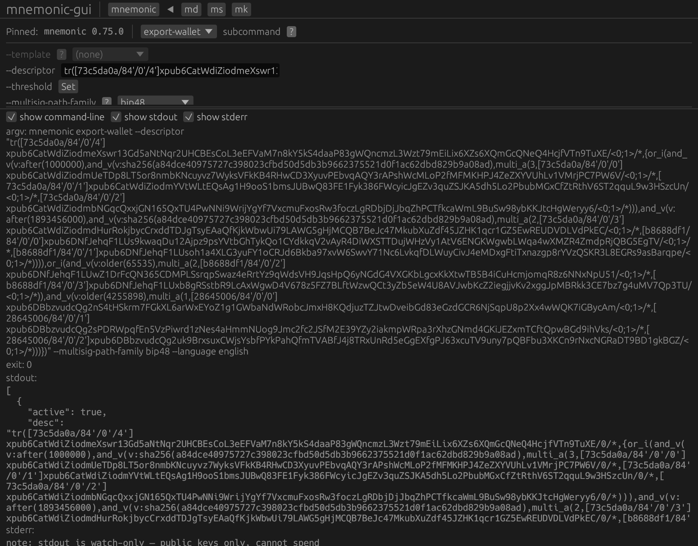

**Output (stdout):**

```{.text include="tutorial/tut-j4-18-core-export.stdout.txt"}
(captured transcript — included at build time)
```

**Standard error (stderr):**

```{.text include="tutorial/tut-j4-18-core-export.stderr.txt"}
(captured transcript — included at build time)
```

**Exit code:**

```{.text include="tutorial/tut-j4-18-core-export.exit.txt"}
(captured transcript — included at build time)
```

## BSMS unsupported for Taproot {#tut-j4-19-bsms-unsupported}

A second teaching refusal. Ask `export-wallet` for **`--format`** `bsms`
on the Taproot descriptor and it declines with exit 2: `error: --format
bsms does not support taproot (P2trMulti); BIP-129 §1 prerequisites do
not yet include BIP-386…` The message points you at the working paths
— `--format bitcoin-core` (Core-importable) or `--format sparrow`
(Sparrow's Taproot-capable JSON). BSMS simply has no Taproot encoding
yet; this is expected, not a bug in your descriptor. The filled form is
below.

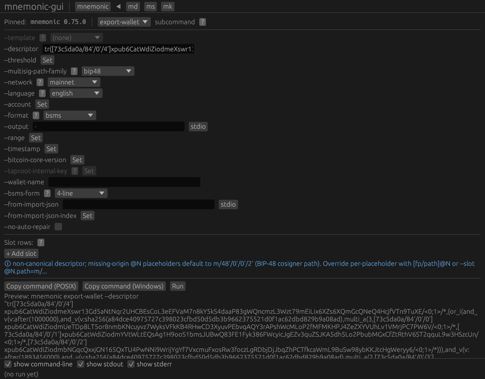

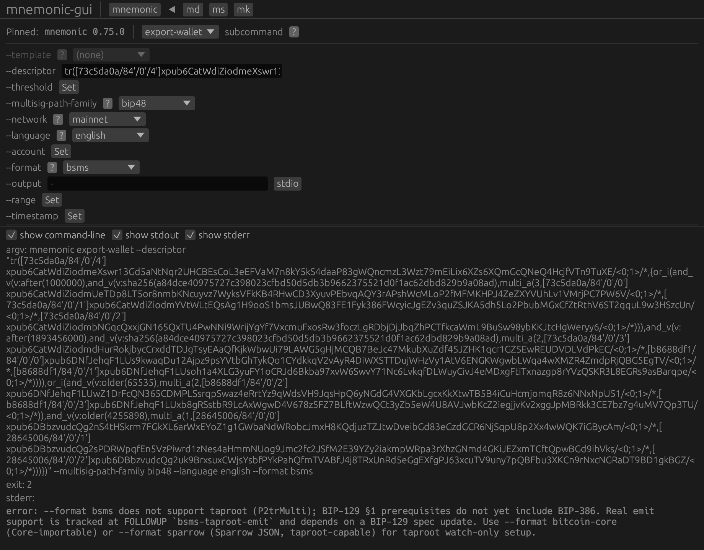

**Output (stdout):**

```{.text include="tutorial/tut-j4-19-bsms-unsupported.stdout.txt"}
(captured transcript — included at build time)
```

**Standard error (stderr):**

```{.text include="tutorial/tut-j4-19-bsms-unsupported.stderr.txt"}
(captured transcript — included at build time)
```

**Exit code:**

```{.text include="tutorial/tut-j4-19-bsms-unsupported.exit.txt"}
(captured transcript — included at build time)
```

## Compare cost {#tut-j4-20-compare-cost}

`compare-cost` weighs the two wrappers for the same spending policy:
`wsh(M)` versus `tr(NUMS, {M})`. Select **Compare Cost (wsh vs tr per
spending condition)** and paste the folded miniscript into
**`--miniscript`**. The filled form is below.

The panel (standard output only — this subcommand prints no standard
error) tabulates, per spend condition, the witness size in virtual
bytes and satoshis for `wsh` against `tr`, and the delta. Every
condition costs **more** on the script-path (`+68` to `+71` vB) because
a Taproot script-path spend reveals a leaf plus its control block — the
trade Taproot makes is a *much* cheaper, private cooperative key-path
against slightly dearer fallbacks. The closing notes flag that
per-condition vbytes are rounded individually and that preimage-known
rows assume the spender can supply each preimage.

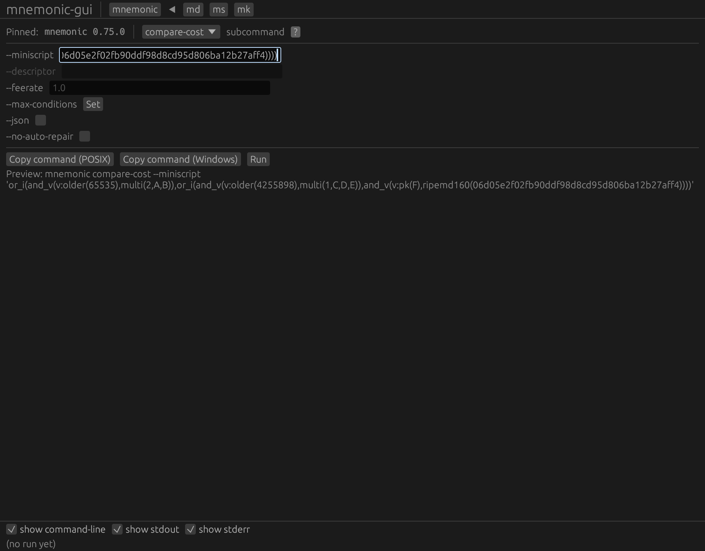

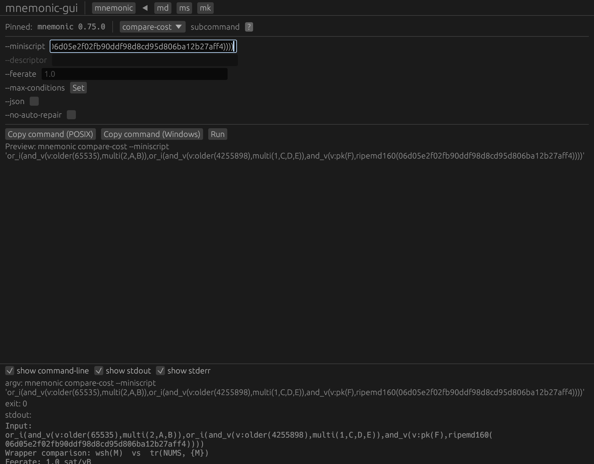

**Output (stdout):**

```{.text include="tutorial/tut-j4-20-compare-cost.stdout.txt"}
(captured transcript — included at build time)
```

**Exit code:**

```{.text include="tutorial/tut-j4-20-compare-cost.exit.txt"}
(captured transcript — included at build time)
```

## NUMS export {#tut-j4-21-nums-export}

When a wallet has **no** cooperative signer, Taproot still applies: put
a provably-unspendable **NUMS** point in the key-path so the only way to
spend is through the script tree. This step canonicalises a
NUMS-internal Taproot 2-of-3, `tr(50929b74…NUMS…,sortedmulti_a(2,…))`.
Template **`(none)`**, paste the descriptor, **`--format`**
`descriptor`. The filled form is below; the panel returns the canonical
descriptor with checksum `…#8nz0lwja`. The `50929b74c1a04954…803ac0`
key is the BIP-341 NUMS `H` point — nobody knows its private key, so the
key-path is disabled by construction.

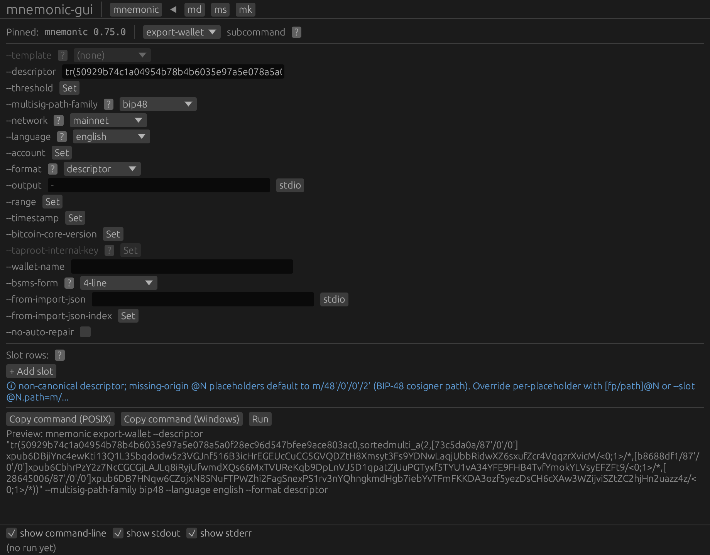

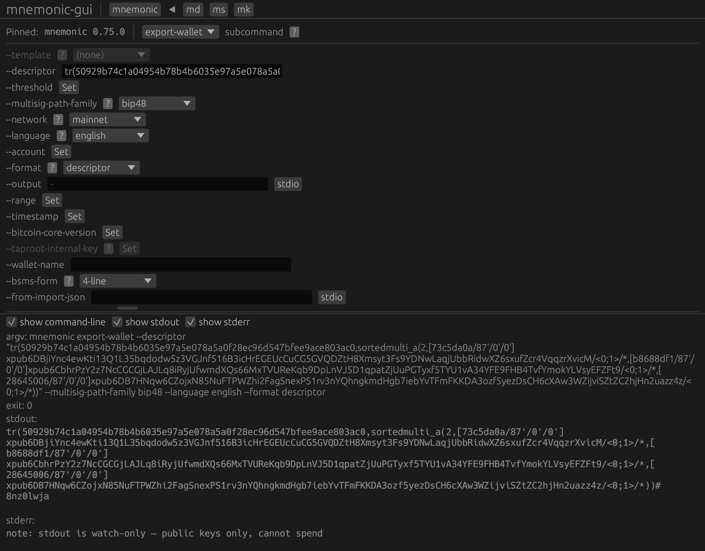

**Output (stdout):**

```{.text include="tutorial/tut-j4-21-nums-export.stdout.txt"}
(captured transcript — included at build time)
```

**Standard error (stderr):**

```{.text include="tutorial/tut-j4-21-nums-export.stderr.txt"}
(captured transcript — included at build time)
```

**Exit code:**

```{.text include="tutorial/tut-j4-21-nums-export.exit.txt"}
(captured transcript — included at build time)
```

## NUMS — feed the bundle JSON {#tut-j4-nums-feed-bundle-json}

The plumbing behind the NUMS restore: a `bundle --descriptor … --json`
run on the NUMS 2-of-3 whose `md1` chunks the next step consumes.
Transcript only.

**Output (stdout):**

```{.text include="tutorial/tut-j4-nums-feed-bundle-json.stdout.txt"}
(captured transcript — included at build time)
```

**Standard error (stderr):**

```{.text include="tutorial/tut-j4-nums-feed-bundle-json.stderr.txt"}
(captured transcript — included at build time)
```

**Exit code:**

```{.text include="tutorial/tut-j4-nums-feed-bundle-json.exit.txt"}
(captured transcript — included at build time)
```

## NUMS restore {#tut-j4-nums-restore}

The NUMS Taproot multisig round-trips from its `md1` card, exactly like
the cooperative-key vault (Template `(none)`; chunks chained
from the feed above). Transcript only — the interaction mirrors the
restore step.

**Output (stdout):**

```{.text include="tutorial/tut-j4-nums-restore.stdout.txt"}
(captured transcript — included at build time)
```

**Standard error (stderr):**

```{.text include="tutorial/tut-j4-nums-restore.stderr.txt"}
(captured transcript — included at build time)
```

**Exit code:**

```{.text include="tutorial/tut-j4-nums-restore.exit.txt"}
(captured transcript — included at build time)
```

## Restore — feed the bundle JSON {#tut-j4-restore-feed-bundle-json}

The plumbing behind the restore step: the `bundle --descriptor … --json` run on
the depth-1 Taproot vault whose `md1` array the restore consumes.
Transcript only.

**Output (stdout):**

```{.text include="tutorial/tut-j4-restore-feed-bundle-json.stdout.txt"}
(captured transcript — included at build time)
```

**Standard error (stderr):**

```{.text include="tutorial/tut-j4-restore-feed-bundle-json.stderr.txt"}
(captured transcript — included at build time)
```

**Exit code:**

```{.text include="tutorial/tut-j4-restore-feed-bundle-json.exit.txt"}
(captured transcript — included at build time)
```
