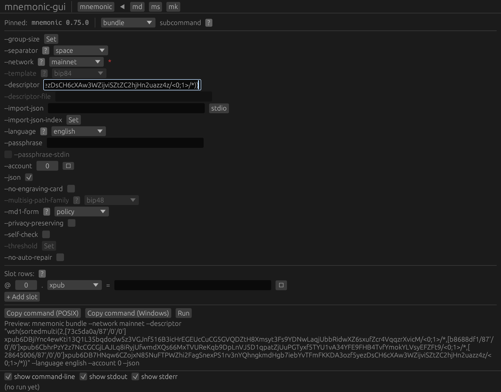
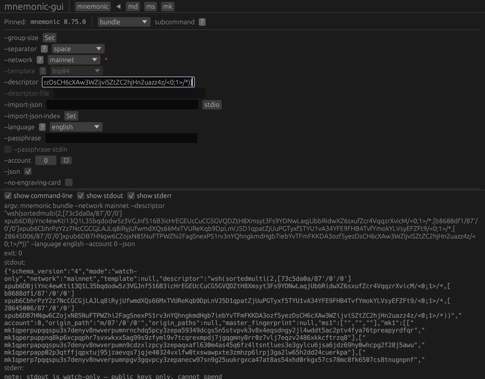
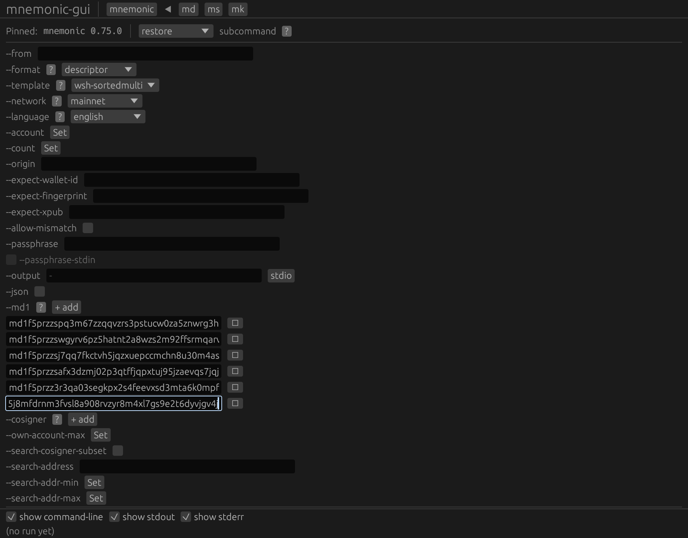
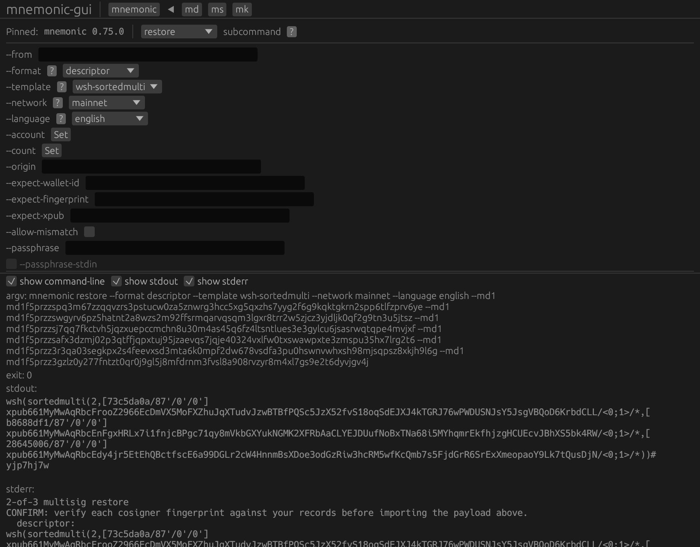

# Chapter 5 — Watch-only export (Journey 5)

_Chapter introduction to be written in the editorial pass._

## 22 bundle json {#tut-j5-22-bundle-json}

_Step narrative to be written in the editorial pass._





**Output (stdout):**

```{.text include="tutorial/tut-j5-22-bundle-json.stdout.txt"}
(captured transcript — included at build time)
```

**Standard error (stderr):**

```{.text include="tutorial/tut-j5-22-bundle-json.stderr.txt"}
(captured transcript — included at build time)
```

**Exit code:**

```{.text include="tutorial/tut-j5-22-bundle-json.exit.txt"}
(captured transcript — included at build time)
```

## 23 restore descriptor {#tut-j5-23-restore-descriptor}

_Step narrative to be written in the editorial pass._





**Output (stdout):**

```{.text include="tutorial/tut-j5-23-restore-descriptor.stdout.txt"}
(captured transcript — included at build time)
```

**Standard error (stderr):**

```{.text include="tutorial/tut-j5-23-restore-descriptor.stderr.txt"}
(captured transcript — included at build time)
```

**Exit code:**

```{.text include="tutorial/tut-j5-23-restore-descriptor.exit.txt"}
(captured transcript — included at build time)
```

## 24 restore core {#tut-j5-24-restore-core}

_Step narrative to be written in the editorial pass._


**Output (stdout):**

```{.text include="tutorial/tut-j5-24-restore-core.stdout.txt"}
(captured transcript — included at build time)
```

**Standard error (stderr):**

```{.text include="tutorial/tut-j5-24-restore-core.stderr.txt"}
(captured transcript — included at build time)
```

**Exit code:**

```{.text include="tutorial/tut-j5-24-restore-core.exit.txt"}
(captured transcript — included at build time)
```
