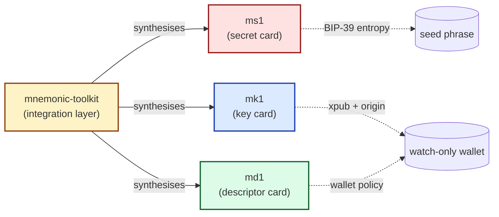

# Welcome to the m-format constellation

Self-custodying Bitcoin starts with one secret — your seed phrase —
and an inevitable question: *how do I keep that intact for decades?*
The m-format constellation is a family of four sibling formats that answer
the question by splitting the backup into independently-checksummed,
steel-engravable cards.

## The four siblings

| Card | Carries | What it answers |
|---|---|---|
| **ms1\index{ms1}** | BIP-39 entropy | "What were the seed words?" |
| **mk1\index{mk1}** | xpub + origin (master fingerprint + BIP path) | "What public key did the wallet use, and at which derivation?" |
| **md1\index{md1}** | wallet policy (template + bound xpub) | "What was the wallet's *spending rule* — single-sig? 2-of-3 multisig? taproot?" |

A fourth piece — the **`mnemonic-toolkit`\index{mnemonic-toolkit}**
CLI — is the *integration layer* that synthesises a coherent bundle
from your inputs and verifies the cross-bindings. It does not engrave
its own card; it produces the three card strings (ms1, mk1, md1) plus
the visual engraving cards.

## Why three cards instead of one

A single seed phrase, engraved on steel, recovers a wallet *if and
only if* you also remember the wallet's spending rule. For a single-
sig BIP-84 wallet, that's implicit: most wallet apps will guess. For
a multisig wallet — a 2-of-3 with two cosigners' xpubs and a
taproot internal key — the seed alone is insufficient. You need:

- the **secret** (ms1) to sign,
- the **public keys** (mk1 cards from each cosigner) to construct the
  multisig script,
- the **policy** (md1) to know *what kind* of multisig.

Engraving all three on independent steel cards lets each card be
stored separately and hardened against different threats. The
redundancy is **asymmetric**: a surviving `ms1` plus knowledge of
the wallet template suffices to re-derive `mk1` and `md1`, but
losing all copies of `ms1` means losing spending capability
permanently — the public cards alone reconstruct only a watch-only
setup. Each card also carries its own BCH error-correction\index{BCH}
checksum, so per-card mis-stamps and minor surface damage are
locatable, not catastrophic ([Appendix E](#appendix-e-codex32-bch-m-codec-error-correction)
gives the precise per-card detection / correction guarantees).
Multisig adds threshold-level redundancy across cosigners' `ms1`
cards: in a 2-of-3 wallet, one cosigner's `ms1` may be lost
without losing spending capability; two cannot.
[Chapter 35](#recovery-paths-by-damaged-card-scenario) walks
through the full recovery matrix.

:::primer
**Cross-binding, in one sentence.** Each mk1 card carries a 4-byte
`policy_id_stub`\index{policy\_id\_stub} — `SHA-256(canonical wallet-policy
preimage)[0..4]` — that is also computable from each md1 card. If you
mix cards from different wallets, the stubs disagree and
`mnemonic verify-bundle` fails fast.
:::

## How to use this manual

Most readers want one of three things:

1. **"Show me what to do, fast."** Read [Part II — Quick start]
   (#your-first-bundle). 30 minutes, ends with a working bundle on
   paper.
2. **"I have this *specific* situation: 2-of-3 multisig with three
   cosigners on three machines."** Read [Part III —
   Guided workflows](#multi-source-2-of-3-multisig). Eight end-to-end
   recipes covering single-sig, multisig, taproot, watch-only,
   recovery, migration, wallet export, and BIP-85 children.
3. **"I want to know how this compares to SLIP-39 / Shamir / naked
   BIP-39."** Read [Part V — Comparing & contrasting]
   (#m-format-vs-slip-39-vs-naked-bip-39-vs-shamir).

The CLI reference (Part IV) and the appendices (Part VI) are
consulted, not read top-to-bottom.

## Status

This manual is **v0.1**, tracking `mnemonic-toolkit` `main` (initial
sync targets toolkit `v0.8.0`). Each new toolkit tag triggers a fresh
PDF build attached to the corresponding GitHub release. The
[release-history appendix](#appendix-h-release-history) summarises
what each toolkit version added or broke; the toolkit's own
`CHANGELOG.md` is the authoritative source.
