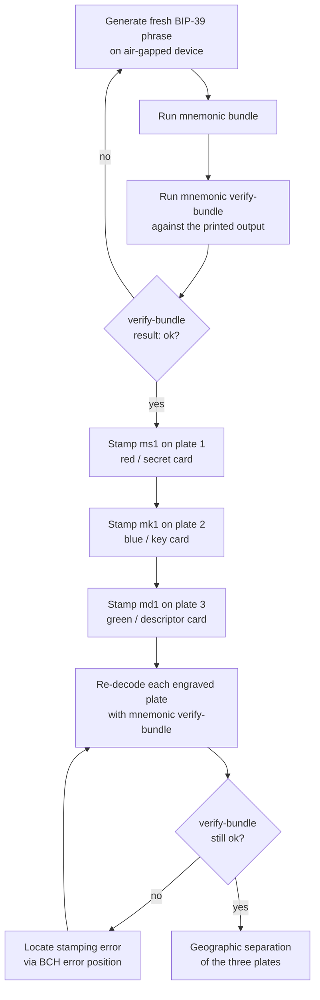

# Single-sig steel-engraved backup

The full ceremony for a single-cosigner BIP-84 mainnet wallet, from
fresh entropy to three engraved plates. Allow about 90 minutes; most
of that is the engraving itself.

This chapter assumes you have read [Your first bundle](#your-first-bundle)
and [Verifying a bundle](#verifying-a-bundle). The CLI mechanics are
identical here; what is added is the *physical* discipline.

:::danger
Examples in this chapter use the canonical BIP-39 test vector
`abandon abandon abandon abandon abandon abandon abandon abandon abandon abandon abandon about`.
This phrase is **public** — chain watchers have swept any wallet
ever derived from it. **Never engrave or fund a wallet built from
the canonical test seed.** For real bundles, generate fresh entropy
on an air-gapped device.
:::

## Ceremony at a glance



## Step 1 — generate fresh entropy off-line

Use any reputable BIP-39 generator: a hardware wallet's "new seed"
flow, the Coldcard's dice roller, or an offline machine running
`bitcoinjs` in a browser kept off the network. The toolkit accepts
any standards-conforming 12 / 15 / 18 / 21 / 24-word mnemonic in any
of the ten BIP-39 wordlists.

Write the resulting phrase down on scratch paper *only for the
duration of the ceremony*. The phrase will live on the ms1 card and
in your head; the scratch paper is destroyed at the end.

## Step 2 — synthesise the bundle

```sh
mnemonic bundle \
  --network mainnet \
  --template bip84 \
  --slot @0.phrase="abandon abandon abandon abandon abandon abandon abandon abandon abandon abandon abandon about" \
  --self-check \
  > bundle.txt
```

Three additions vs. [Your first bundle](#your-first-bundle):

- **`--self-check`** — the toolkit re-parses its own emitted bundle and
  verifies it round-trips before exiting. A bug in card synthesis
  surfaces here, not later when you have stamped two plates and
  discover the third disagrees.
- **redirect to `bundle.txt`** — keeps secret material off the
  scrollback buffer.
- **omit `--no-engraving-card`** (the default behaviour) — the
  engraving-card layout is emitted on stderr, separate from the
  copy-pasteable card strings on stdout. The layout is the
  visual aid you align against when stamping.

## Step 3 — verify before stamping

`bundle.txt` now contains the three card strings. Read them back with
`mnemonic verify-bundle`:

```sh
mnemonic verify-bundle \
  --network mainnet \
  --template bip84 \
  --slot @0.phrase="abandon abandon abandon abandon abandon abandon abandon abandon abandon abandon abandon about" \
  --ms1 ms10entrsqqqqqqqqqqqqqqqqqqqqqqqqqqqqcj9sxraq34v7f \
  --mk1 mk1qprsqhpqqsq3cqtsleeutks2qvzg3vs70mejhk622ws2kgdemj2cd8zwj2skzx2wq0qw70l4q99vdyh5x0z8v4yslsp8qp3yxg3dpe854wq4 \
  --mk1 mk1qprsqhpp0f30mtxzd65mvwcur9usdatwuqvq6z70r9nwrgk6xn6l8gy6nwa2n977sw6zh34rma0nh \
  --md1 md1fgdxlpqpqpm6jzzqqvqpdqw0za5zs4gyy55aq4vsmnhy4s6wyaypu34c7raqu8np \
  --md1 md1fgdxlpqf2zcgefcpupmel75q5435j7seugaj5jr7qyur6vt76es5cdeyrq7zdy0d \
  --md1 md1fgdxlpq3xa2dk8vwpj7gx74hwqxqdp083jehp5tdrfa0n5zdfkqcdlrvnh5r62jn
```

The `result: ok` final line is the green light to begin stamping.

## Step 4 — stamp the three plates

The convention is colour-keyed. The `mnemonic-toolkit` engraving-card
emission uses red for ms1, blue for mk1, green for md1; the same
colours apply to physical plates if you label them.

| Plate | Card | Strings to stamp | What it carries |
|---|---|---|---|
| **Red** | ms1 | 1 | BIP-39 entropy |
| **Blue** | mk1 | 2 (concatenated `xpub` + origin) | xpub fingerprint + path |
| **Green** | md1 | 3 (concatenated wallet-policy chunks) | template + bound xpub |

The chunked form (`ms10e ntrsq qqqqq qqqqq qqqqq qqqqq qqqqq qqcj9 sxraq 34v7f`)
is the engraving guide — five-character groups separated by spaces
align with the printed engraving cards.

Each plate carries its own BCH\index{BCH error correction} error-correction
checksum. If you mis-stamp a single character (`s` instead of `5`,
say), the codec located it during decode and tells you the *position*
of the error so you can verify against the original. The single-string
ms1 card tolerates more errors than the longer mk1/md1 strings, but
all three are recoverable from a small number of stamping mistakes.

## Step 5 — verify each engraved plate

Crucially: don't trust your own typing. After stamping, re-decode
each plate by reading the engraved characters and running them
through `mnemonic verify-bundle` again — *with the same flags as
Step 3*. If `result: ok`, the plate is faithful to the bundle. If a
sub-check fails, the diagnostic names the failing card (e.g. `mk1_decode: error at position 47`)
and you know which character to inspect.

Use a magnifier; eyes lie about `0` vs `o` and `1` vs `l`. The codec
alphabet is *deliberately* chosen to exclude visually-similar
characters, but stamping artefacts (a struck depth difference, a
misaligned letter) can mimic the wrong character at glance.

## Step 6 — geographic separation

For meaningful protection against fire, flood, theft, or seizure,
the three plates should rest in three independent locations. A common
arrangement:

- **Red (ms1)** — primary safe, on-site, fireproof.
- **Blue (mk1)** — bank safe-deposit box.
- **Green (md1)** — trusted family member, attorney, or off-site
  vault.

The cross-binding\index{cross-binding} via `policy_id_stub` means an
attacker who steals only one plate cannot derive the wallet alone:

- ms1 alone reconstitutes the seed but not the wallet's spending rule
  (which derivation? which template?). Software that imports
  BIP-39 phrases will *guess*, often wrongly for non-default
  templates.
- mk1 + md1 alone is a watch-only bundle; spends are impossible
  without the seed.
- Any two plates lacking the third leave the wallet unrecoverable
  (or at least requires Bitcoin-forensics-level reconstruction).

The recovery side of this arithmetic is covered in
[Recovery paths by damaged-card scenario](#recovery-paths-by-damaged-card-scenario).

## Variants

- **BIP-86 taproot single-sig.** Replace `--template bip84` with
  `--template bip86`. The derivation switches to `m/86'/0'/0'`; the
  ceremony is otherwise identical.
- **BIP-44 / BIP-49.** Same pattern, derivation changes to
  `m/44'/0'/0'` (legacy) or `m/49'/0'/0'` (nested-segwit).
- **Testnet / signet.** Replace `--network mainnet` with `--network testnet`
  or `--network signet`. The ms1 card re-encodes the same entropy,
  but the mk1's xpub serialises with the testnet prefix (`tpub`).
- **Privacy-preserving fingerprint.** Add `--privacy-preserving` to
  suppress the master fingerprint from the mk1 emission. Recovery
  software then re-derives the fingerprint from the seed at import.

For multisig variants — the more security-meaningful use of the
m-format constellation — read the next chapter,
[Multi-source 2-of-3 multisig](#multi-source-2-of-3-multisig).
