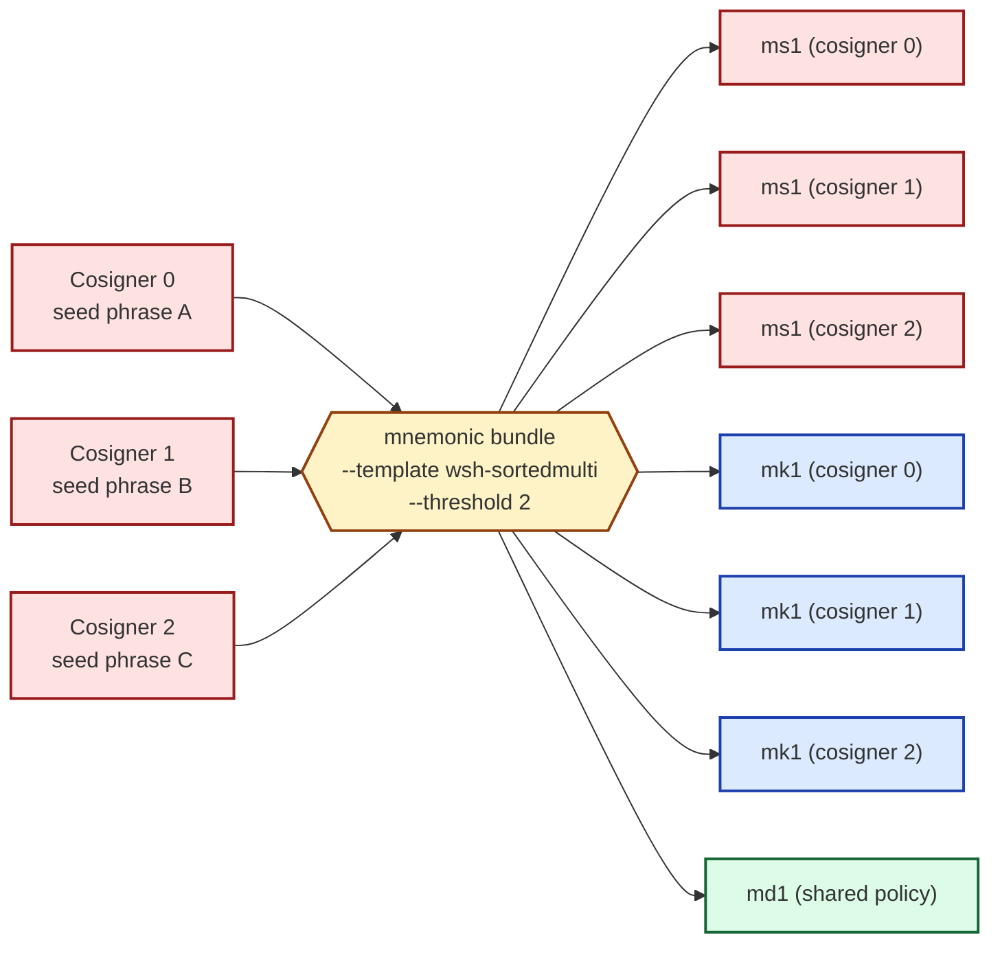

# Multi-source 2-of-3 multisig

The headline use of the m-format constellation: a 2-of-3 segwit multisig
wallet whose three cosigners each generate their seed *on their own
machine*. Each cosigner ends up with a personal ms1 card plus the
same shared mk1-set + md1-set.

This chapter walks the *coordinated* synthesis flow first, where
one laptop has all three phrases briefly during the bundle pass.
For the fully air-gapped variant — where no machine ever sees more
than one cosigner's secret — see the section
["Air-gapped variant"](#air-gapped-variant) at the end.

:::danger
Examples below use the canonical BIP-39 test vector
`abandon abandon abandon abandon abandon abandon abandon abandon abandon abandon abandon about`
for cosigner 0 and two derived BIP-39 test vectors for cosigners 1
and 2. All three are **public**. Never engrave or fund a wallet built
from these seeds.
:::

## What you build



Three cosigners produce **seven cards total**: three ms1 cards (one per
cosigner), three mk1 cards (one per cosigner), and one md1 card (the
shared wallet policy). Each cosigner's private engraving set is their
own ms1 + the three mk1s + the one md1. The xpubs are public; sharing
mk1s across cosigners is safe.

## Step 1 — pick your template

`wsh-sortedmulti` is the segwit BIP-67 sorted-multisig template. The
toolkit also offers `wsh-multi` (unsorted), `sh-wsh-sortedmulti` and
`sh-wsh-multi` (nested-segwit, BIP-49-style addresses), and the two
taproot variants `tr-multi-a` and `tr-sortedmulti-a`. For new wallets,
prefer `wsh-sortedmulti` over `wsh-multi`: BIP-67 sorting means the
cosigner order on the engraved md1 is irrelevant during recovery, so
losing track of "who was @0?" doesn't brick the wallet.

For taproot multisig, see [Taproot multisig](#taproot-multisig).

## Step 2 — synthesise the bundle

```sh
mnemonic bundle \
  --network mainnet \
  --template wsh-sortedmulti \
  --threshold 2 \
  --slot @0.phrase="abandon abandon abandon abandon abandon abandon abandon abandon abandon abandon abandon about" \
  --slot @1.phrase="legal winner thank year wave sausage worth useful legal winner thank yellow" \
  --slot @2.phrase="letter advice cage absurd amount doctor acoustic avoid letter advice cage above" \
  --self-check \
  > bundle.txt
```

The interesting flags vs. single-sig:

- **`--template wsh-sortedmulti`** — BIP-67-sorted segwit multisig. The
  emitted descriptor will be `wsh(sortedmulti(2,@0,@1,@2))`.
- **`--threshold 2`** — the K of K-of-N. Required for multisig
  templates; ignored for single-sig.
- **`--slot @N.phrase=…`** repeated three times — one slot per
  cosigner, indexed `@0` through `@2`. The slot index becomes the
  cosigner index in the BIP-388 wallet policy.
- **`--multisig-path-family bip87`** is the default and stays. The
  toolkit derives at `m/87'/0'/0'` for each cosigner. To use the
  Coldcard / SeedSigner-friendly `m/48'/0'/0'/2'` BIP-48 family,
  pass `--multisig-path-family bip48`.

The output is the full seven-card bundle. Each cosigner's ms1
appears under a `# === Cosigner N ===` separator on the engraving-card
stderr stream; the stdout strings are grouped per card type.

## Step 3 — verify before stamping

```sh
mnemonic verify-bundle \
  --network mainnet \
  --template wsh-sortedmulti \
  --threshold 2 \
  --slot @0.phrase="abandon abandon abandon abandon abandon abandon abandon abandon abandon abandon abandon about" \
  --slot @1.phrase="legal winner thank year wave sausage worth useful legal winner thank yellow" \
  --slot @2.phrase="letter advice cage absurd amount doctor acoustic avoid letter advice cage above" \
  --ms1 <ms1-cosigner-0> \
  --ms1 <ms1-cosigner-1> \
  --ms1 <ms1-cosigner-2> \
  --mk1 <mk1-cosigner-0-line-1> --mk1 <mk1-cosigner-0-line-2> \
  --mk1 <mk1-cosigner-1-line-1> --mk1 <mk1-cosigner-1-line-2> \
  --mk1 <mk1-cosigner-2-line-1> --mk1 <mk1-cosigner-2-line-2> \
  --md1 <md1-line-1> --md1 <md1-line-2> --md1 <md1-line-3> --md1 <md1-line-4>
```

The order of `--mk1` repetitions is a BIP-67 sorted set; the toolkit
re-sorts on its side, so the on-screen ordering you pass does not
have to match the canonical BIP-67 order. The verifier reports
per-cosigner `mk1_xpub_match`, plus the across-cosigner
`md1_xpub_match` confirming each cosigner's xpub was bound into the
shared md1 in the right position.

`result: ok` means all three personal sets check out and the shared
md1 binds the right xpubs at the right cosigner positions.

## Step 4 — stamp each cosigner's set

Each cosigner physically receives three plates — their own ms1, the
three mk1s as a public xpub set, and the one shared md1.

A common arrangement:

| Plate | Held by | Engraved with |
|---|---|---|
| Red (ms1) | only cosigner N | their own ms1 (1 string) |
| Blue×3 (mk1s) | every cosigner | three mk1 cards (2 strings each) |
| Green (md1) | every cosigner | shared md1 (3–4 strings) |

The mk1 plates are public, so distributing them is harmless. The
md1 plate is also public (it carries no secret). Only the personal
ms1 plate must be guarded.

Stamping discipline (plate-by-plate, decode-after-each) follows the
same drill as the [single-sig ceremony](#single-sig-steel-engraved-backup);
do not skip the post-stamp `verify-bundle` re-decode step.

## Recovery dynamics

A 2-of-3 wallet is *spendable* when any two cosigners cooperate. It
is *recoverable* with even fewer cards intact, depending on what
remains:

| Lost / damaged | Recovery |
|---|---|
| One cosigner's ms1 | Other two cosigners' ms1s + the public mk1 set + md1 reconstruct the wallet. The lost ms1 is a regenerable surface (re-stamp from the still-valid phrase, if the cosigner can restate it). |
| One mk1 plate | Re-derive from any cosigner's seed via `mnemonic convert --from phrase=… --to mk1`. The mk1 carries no secret; rebuilding it is fast. |
| The md1 plate | Re-derive from `mnemonic export-wallet --template wsh-sortedmulti --threshold 2 --slot @N.xpub=…` (one slot per cosigner; only their xpubs are needed, no seeds). |
| Any *one* full card category (all ms1s, or all mk1s, or the md1) | Recoverable — the seeds reconstruct everything from scratch given the policy. |
| Two ms1s + the md1 | The threshold is 2; the surviving two seeds spend the wallet. |
| Three ms1s lost | Wallet is bricked — funds unrecoverable. |

The detailed scenarios are in
[Recovery paths by damaged-card scenario](#recovery-paths-by-damaged-card-scenario).

## Air-gapped variant

The above flow has all three phrases on one machine briefly during
the `bundle` invocation. To keep each cosigner's seed strictly on
their own air-gapped device:

1. **On each cosigner's machine**, run:

   ```sh
   mnemonic convert \
     --from phrase="<their phrase>" \
     --to xpub \
     --template wsh-sortedmulti \
     --account 0
   ```

   Output is the cosigner's xpub at the multisig derivation path.

2. **On the coordinator's machine**, with only the three xpubs (no
   secrets), run:

   ```sh
   mnemonic bundle \
     --network mainnet \
     --template wsh-sortedmulti \
     --threshold 2 \
     --slot @0.xpub=<xpub-0> \
     --slot @1.xpub=<xpub-1> \
     --slot @2.xpub=<xpub-2>
   ```

   This emits the *watch-only* bundle: three mk1s + one md1, no ms1.
   The watch-only bundle is what every cosigner engraves on their
   blue and green plates.

3. **On each cosigner's machine**, separately, run:

   ```sh
   mnemonic convert \
     --from phrase="<their phrase>" \
     --to ms1
   ```

   Output is just their personal ms1 string. Each cosigner engraves
   their own red plate without the coordinator ever seeing the seed.

The `policy_id_stub` cross-binding still holds: each cosigner's mk1
carries the stub computed from the shared wallet policy; the md1
re-computes the same stub. Tampering at the coordinator (e.g.
swapping in an attacker's xpub for cosigner 2) makes the stubs
disagree on cosigner 2's mk1 vs. md1, and `verify-bundle` flags it.

## Variants

- **3-of-5, 4-of-7, etc.** — pass `--threshold K` and `--slot @N.…`
  for `N=0..N-1`. The toolkit caps at `1 ≤ K ≤ N ≤ 16` (BIP-388 limit).
- **`wsh-multi` (unsorted)** — replace `wsh-sortedmulti` with
  `wsh-multi`. The cosigner order on the engraved md1 then matters
  during recovery; track it explicitly.
- **Nested-segwit (`sh-wsh-sortedmulti`)** — BIP-49-style P2SH-wrapped
  segwit. Useful for legacy-only wallet compatibility; addresses
  start with `3…` rather than `bc1q…`.
- **Taproot (`tr-multi-a` / `tr-sortedmulti-a`)** — see
  [Taproot multisig](#taproot-multisig).
- **BIP-48 path family** — add `--multisig-path-family bip48` for
  `m/48'/0'/0'/2'` derivation (Coldcard, SeedSigner, Sparrow's
  default for native segwit multisig).
