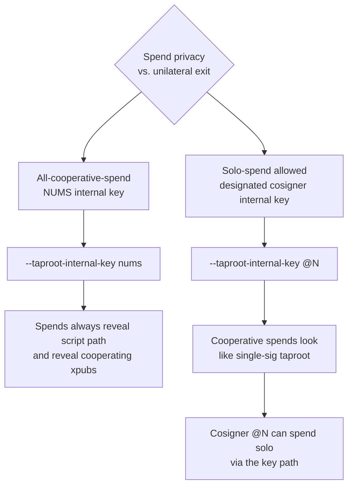

# Taproot multisig

Taproot multisig (`tr-multi-a` / `tr-sortedmulti-a`) puts the
cooperative-spend script in a **script-path leaf**, with a separate
**key-path internal key** that signs cooperatively when all cosigners
are online. The result is a Schnorr signature that looks identical
to a single-sig taproot spend on-chain — visually indistinguishable
from a wallet of one — while preserving the K-of-N script-path
fallback for non-cooperative spends.

This chapter covers the two key-path designs the toolkit supports:

- **NUMS** internal key — a verifiable nothing-up-my-sleeve point that
  cannot sign; forces all spends through the script path.
- **Designated cosigner** internal key — one cosigner's xpub is the
  key-path; that cosigner can spend solo via the key path; the others
  fall back to the script path.

:::primer
**Background — taproot multisig vs. Bitcoin multisig.** A pre-taproot
2-of-3 wallet (`wsh(sortedmulti(2,…))`) reveals the cosigner xpubs
on every spend, every time. Taproot multisig hides them: the
key-path spend reveals only one Schnorr signature; the script-path
spend reveals only the cooperating subset's xpubs (the *failure
mode* leaks more than the *happy path*). The privacy gain is real
but contingent on cooperative spends being the norm.
:::

:::danger
Examples below use the canonical BIP-39 test vector and two derived
test vectors. All three are **public**. Never engrave or fund a
wallet built from these seeds.
:::

## Key-path design choice



| Internal key | Solo-spendable by | On-chain footprint | When to choose |
|---|---|---|---|
| `nums` | nobody (BIP-341 reference NUMS point) | every spend reveals script | privacy-by-uniformity is less important than guaranteeing K-of-N enforcement on every spend |
| `@N` (cosigner xpub) | cosigner N alone (key path) | cooperative spend is single-sig-shaped; non-cooperative spend reveals script | privacy in cooperative spends matters; one cosigner is "primary" and the multisig is a recovery / coercion-resistance layer |

The toolkit accepts `--taproot-internal-key nums` for the NUMS-point
form and `--taproot-internal-key @N` for the designated-cosigner form.
If you specify `@2`, cosigner 2's xpub becomes the internal key and
cosigner 2 is *removed* from the script-path leaf set. The remaining
cosigners (0, 1) form the script-path `multi_a` leaf with adjusted
threshold.

## Step 1 — synthesise (NUMS internal key)

```sh
mnemonic bundle \
  --network mainnet \
  --template tr-sortedmulti-a \
  --threshold 2 \
  --taproot-internal-key nums \
  --slot @0.phrase="abandon abandon abandon abandon abandon abandon abandon abandon abandon abandon abandon about" \
  --slot @1.phrase="legal winner thank year wave sausage worth useful legal winner thank yellow" \
  --slot @2.phrase="letter advice cage absurd amount doctor acoustic avoid letter advice cage above" \
  --self-check
```

The descriptor inside md1 will be
`tr(NUMS_POINT,sortedmulti_a(2,@0,@1,@2))`. Spends always traverse
the script path; the NUMS point cannot sign.

## Step 2 — synthesise (designated cosigner)

```sh
mnemonic bundle \
  --network mainnet \
  --template tr-sortedmulti-a \
  --threshold 2 \
  --taproot-internal-key @2 \
  --slot @0.phrase="abandon abandon abandon abandon abandon abandon abandon abandon abandon abandon abandon about" \
  --slot @1.phrase="legal winner thank year wave sausage worth useful legal winner thank yellow" \
  --slot @2.phrase="letter advice cage absurd amount doctor acoustic avoid letter advice cage above" \
  --self-check
```

Cosigner 2's xpub becomes the key-path. The script-path leaf becomes
`sortedmulti_a(K=2, @0, @1)` — only cosigners 0 and 1 in the leaf,
because cosigner 2 has been promoted out. With `--threshold 2` and
two remaining cosigners, the script path requires unanimity of the
script-path participants.

For larger sets, the script-path threshold preserves the original K:
a `tr-multi-a` with K=3 across cosigners @0..@4 with
`--taproot-internal-key @4` gives a script-path `multi_a(3, @0, @1, @2, @3)`
— still K=3, just over the remaining four.

## Step 3 — verify and stamp

`mnemonic verify-bundle` accepts the same `--taproot-internal-key`
flag and re-derives the expected key-path point and script-path leaf
to verify the engraved cards match. The stamping ceremony is
identical to the [non-taproot multisig flow](#multi-source-2-of-3-multisig).

## Multi-leaf taproot

For more sophisticated taproot policies — multiple script-path
branches, e.g. "2-of-3 of cosigners A/B/C or timelock-recovery key
D" — supply a user-defined BIP-388 wallet policy directly:

```sh
mnemonic bundle \
  --network mainnet \
  --descriptor 'tr(@4,{multi_a(2,@0,@1,@2),and_v(v:older(52596),pk(@3))})' \
  --slot @0.phrase=<…> \
  --slot @1.phrase=<…> \
  --slot @2.phrase=<…> \
  --slot @3.phrase=<…> \
  --slot @4.phrase=<…>
```

Two script-path leaves (cooperative-multisig + emergency-timelock)
and a key-path internal key. The toolkit emits the wallet policy
bound to the five xpubs in the appropriate slots.

For a deep dive on writing safe multi-leaf taproot policies, the
authoritative reference is BIP-388 itself; the
[descriptors and BIP-388 primer](#appendix-d-descriptors-and-bip-388-primer)
gives a 1-page orientation.

## Variants

- **`tr-multi-a` (unsorted)** — same as `tr-sortedmulti-a` but the
  cosigner xpubs in the script-path leaf are *not* re-sorted. Use
  this only if you have a reason to fix cosigner order on-chain.
- **Single-sig taproot** — for a one-cosigner taproot wallet, prefer
  `--template bip86` (covered in
  [single-sig steel-engraved backup](#single-sig-steel-engraved-backup)).
- **Tapscript opcodes other than `multi_a`** — supply a
  `--descriptor` directly. The toolkit's user-supplied descriptor
  parser accepts the BIP-388 grammar.
