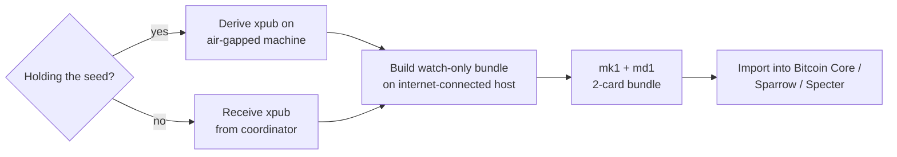

# Watch-only xpub bundle

Sometimes you want to *track* a wallet — see its balance, derive
addresses, monitor incoming transactions — without holding the seed.
The m-format star supports this via the **2-card watch-only bundle**:
mk1 + md1, no ms1. Without the secret card the wallet cannot sign,
but a watch-only client (Bitcoin Core / Sparrow / Specter) can
derive addresses and watch the chain.

:::primer
**Background — why watch-only matters.** A watch-only wallet sees
the blockchain as the spending wallet does, but cannot move funds.
Useful for monitoring (incoming-payment tracking, balance reporting),
auditing (publishing balance proofs), or coordinator workflows where
one party tracks the wallet's UTXOs and presents PSBTs to signers.
:::

## When to build a watch-only bundle



## Building a 2-card watch-only bundle from a phrase

(Same canonical test seed as [Chapter 22](#your-first-bundle); see
the DANGER box there.)

The two-step shape — first derive the xpub on the seed-holding
machine, then build the bundle on a watch-only host — keeps the
seed off the bundle-building host:

```sh
# Step 1 (on the air-gapped seed-holder)
mnemonic convert \
  --from phrase="abandon abandon abandon abandon abandon abandon abandon abandon abandon abandon abandon about" \
  --to xpub \
  --template bip84

# Step 2 (on the internet-connected host)
mnemonic bundle \
  --network mainnet \
  --template bip84 \
  --slot @0.xpub=<xpub from Step 1>
```

The output is an mk1 + md1 pair (no ms1, since no seed was passed).

For multisig watch-only, repeat `--slot @N.xpub=…` once per cosigner
and pass `--threshold K`:

```sh
mnemonic bundle \
  --network mainnet \
  --template wsh-sortedmulti \
  --threshold 2 \
  --slot @0.xpub=<xpub-cosigner-0> \
  --slot @1.xpub=<xpub-cosigner-1> \
  --slot @2.xpub=<xpub-cosigner-2>
```

The output is `3 mk1 + 1 md1 = 4 cards` for a 2-of-3 multisig. Each
cosigner can hold one mk1 (their public-key card) plus the shared
md1; alternatively, the watch-only operator holds all four.

## Importing a watch-only bundle

For a quick xpub re-derivation from mk1 + md1 alone:

```sh
# Recover xpub + fingerprint + path from mk1
mnemonic convert \
  --from mk1="<mk1-line-1> <mk1-line-2>" \
  --to xpub --to fingerprint --to path

# Recover wallet-policy template from md1
md decode <md1-line-1> <md1-line-2> <md1-line-3>
```

Compose the result into the watch-only artifact your wallet expects;
the [wallet-export workflow](#exporting-to-bitcoin-core-bip-388-sparrow-specter)
covers the four supported output formats.

## Privacy-preserving variant

For a watch-only bundle that does not reveal the master fingerprint
(useful for coordinator-side bundles that fan out to many cosigners),
add `--privacy-preserving`:

```sh
mnemonic bundle \
  --network mainnet \
  --template bip84 \
  --slot @0.xpub=<xpub> \
  --privacy-preserving
```

The mk1 emits a zero-fingerprint placeholder. Recovery software
re-derives the actual fingerprint from the seed at import time, so
the privacy property holds only as long as the watch-only bundle is
used standalone.
