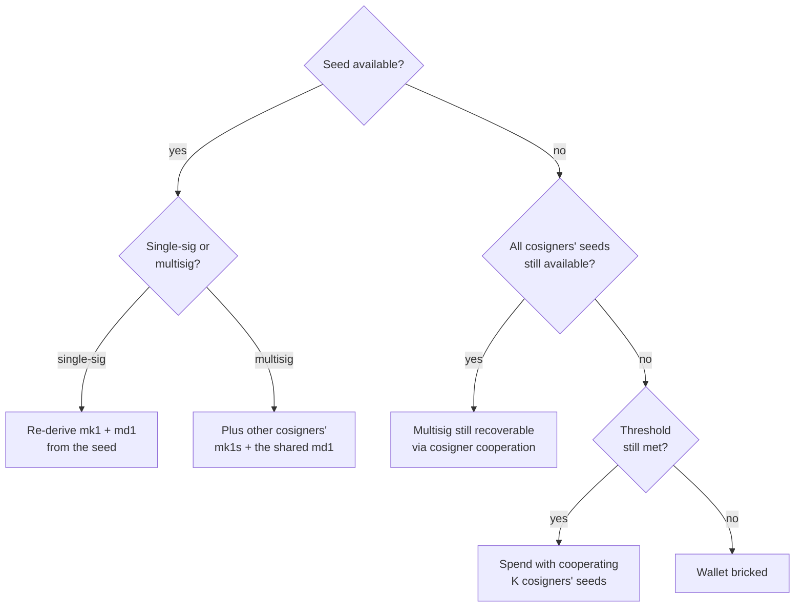

# Recovery paths by damaged-card scenario

Cards get scratched, water-damaged, partly-stamped, lost, or
confiscated. This chapter walks through what each failure mode means
for the wallet and how to recover, ordered roughly by frequency.

The single principle behind every scenario: **the seed reconstructs
everything else**. Public-key material (mk1, md1) is derivable from
the seed; only the seed itself is irreplaceable. So recovery paths
fan out from "do you still have a seed?".



## "I have my seed + passphrase — restore my wallet on a PC"

The headline recovery: you hold the seed (the words, or the `ms1` card)
and — if you used one — the BIP-39 passphrase, and you want to bring the
wallet up watch-only on a computer. `mnemonic restore` turns that secret
material into a watch-only restore document: the master fingerprint, the
first receive address(es), and the concrete single-sig descriptor(s),
ready to paste into wallet software.

**Verify the master fingerprint against your records *before* funding or
trusting any address.** The fingerprint is the cheapest
passphrase-correctness oracle: a wrong passphrase (or a transcription
slip in the seed) derives a *different* valid wallet, with a different
fingerprint, silently. Hard-gate it with `--expect-fingerprint` so a
mismatch fails loudly (exit 4) instead of handing you addresses for the
wrong wallet:

```sh
seed="abandon abandon abandon abandon abandon abandon abandon \
abandon abandon abandon abandon about"
printf '%s' "$seed" |
  mnemonic restore --from phrase=- --template bip84 \
    --expect-fingerprint 73c5da0a
```

Stdout leads with the verification line, then the descriptor + first
address:

```text
master fingerprint: 73c5da0a  (passphrase: none)
CONFIRM: this fingerprint matches the wallet you are restoring before importing any descriptor.

bip84 (native segwit P2WPKH):
  descriptor: wpkh([73c5da0a/84'/0'/0']xpub6CatWdiZiodmUeTDp8LT5or8nmbKNcuyvz7WyksVFkKB4RHwCD3XyuvPEbvqAQY3rAPshWcMLoP2fMFMKHPJ4ZeZXYVUhLv1VMrjPC7PW6V/<0;1>/*)#hpg6d6w2
  first recv: bc1qcr8te4kr609gcawutmrza0j4xv80jy8z306fyu
```

If you do not know which wallet type you used, omit `--template` to emit
all four (BIP-44/49/84/86) and match the address against your records.
If you used a passphrase, feed it through the stdin channel (the seed
then comes via `@env:` so neither secret touches the argv):

```sh
export RSEED="$seed"
printf 'YOUR-PASSPHRASE' |
  mnemonic restore --from phrase=@env:RSEED --template bip84 \
    --passphrase-stdin --expect-fingerprint <your-fingerprint>
```

If your seed lives on an `ms1` card rather than as words, restore reads
it directly — `--from ms1=ms10entr…` (or `--from ms1=-` to pipe it).
Restore is **watch-only-out and never signs** — it emits public keys,
addresses, and descriptors only, never `xprv` or WIF. To get an
importable wallet file rather than a bare descriptor, add `--format`
(e.g. `--format bitcoin-core` / `sparrow` / `coldcard`) with a single
`--template`; the payload then pipes from stdout and the verification
block goes to stderr. See [`mnemonic
restore`](../40-cli-reference/41-mnemonic.md#mnemonic-restore) for the
full flag reference.

**Multisig recovery (v0.44.0):** restore also reconstructs a **multisig**
wallet from its shared wallet-policy `md1` card — the card carries every
cosigner's public key, so the concrete watch-only multisig descriptor comes
from the card alone:

```sh
mnemonic restore --md1 <card-chunk> [--md1 <card-chunk> …]
```

Add `--from <your seed>` to prove which cosigner is yours, and/or
`--cosigner @N=<mk1|xpub>` to cross-check another cosigner's key; only the
positions you supply are marked verified (the verdict stays `PARTIAL`
otherwise). `wsh` / `sh(wsh)` and taproot NUMS multisig (`tr-multi-a` /
`tr-sortedmulti-a`) reconstruct; a non-NUMS cosigner-internal taproot `md1` is refused.
See [Multisig-cosigner restore](../40-cli-reference/41-mnemonic.md#multisig-cosigner-restore)
for the full reference.

## Single-sig wallet — single card lost

**Lost ms1**: re-derive from the seed phrase you remember:

```sh
mnemonic convert \
  --from phrase="<your phrase>" \
  --to ms1
```

Re-stamp.

**Lost mk1**: re-derive from the seed:

```sh
mnemonic convert \
  --from phrase="<your phrase>" \
  --to mk1 \
  --template bip84
```

Re-stamp.

**Lost md1**: derive a new one from xpub:

```sh
xpub=$(mnemonic convert --from phrase="<your phrase>" --to xpub --template bip84)
mnemonic bundle \
  --network mainnet \
  --template bip84 \
  --slot @0.xpub=$xpub
```

The `mk1` and `md1` emitted should match the originals (cross-check
with `verify-bundle` before discarding the originals); re-stamp the
md1 and the mk1 stays intact.

## Single-sig wallet — seed is the only thing left

If you have *only* the seed phrase (no cards), import the phrase
into a wallet that supports BIP-39 directly. Standard wallet apps
(Bitcoin Core, Sparrow, Electrum, hardware wallets) recover from
phrase; the m-format constellation bundle is a *backup*, not a *requirement*.

If you previously used a non-default template (BIP-86 taproot, for
example), specify it on import; the seed alone does not record the
template, only the m-format md1 does.

## Multisig wallet — one cosigner's ms1 lost

The other cosigners still have their seeds; the shared mk1 set and
md1 are intact. Recovery:

1. The cosigner with the missing ms1 re-derives it from their seed
   (if memorised) and re-stamps.
2. If the cosigner cannot recall their seed but the wallet's
   *threshold* remains met by the surviving cosigners, the wallet
   stays spendable. The compromised cosigner is replaced by a fresh
   key in a follow-up "key rotation" — synthesise a fresh seed,
   generate a new bundle replacing the lost cosigner's slot, and
   transfer all funds to the new wallet.

## Multisig wallet — md1 is lost or unreadable

Re-derive from any cosigner's xpub set:

```sh
mnemonic export-wallet \
  --template wsh-sortedmulti \
  --threshold 2 \
  --slot @0.xpub=<xpub-0> \
  --slot @1.xpub=<xpub-1> \
  --slot @2.xpub=<xpub-2> \
  --format bip388
```

Or rebuild the full bundle:

```sh
mnemonic bundle \
  --network mainnet \
  --template wsh-sortedmulti \
  --threshold 2 \
  --slot @0.xpub=<xpub-0> \
  --slot @1.xpub=<xpub-1> \
  --slot @2.xpub=<xpub-2>
```

The cross-binding `policy_id_stub` re-derives identically as long as
the cosigner xpubs and template are unchanged.

## Multisig wallet — partial card damage

The BCH error-correction codec located damage to a small number of
characters. The codec's error position diagnostic identifies *which*
character is wrong:

```sh
mnemonic convert --from ms1=ms10entrsqqQqqqqqqqqqqqqqqqqqqqqqqqqcj9sxraq34v7f --to phrase
```

Outputs (illustrative):

```text
error: ms1 BCH checksum failed
  position 11: invalid character 'Q' (expected 'q')
```

Manually correct the character (the codec narrows the candidate set
to typically 1-2 characters at the named position). For damage
beyond the codec's correction radius (more than a few errors), the
card is unrecoverable from itself — fall back to re-deriving from
the seed (or other cosigners' cards in multisig).

## Worst-case scenarios

| Scenario | Recoverable? |
|---|---|
| Single-sig, all cards intact | yes (trivially) |
| Single-sig, ms1 only | yes — import phrase into BIP-39 wallet |
| Single-sig, mk1 + md1 only | yes (watch-only); spending requires the seed |
| Single-sig, no ms1 + no seed | no |
| 2-of-3 multisig, 2 cosigners' ms1s + md1 | yes |
| 2-of-3 multisig, 1 cosigner's ms1 + md1 | watch-only only; spending requires another seed |
| 2-of-3 multisig, all 3 cosigners lose ms1 | no — wallet bricked |

## After recovery

Treat the recovered wallet as a *signal* that the original engraving
discipline was compromised. After moving funds:

1. Generate a fresh wallet with new entropy.
2. Stamp a new bundle.
3. Move funds.
4. Destroy the damaged plates carefully (they may still contain
   secrets even though the wallet is empty).
