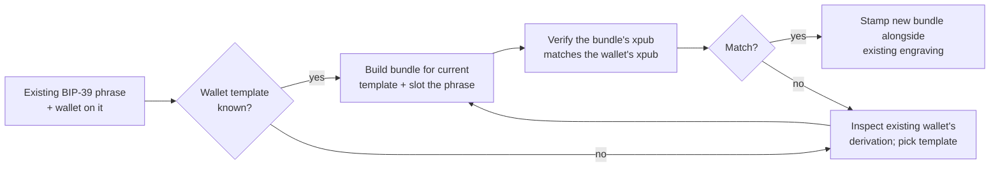

# Migrating from BIP-39-only to the m-format star

If you already keep your wallet on a BIP-39 phrase — engraved on
steel, stamped on washers, or memorised in your head — the m-format
star is a layer *on top of* what you have, not a replacement. The
seed phrase remains the secret. The bundle adds checksum-protected
encoding, descriptor binding, and a watch-only path that BIP-39
alone does not provide.

This chapter walks the *migration*: keeping your existing seed
phrase intact while adding the three-card bundle alongside.

:::primer
**Background — what BIP-39 alone misses.** A 12-word phrase
recovers a wallet *if and only if* you also remember the
derivation. For a default BIP-84 mainnet wallet, most software
guesses correctly. For BIP-86 taproot, BIP-49 nested-segwit, a
non-zero account index, or any multisig setup, the derivation is
unstated by the phrase alone. Worse, transcription errors in steel
engraving silently corrupt valid words into different valid words —
a 12-word phrase has no per-word checksum. The m-format ms1 card
fixes both issues: BCH error correction, plus the policy-side
binding that names the wallet's spending rule.
:::

## Migration paths



## Step 1 — identify your wallet's template

Look in your wallet's settings or descriptor export. Common cases:

| Wallet UI says | Template flag |
|---|---|
| "Native SegWit (bech32)" / `bc1q…` addresses | `--template bip84` |
| "Taproot (bech32m)" / `bc1p…` addresses | `--template bip86` |
| "Nested SegWit" / `3…` addresses | `--template bip49` |
| "Legacy" / `1…` addresses | `--template bip44` |
| Multisig (any) | `--template wsh-sortedmulti` (most common) |

If your wallet exports a BIP-388 wallet policy or a descriptor
string directly, prefer that:

```sh
mnemonic bundle \
  --network mainnet \
  --descriptor 'wpkh([73c5da0a/84h/0h/0h]xpub.../<0;1>/*)' \
  --slot @0.phrase="<your phrase>"
```

The toolkit accepts any BIP-388-conformant descriptor.

## Step 2 — build the bundle

Once the template is known:

```sh
mnemonic bundle \
  --network mainnet \
  --template <template> \
  --account <account-index> \
  --slot @0.phrase="<your phrase>" \
  --self-check
```

The default `--account 0` matches most wallets. Hardware wallets
sometimes use `--account 1` and up; check your device's documentation.

## Step 3 — verify the xpub agrees

The most important migration check: does the toolkit's mk1 carry
the *same* xpub your wallet currently uses? Mismatch means the
template / account / network is wrong, and a wallet built from the
bundle would diverge from your existing wallet — fund-loss risk.

```sh
# Extract the xpub the bundle would emit
mnemonic convert \
  --from phrase="<your phrase>" \
  --to xpub \
  --template <template> \
  --account <account-index>

# Compare against your wallet's "Show xpub" dialog
```

If they agree, you've matched the wallet. If they don't, iterate on
template/account until they do — *do not stamp a bundle whose xpub
doesn't match the wallet you intended to back up*.

## Step 4 — stamp the new bundle alongside

The migration is non-destructive: leave the existing BIP-39 plate
alone, stamp the three new m-format plates as additional backup.
After verification, you can choose to retire the BIP-39 plate, but
there's no rush — the bundle and the BIP-39 plate are
interoperable.

## Migrating multisig wallets

If your existing wallet is multisig with cosigners on hardware
devices:

1. Each cosigner exports their xpub from their hardware wallet.
2. The coordinator builds the bundle from xpubs only (no phrases):

   ```sh
   mnemonic bundle \
     --network mainnet \
     --template wsh-sortedmulti \
     --threshold K \
     --slot @0.xpub=<xpub from cosigner 0> \
     --slot @1.xpub=<xpub from cosigner 1> \
     --slot @2.xpub=<xpub from cosigner 2>
   ```

3. Each cosigner additionally produces their own ms1 from their
   own seed on their own air-gapped device:

   ```sh
   mnemonic convert --from phrase="<their phrase>" --to ms1
   ```

4. Verify the resulting bundle's xpub set matches the existing
   wallet's xpub set.

## Things to *not* do during migration

- **Don't share phrases between cosigners during migration.** If
  the original wallet was set up with each cosigner on their own
  device, preserve that property. The bundle workflow allows
  full air-gapped migration; use it.
- **Don't migrate without verifying xpubs.** A wrong-template
  bundle that ships will look like a backup but recover a different
  wallet.
- **Don't destroy the BIP-39 plate before round-trip-testing the
  bundle.** Run `mnemonic verify-bundle` against the engraved cards
  *and* derive an address from the resulting xpub *and* compare
  against an existing wallet address before discarding any backup.
