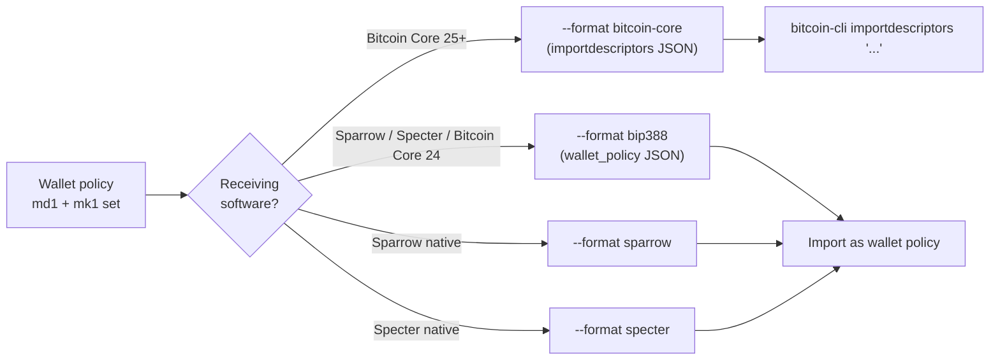

# Exporting to Bitcoin Core / BIP-388 / Sparrow / Specter

The bundle's md1 card carries the wallet policy (template + bound
xpubs). To turn that into a watch-only wallet your monitoring
software can import, run `mnemonic export-wallet`. The subcommand
emits the same wallet in any of four interchange formats; pick the
one your software wants.

## Format selection



## Bitcoin Core (default format)

Bitcoin Core's `importdescriptors` RPC accepts a JSON array; the
toolkit's default output matches:

```sh
mnemonic export-wallet \
  --template bip84 \
  --slot @0.xpub=<xpub> \
  --network mainnet \
  --range 0,999 \
  --timestamp now
```

Output is a JSON array with the descriptor, its `range`, the
`timestamp`, and the `internal` flag for receive vs. change. Pipe
into `bitcoin-cli`:

```sh
bitcoin-cli importdescriptors "$(mnemonic export-wallet --template bip84 --slot @0.xpub=<xpub>)"
```

For a multisig wallet, repeat `--slot @N.xpub` and add `--threshold K`.

The `--bitcoin-core-version` flag controls compatibility:
`--bitcoin-core-version 24` emits the older format; `25` (the
default) is current.

## BIP-388 wallet policy

Bitcoin Core 24+, Sparrow, Specter, Coldcard, and most modern
wallets accept BIP-388 wallet policies:

```sh
mnemonic export-wallet \
  --template wsh-sortedmulti \
  --threshold 2 \
  --slot @0.xpub=<xpub-0> \
  --slot @1.xpub=<xpub-1> \
  --slot @2.xpub=<xpub-2> \
  --format bip388
```

Output is the canonical BIP-388 JSON shape:

```json
{
  "name": "wsh-sortedmulti-2-of-3",
  "description": "",
  "policy_template": "wsh(sortedmulti(2,@0/<0;1>/*,@1/<0;1>/*,@2/<0;1>/*))",
  "keys_info": [
    "[fp0/48h/0h/0h/2h]xpub...",
    "[fp1/48h/0h/0h/2h]xpub...",
    "[fp2/48h/0h/0h/2h]xpub..."
  ]
}
```

## Sparrow native format

```sh
mnemonic export-wallet \
  --template wsh-sortedmulti \
  --threshold 2 \
  --slot @0.xpub=<xpub-0> \
  --slot @1.xpub=<xpub-1> \
  --slot @2.xpub=<xpub-2> \
  --format sparrow \
  --output sparrow-wallet.json
```

The Sparrow native format is similar to BIP-388 with Sparrow-specific
metadata (label, scripts, gap-limit hints). Import via Sparrow's
*File → Import* dialog.

## Specter native format

```sh
mnemonic export-wallet \
  --template wsh-sortedmulti \
  --threshold 2 \
  --slot @0.xpub=<xpub-0> \
  --slot @1.xpub=<xpub-1> \
  --slot @2.xpub=<xpub-2> \
  --format specter
```

Specter's native config follows its own JSON conventions. Import via
the Specter HTTP API or the *Add Wallet* UI.

## From a user-supplied descriptor

If you have a descriptor string that doesn't match a built-in
template:

```sh
mnemonic export-wallet \
  --descriptor 'tr(NUMS,sortedmulti_a(2,@0,@1,@2))' \
  --slot @0.xpub=<xpub-0> \
  --slot @1.xpub=<xpub-1> \
  --slot @2.xpub=<xpub-2> \
  --format bip388
```

The toolkit accepts any BIP-388-conformant descriptor and binds the
slotted xpubs into it.

## Taproot multisig export

Taproot multisig requires the `--taproot-internal-key` flag (mirrors
`bundle`):

```sh
mnemonic export-wallet \
  --template tr-sortedmulti-a \
  --threshold 2 \
  --taproot-internal-key nums \
  --slot @0.xpub=<xpub-0> \
  --slot @1.xpub=<xpub-1> \
  --slot @2.xpub=<xpub-2> \
  --format bip388
```

For the cosigner-as-internal-key variant, use `--taproot-internal-key @N`.
See [Taproot multisig](#taproot-multisig) for the design choice.

## Tips

- **Range.** The `--range 0,999` default covers the first 1000
  addresses. Increase if you've used more (e.g., a heavily-used
  exchange wallet). Bitcoin Core re-scans the chain for the
  imported range; large ranges cost time, not safety.
- **Timestamp.** `--timestamp now` skips re-scan (assumes the wallet
  has no historical transactions before "now"). Use a unix-seconds
  value to re-scan from a specific epoch — e.g. `--timestamp 1700000000`
  for late 2023.
- **Output redirect.** Use `--output file.json` (or `> file.json`)
  to keep the JSON out of your shell history and ready for
  piped import.
