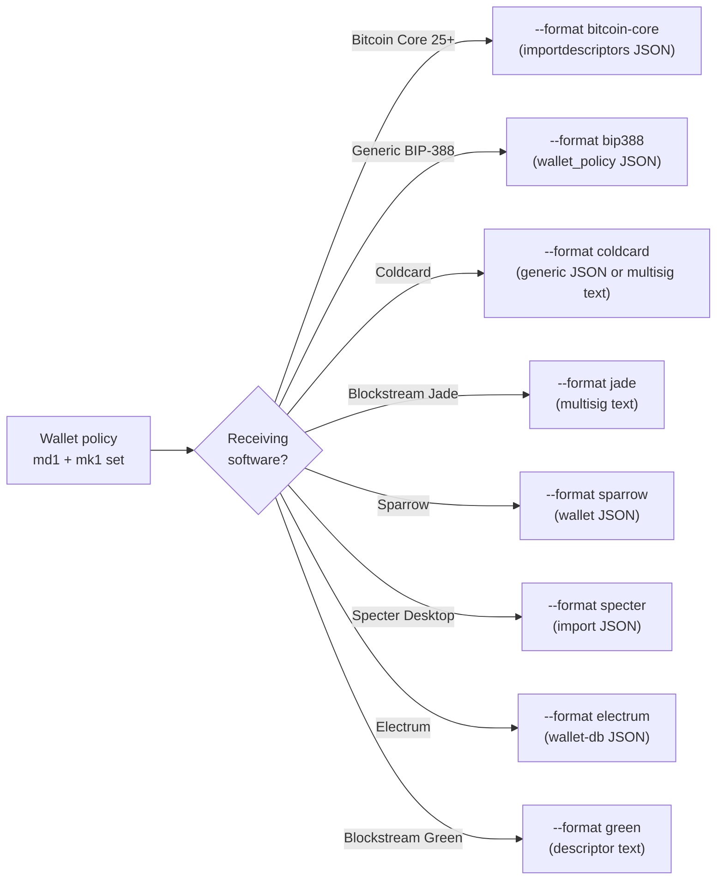

# Exporting to Bitcoin Core / BIP-388 / vendor formats

The bundle's md1 card carries the wallet policy (template + bound
xpubs). To turn that into a watch-only wallet your monitoring
software can import, run `mnemonic export-wallet`. The subcommand
emits the same wallet in any of eight interchange formats (v0.8.1
expanded the original four with `coldcard`, `jade`, `sparrow`,
`specter`, `electrum`, `green`); pick the one your software wants.

## Format selection



## Bitcoin Core (default format)

Bitcoin Core's `importdescriptors` RPC accepts a JSON array; the
toolkit's default output matches:

```sh
mnemonic export-wallet \
  --template bip84 \
  --slot @0.xpub=<xpub> \
  --network mainnet \
  --range 0,999 \
  --timestamp now
```

Output is a JSON array with the descriptor, its `range`, the
`timestamp`, and the `internal` flag for receive vs. change. Pipe
into `bitcoin-cli`:

```sh
bitcoin-cli importdescriptors "$(mnemonic export-wallet --template bip84 --slot @0.xpub=<xpub>)"
```

For a multisig wallet, repeat `--slot @N.xpub` and add `--threshold K`.

The `--bitcoin-core-version` flag controls compatibility:
`--bitcoin-core-version 24` emits the older format; `25` (the
default) is current.

## BIP-388 wallet policy

Bitcoin Core 24+, Sparrow, Specter, Coldcard, and most modern
wallets accept BIP-388 wallet policies:

```sh
mnemonic export-wallet \
  --template wsh-sortedmulti \
  --threshold 2 \
  --slot @0.xpub=<xpub-0> \
  --slot @1.xpub=<xpub-1> \
  --slot @2.xpub=<xpub-2> \
  --format bip388
```

Output is the canonical BIP-388 JSON shape:

```json
{
  "name": "wsh-sortedmulti-2-of-3",
  "description": "",
  "description_template": "wsh(sortedmulti(2,@0/**,@1/**,@2/**))",
  "keys_info": [
    "[fp0/87h/0h/0h]xpub...",
    "[fp1/87h/0h/0h]xpub...",
    "[fp2/87h/0h/0h]xpub..."
  ]
}
```

(The default `--multisig-path-family bip87` produces `m/87'/0'/0'`
paths. For Coldcard / SeedSigner / older-Sparrow compatibility, add
`--multisig-path-family bip48` and the paths become `m/48'/0'/0'/2'`.)

## Sparrow + Specter (currently via BIP-388)

`--format sparrow` and `--format specter` are accepted by the
binary but currently return a deferral stub:

```text
error: --format <sparrow> is deferred to a future release; use
--format bitcoin-core or --format bip388 instead.
```

For now, export as BIP-388 and import via the receiving wallet's
BIP-388-aware path:

```sh
mnemonic export-wallet \
  --template wsh-sortedmulti \
  --threshold 2 \
  --slot @0.xpub=<xpub-0> \
  --slot @1.xpub=<xpub-1> \
  --slot @2.xpub=<xpub-2> \
  --format bip388 \
  --output wallet-policy.json
```

Sparrow consumes wallet-policy JSON via *File → Import → Wallet
Policy*. Specter accepts BIP-388 via the *Add Wallet → Import → Multisig*
flow. Native Sparrow / Specter shapes will land if a future toolkit
release lights up the format stubs.

## From a user-supplied descriptor

If you have a descriptor string that doesn't match a built-in
template:

```sh
mnemonic export-wallet \
  --descriptor 'tr(NUMS,sortedmulti_a(2,@0,@1,@2))' \
  --slot @0.xpub=<xpub-0> \
  --slot @1.xpub=<xpub-1> \
  --slot @2.xpub=<xpub-2> \
  --format bip388
```

The toolkit accepts any BIP-388-conformant descriptor and binds the
slotted xpubs into it.

## Taproot multisig export

Taproot multisig requires the `--taproot-internal-key` flag (mirrors
`bundle`):

```sh
mnemonic export-wallet \
  --template tr-sortedmulti-a \
  --threshold 2 \
  --taproot-internal-key nums \
  --slot @0.xpub=<xpub-0> \
  --slot @1.xpub=<xpub-1> \
  --slot @2.xpub=<xpub-2> \
  --format bip388
```

For the cosigner-as-internal-key variant, use `--taproot-internal-key @N`.
See [Taproot multisig](#taproot-multisig) for the design choice.

## All four single-sig types from one seed

`export-wallet` is watch-only: it binds an account *xpub* (one BIP
path), never a seed. To emit all four BIP-defined single-sig wallet
types from one seed — BIP-44 (P2PKH), BIP-49 (P2SH-P2WPKH), BIP-84
(P2WPKH), BIP-86 (P2TR) — compose two commands and loop: derive each
type's *public* account xpub with `convert`, then bind it with
`export-wallet`. The seed is consumed by `convert` to produce a public
key and never reaches `export-wallet`, so the watch-only boundary holds.

The master fingerprint identifies the master key independent of the
derivation path, so it is the same for all four types — derive it once:

```sh
read -rs PHRASE   # read from stdin: keeps the seed off argv / out of /proc

mfp=$(printf '%s' "$PHRASE" \
  | mnemonic convert --from phrase=- --to fingerprint --template bip84 \
  | sed 's/^fingerprint: //')

for t in bip44 bip49 bip84 bip86; do
  xpub=$(printf '%s' "$PHRASE" \
    | mnemonic convert --from phrase=- --to xpub --template "$t" \
    | sed 's/^xpub: //')
  mnemonic export-wallet \
    --template "$t" \
    --slot "@0.xpub=$xpub" \
    --slot "@0.fingerprint=$mfp" \
    --format bitcoin-core \
    --output "wallet-$t.json"
done
```

Each `wallet-<type>.json` is a Bitcoin Core `importdescriptors` array
with the correct origin — e.g. for BIP-84, using the all-zeros BIP-39
test seed (master fingerprint `73c5da0a`; see
[Test seeds and example data](#appendix-f-test-seeds-and-example-data)):

```text
wpkh([73c5da0a/84'/0'/0']xpub6CatWdiZiodmU.../0/*)#...
```

Use `--format bitcoin-core` for this recipe: its `importdescriptors`
array is the one interchange shape that holds several descriptors in a
single artifact (you can even concatenate all four into one array for a
single import). The single-wallet file formats (`coldcard`, `electrum`,
`green`, …) describe one wallet per file, so for those the loop writes
four separate files, as `--output wallet-$t.json` above already does.

For just the **receive/change addresses** (not an import artifact),
`addresses` reads the seed directly — loop the four script types:

```sh
read -rs PHRASE
for st in p2pkh p2sh-p2wpkh p2wpkh p2tr; do
  echo "# $st"
  printf '%s' "$PHRASE" | mnemonic addresses --from phrase=- --address-type "$st" --count 3
done
```

## Concrete descriptor ↔ bundle round-trip

`md1` is **keyless by design**: a wallet card carries the BIP-388 `@N`
*template* (the script policy), not any keys. A *concrete* descriptor —
the template with each `@N` resolved to a real `[fingerprint/path]xpub`
key — is therefore a **bundle-level artifact**: it pairs the `md1`
template with the `mk1` cosigner xpubs. That is why the concrete
descriptor in/out lives at the toolkit (full-bundle) layer and is **not**
an `md`-CLI feature.

This gives a closed loop: a concrete descriptor can be turned **into**
cards (`bundle --descriptor`, watch-only) and an existing bundle can be
emitted **back out** as a bare concrete descriptor
(`export-wallet … --format descriptor`).

### IN — concrete descriptor → cards

Feed a concrete (or `@N`-template) descriptor plus the per-placeholder
xpubs to `bundle`; the cards are synthesised watch-only:

```sh
x0=xpub6DBjiYnc4ewKti13Q1L35bqdodw5z3VGJnf516B3icHrEGEUcCuCG5GVQDZtH8Xmsyt3Fs9YDNwLaqjUbbRidwXZ6sxufZcr4VqqzrXvicM
x1=xpub6DVvJu3xFotP7byMCoCa9B5EmDcCo9Yznz7kuEogMemnYTMumxxCnXhk1pfJZHPuoX79HbjaeAgnUVvf4kdrsRCyCeWEaA1ScWhHa75ENr8

mnemonic bundle \
  --network mainnet \
  --descriptor 'wsh(sortedmulti(2,@0,@1))' \
  --slot "@0.xpub=$x0" \
  --slot "@1.xpub=$x1"
```

This emits the steel-engravable `md1` template card plus one `mk1` card
per cosigner (no `ms1` — descriptor mode is watch-only). See
[From a user-supplied descriptor](#from-a-user-supplied-descriptor) for
the full bundle layout.

### OUT — bundle → bare concrete descriptor

`--format descriptor` emits exactly one line — the canonical descriptor
with its BIP-380 checksum, `<descriptor>#<checksum>` — and nothing else
(no JSON, no wallet-file wrapper). It works for single-sig and multisig
alike.

The most direct form binds an account xpub straight to a template. Add
`--slot @N.fingerprint=<mfp>` for a real key origin — without it the
origin defaults to the all-zeros `[00000000/…]` placeholder (derive the
master fingerprint once with `convert`, exactly as in the four-types
recipe above):

```sh
read -rs PHRASE

mfp=$(printf '%s' "$PHRASE" \
  | mnemonic convert --from phrase=- --to fingerprint --template bip84 \
  | sed 's/^fingerprint: //')
xpub=$(printf '%s' "$PHRASE" \
  | mnemonic convert --from phrase=- --to xpub --template bip84 \
  | sed 's/^xpub: //')

mnemonic export-wallet \
  --template bip84 \
  --slot "@0.xpub=$xpub" \
  --slot "@0.fingerprint=$mfp" \
  --format descriptor
```

For the all-zeros BIP-39 test seed (master fingerprint `73c5da0a`) this
prints:

```text
wpkh([73c5da0a/84'/0'/0']xpub6CatWdiZiodmU.../<0;1>/*)#hpg6d6w2
```

To round-trip an **existing** bundle (or any imported wallet) back to a
descriptor, pipe an `import-wallet --json` envelope through
`--from-import-json`. The descriptor body is reproduced losslessly
(only the checksum is recomputed):

```sh
mnemonic import-wallet --blob wallet.json --format sparrow --json \
  | mnemonic export-wallet --from-import-json - --format descriptor
```

For the `sparrow-multisig-2of3-p2wsh-sortedmulti` example wallet this
prints:

```text
wsh(sortedmulti(2,[b8688df1/48'/0'/0'/2']xpub6FQya.../<0;1>/*,[28645006/48'/0'/0'/2']xpub6DnEB.../<0;1>/*,[5436d724/48'/0'/0'/2']xpub6Buxw.../<0;1>/*))#he0ej3xr
```

### Caveats

- **Taproot via `--from-import-json` is refused.** The import path does
  not surface a taproot internal-key designation (NUMS vs raw x-only),
  so `export-wallet --from-import-json … --format descriptor` rejects
  `tr(...)` envelopes. Emit a taproot descriptor through the direct
  passthrough door instead — supply the concrete `tr(...)` body to
  `--descriptor`:

  ```sh
  mnemonic export-wallet \
    --descriptor 'tr([73c5da0a/86h/0h/0h]xpub6CatWdiZiodmU.../<0;1>/*)' \
    --format descriptor
  ```

- **`--format descriptor` vs `--format green`.** `descriptor` emits the
  raw canonical descriptor for **any** policy (single-sig or multisig).
  `green` emits Blockstream Green's wallet text and is **single-sig
  only**. Pick `descriptor` whenever you want the policy-agnostic
  descriptor string itself.

## Tips

- **Range.** The `--range 0,999` default covers the first 1000
  addresses. Increase if you've used more (e.g., a heavily-used
  exchange wallet). Bitcoin Core re-scans the chain for the
  imported range; large ranges cost time, not safety.
- **Timestamp.** The default is `--timestamp 0` (rescan from genesis),
  so Bitcoin Core discovers an existing key's full transaction history —
  the right choice when importing a wallet you may already have used.
  Pass `--timestamp now` to skip the re-scan (assumes the wallet has no
  historical transactions before "now"), or a unix-seconds value to
  re-scan from a specific epoch — e.g. `--timestamp 1700000000` for late
  2023. (The example above passes `now` explicitly to show the flag.)
- **Output redirect.** Use `--output file.json` (or `> file.json`)
  to keep the JSON out of your shell history and ready for
  piped import.

## Coldcard multisig text (worked example)

Coldcard's multisig wallet-import format is a small text file with
exactly five line-types: `Name:`, `Policy:`, `Derivation:`,
`Format:`, and one `<XFP>: xpub...` line per cosigner. The same
shape is accepted byte-for-byte by Blockstream Jade
(`--format jade` delegates to Coldcard's emitter).

The 2-of-3 wsh-sortedmulti export below uses three Trezor-style test
xpubs at the BIP-48 wsh path `m/48'/0'/0'/2'`:

```sh
mnemonic export-wallet \
  --format coldcard \
  --template wsh-sortedmulti \
  --threshold 2 \
  --multisig-path-family bip48 \
  --network mainnet \
  --wallet-name "VaultColdStorage" \
  --slot @0.xpub=xpub6FQya7zGhR92kacYsNnjreouvnHJMpXYsUXnW6NJJAJRCKsa26TzDy4LdnGhEurr3d6y1J8PJ7EEMKQp74XTqYvmGJNogYXSKDszYHtF8mX \
  --slot @0.fingerprint=b8688df1 \
  --slot @0.path=m/48\'/0\'/0\'/2\' \
  --slot @1.xpub=xpub6DnEBNkSJKBYQmsbhS1sP9cNdtU5c9PLFGCjTJmxicxc13WB8zNNGQazabQpyFAGW5bV9tMko4uBxDxjUKL6dSAcx1tEbgEHtgSqyRsekh6 \
  --slot @1.fingerprint=28645006 \
  --slot @1.path=m/48\'/0\'/0\'/2\' \
  --slot @2.xpub=xpub6Buxw9MmbkJr4iAw8SACNci2hQNuPCMwt9P7HkK62ZQAW9UcJaQ2bc6ARD892TToQQ9Rp6AHujHxBLXqAsvn5fRnLfnhKSRfz8qtaoyKUYx \
  --slot @2.fingerprint=5436d724 \
  --slot @2.path=m/48\'/0\'/0\'/2\' \
  --output coldcard-multisig.txt
```

Output (`coldcard-multisig.txt`):

```text
Name: VaultColdStorage
Policy: 2 of 3
Derivation: m/48'/0'/0'/2'
Format: P2WSH
5436D724: xpub6Buxw9MmbkJr4iAw8SACNci2hQNuPCMwt9P7HkK62ZQAW9UcJaQ2bc6ARD892TToQQ9Rp6AHujHxBLXqAsvn5fRnLfnhKSRfz8qtaoyKUYx
28645006: xpub6DnEBNkSJKBYQmsbhS1sP9cNdtU5c9PLFGCjTJmxicxc13WB8zNNGQazabQpyFAGW5bV9tMko4uBxDxjUKL6dSAcx1tEbgEHtgSqyRsekh6
B8688DF1: xpub6FQya7zGhR92kacYsNnjreouvnHJMpXYsUXnW6NJJAJRCKsa26TzDy4LdnGhEurr3d6y1J8PJ7EEMKQp74XTqYvmGJNogYXSKDszYHtF8mX
```

Vendor-specific details encoded here:

- **Cosigner order.** For `wsh-sortedmulti` (and `sh-wsh-sortedmulti`)
  the cosigner lines are sorted lexicographically by xpub, matching
  Bitcoin Core's `sortedmulti` consensus rule. For the unsorted
  variants (`wsh-multi` / `sh-wsh-multi`) cosigners appear in
  slot-index order (`@0`, `@1`, `@2`).
- **XFP case.** Coldcard expects uppercase 8-hex master fingerprints
  on cosigner lines. The slot input `@N.fingerprint=` accepts
  either case; the emitter upcases.
- **xpub form.** BIP-32 base58 form (`xpub.../xprv...`); SLIP-132
  variants (`Zpub` / `Vpub` — capital, multisig) are NOT used on
  cosigner lines per the Coldcard format, even though the toolkit
  accepts them on the slot input (and normalizes to BIP-32 internally).
- **`Format:`.** `P2WSH` for `wsh-*` templates; `P2SH-P2WSH` for `sh-wsh-*`.
- **`Derivation:`.** A single line whose value is the shared origin
  path across cosigners (if all match); falls back to the Coldcard
  convention `m/0'/0'` if cosigners disagree.
- **`Name:` truncation.** Capped at 20 Unicode scalar values per the
  Coldcard reference format; non-ASCII names are truncated at
  codepoint granularity (not byte) so multi-byte sequences are not
  split.

The same text is byte-identical to Jade's
`register_multisig.multisig_file` — switch `--format coldcard` to
`--format jade` and the output is the same file. Both Coldcard and
Jade firmware import this file via SD-card or QR-stream.

Taproot multisig (`tr-multi-a` / `tr-sortedmulti-a`) is not yet
supported by either Coldcard or Jade firmware (tracked under
FOLLOWUPS `coldcard-tr-multi-a-pending-firmware` and
`jade-tr-multi-a-pending-firmware`). For taproot multisig setup,
use `--format bitcoin-core` (descriptor) or `--format sparrow`
(which supports taproot multisig via descriptor-passthrough).
