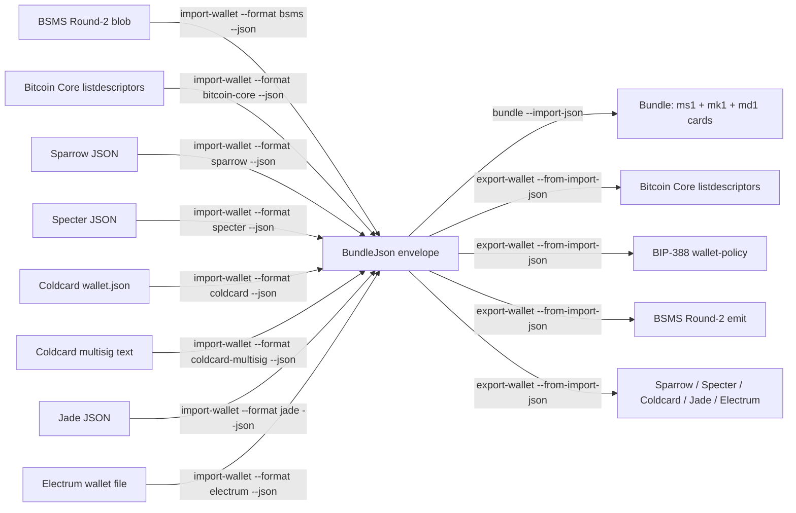

# Cross-format wallet conversion (v0.28.0)

Imagine a hardware-wallet coordinator hands you a BSMS Round-2 blob
describing a 2-of-3 multisig wallet, but the watch-only tool you want
to run is Bitcoin Core. Or you have a Sparrow wallet export and you
want to migrate it to a Coldcard. Or you have an Electrum 4.x wallet
file and you need to register it with a BSMS-Round-2-consuming
coordinator.

v0.28.0 makes any of these a single pipeline. The eight **source
formats** the `import-wallet` surface accepts —

- BSMS Round-2 (BIP-129)
- Bitcoin Core `listdescriptors`
- Sparrow Wallet JSON
- Specter-DIY JSON
- Coldcard single-sig `wallet.json`
- Coldcard multisig text
- Blockstream Jade
- Electrum 4.x wallet file

— each flow into the toolkit's **canonical `BundleJson` envelope** via
`import-wallet --json`, and any **destination** (`bundle` synthesis
or any `export-wallet --format X`) consumes that envelope via
`--import-json` / `--from-import-json`. The envelope is the inter-
format mediator — wallet-format vendors don't need pairwise adapters.



## Recipe 1 — BSMS Round-2 → Bitcoin Core listdescriptors

Goal: a coordinator-supplied BSMS Round-2 blob describes a 2-of-3
`sh(multi(2, ...))` wallet; you want a Bitcoin Core `importdescriptors`-
compatible JSON to feed `bitcoin-cli`.

```sh
mnemonic import-wallet --format bsms --blob coordinator.bsms.txt --json \
  | mnemonic export-wallet --from-import-json - --format bitcoin-core \
  > core-import.json
```

Then on Bitcoin Core:

```sh
bitcoin-cli createwallet "from-coordinator" true true "" false true
bitcoin-cli -rpcwallet=from-coordinator importdescriptors "$(cat core-import.json)"
```

The output JSON carries two descriptors — receive (`/0/*`) and change
(`/1/*`) — both flagged `active: true`. Bitcoin Core's
`importdescriptors` accepts the array as-is and provisions the wallet.

## Recipe 2 — Bitcoin Core listdescriptors → fresh m-format bundle

Goal: an existing Bitcoin Core `listdescriptors` JSON describes a
single-sig BIP-84 wallet (`wpkh(...)`); you want to materialize the
canonical m-format `ms1` / `mk1` / `md1` engraving cards.

The Bitcoin Core JSON is descriptor-mode; `bundle --import-json` reads
it and synthesizes the toolkit's canonical cards via
`synthesize_descriptor`:

```sh
bitcoin-cli -rpcwallet=mywallet listdescriptors > wallet.json

# Filter to active-receive only (drops the parallel `/1/*` change
# descriptor — same wallet, just the change chain).
mnemonic import-wallet --format bitcoin-core --blob wallet.json \
  --select-descriptor active-receive --json \
  > envelope.json

# Synthesize ms1/mk1/md1 cards from the envelope.
mnemonic bundle --network mainnet --import-json envelope.json
```

The result is a watch-only bundle (`mode: "watch-only"`,
`ms1: [""]`) carrying the wallet's xpub via `mk1` and the descriptor
via `md1`. To attach a seed for the single cosigner (e.g., the wallet
owner's BIP-39 phrase), supply `--slot @0.phrase=...`:

```sh
mnemonic bundle --network mainnet \
  --import-json envelope.json \
  --slot @0.phrase="abandon abandon abandon abandon abandon abandon abandon abandon abandon abandon abandon about"
```

The bundle synthesizer re-derives the xpub from the supplied phrase at
the envelope's `m/84'/0'/0'` origin path and asserts equality against
the blob's xpub. Mismatch returns exit 4 (`ImportWalletSeedMismatch`).

## Recipe 3 — BSMS Round-2 → BIP-388 wallet-policy

For wallets that consume BIP-388 wallet-policy JSON (the format
specified for "self-custodied multisig"), the same pipeline applies:

```sh
mnemonic import-wallet --format bsms --blob multisig.bsms --json \
  | mnemonic export-wallet --from-import-json - --format bip388 \
  > policy.json
```

The output carries the canonical `description_template` (e.g.,
`sh(multi(2,@0/**,@1/**,@2/**))`) and `keys_info` array with the three
cosigner xpubs prefixed by their `[fingerprint/path]` origin
annotations.

> **Note on destination scope.** The envelope mediator
> (`--from-import-json` on the `export-wallet` side) requires the
> destination to be *descriptor-capable*: at v0.28.0 that means
> `bitcoin-core`, `bip388`, and `bsms`. Template-only destinations
> (`sparrow`, `specter`, `coldcard`, `coldcard-multisig`, `jade`,
> `electrum`, `green`) refuse the envelope with `--format <X>
> requires --template` and must be reached by supplying the
> originating seed phrase + `--template` flag directly to
> `export-wallet`. Recipes 4-8 below all target descriptor-capable
> sinks; vendor-to-vendor migrations through template-only sinks
> require an intermediate step through one of the descriptor-capable
> formats (typically `bsms` or `bitcoin-core`) plus an out-of-band
> re-emit into the vendor's native shape.

## Recipe 4 — Sparrow → BSMS Round-2 (for Coldcard coordinator)

Goal: a Sparrow Desktop 2-of-3 P2WSH wallet export needs to be re-
emitted as a BIP-129-canonical BSMS Round-2 blob that a Coldcard Mk4 /
Q coordinator can ingest.

```sh
mnemonic import-wallet --format sparrow \
  --blob sparrow-multisig-2of3-p2wsh-sortedmulti.json --json \
  | mnemonic export-wallet --from-import-json - --format bsms \
  > coordinator.bsms.txt
```

The resulting `coordinator.bsms.txt` is a 4-line BSMS Round-2 blob
(`BSMS 1.0` header, descriptor with `#<checksum>`, path-restrictions,
first address). See chapter 45 § BSMS Round-2 for the full shape spec.
Copy it to the Coldcard's microSD via the "Multisig Wallets > Make
Multisig Wallet > BSMS" path.

The Sparrow → BSMS round-trip drops Sparrow-specific provenance
fields (`label`, `policy_type` enum tag, `script_type` string) since
BSMS Round-2 has no slot for them; they remain accessible in the
envelope's `bundle.import_provenance.sparrow` field for audit.

## Recipe 5 — Specter → Bitcoin Core

Goal: a Specter-DIY singlesig export needs to be loaded into a Bitcoin
Core node for monitoring.

```sh
mnemonic import-wallet --format specter \
  --blob specter-singlesig-p2wpkh.json --json \
  | mnemonic export-wallet --from-import-json - --format bitcoin-core \
  > core-import.json

# Provision the Core wallet:
bitcoin-cli createwallet "from-specter" true true "" false true
bitcoin-cli -rpcwallet=from-specter importdescriptors \
  "$(cat core-import.json)"
```

Specter stores its descriptor with a `<0;1>/*` multipath shape already
(BIP-389) so the envelope-to-Core conversion is descriptor-passthrough
— no rewriting required. Specter's `blockheight` field is preserved in
the envelope's `bundle.import_provenance.specter` but is NOT lifted
into the Bitcoin Core JSON (Bitcoin Core uses its own `timestamp` field
which is wallet-state, dropped on import-wallet round-trip per the
foreign-formats chapter).

## Recipe 6 — Coldcard single-sig → BIP-388 wallet-policy

Goal: a Coldcard Mk4 user wants to register their BIP-84 singlesig
wallet with a hardware-wallet companion app that consumes BIP-388
wallet-policy JSON.

```sh
mnemonic import-wallet --format coldcard \
  --blob coldcard-singlesig-bip84-mainnet.json --json \
  | mnemonic export-wallet --from-import-json - --format bip388 \
  > policy.json
```

The resulting `policy.json` carries the canonical `description_template`
(`wpkh(@0/**)`) plus a single-element `keys_info` array
(`[b8688df1/84'/0'/0']xpub6FQya7zGhR9...`). Companion apps that
understand BIP-388 (BitBox02 firmware, hardware-wallet vendors'
companion software, etc.) load this format directly.

The Coldcard provenance (`chain`, `xfp`, `bip_derivation`, `raw_account`)
is preserved in the envelope's `bundle.import_provenance.coldcard`
field but NOT mirrored into the BIP-388 output (BIP-388 has no slot
for vendor-specific metadata).

## Recipe 7 — Jade → BSMS Round-2

Goal: a Blockstream Jade-coordinated 2-of-3 multisig wallet needs to
be re-emitted as a BSMS Round-2 blob for a BSMS-consuming coordinator
(Specter Desktop, Coldcard Mk4, etc.).

```sh
mnemonic import-wallet --format jade \
  --blob jade-multisig-2of3-p2wsh.json --json \
  | mnemonic export-wallet --from-import-json - --format bsms \
  > coordinator.bsms.txt
```

Jade's `multisig_file` field is a Coldcard-multisig-text body verbatim;
the parser unwraps it through the JSON envelope and re-emits as 4-line
BSMS Round-2. The Jade-specific `id` and `multisig_name` fields are
preserved in the envelope but dropped at BSMS emit time (BSMS has no
slot for them).

## Recipe 8 — Electrum multisig → BSMS Round-2

Goal: an Electrum 4.x 2-of-3 multisig wallet (`wallet_type: "2of3"`)
needs to be registered with a hardware-wallet coordinator that
consumes BSMS Round-2 blobs (Coldcard Mk4, Specter Desktop, etc.).

```sh
mnemonic import-wallet --format electrum \
  --blob electrum-multisig-2of3-wsh.json --json \
  | mnemonic export-wallet --from-import-json - --format bsms \
  > coordinator.bsms.txt
```

The resulting `coordinator.bsms.txt` is a BIP-129-canonical 4-line
BSMS Round-2 blob (`BSMS 1.0` header, descriptor with `#<checksum>`,
path-restrictions, first address). The Electrum-side BSMS Round-2
emit drops Electrum's
`seed_version` integer + wallet `label` (BSMS Round-2 has no slot for
either); those fields remain in the envelope's
`bundle.import_provenance.electrum` field for audit.

The default BSMS emit is the BIP-129-canonical 4-line shape; pass
`--bsms-form 2-line` to `export-wallet` for the lenient 2-line excerpt
shape if the consuming tool requires it.

## Multi-entry envelope handling

Bitcoin Core `listdescriptors` emits 2–4 descriptors per wallet
(receive + change × script type). The envelope wire-shape is a top-
level JSON array, one entry per descriptor:

```sh
mnemonic import-wallet --format bitcoin-core --blob wallet.json --json
# → [{schema_version,bundle:{...},...}, {...}, {...}, {...}]
```

`bundle --import-json` and `export-wallet --from-import-json`
require `--import-json-index N` (or `--from-import-json-index N`) to
disambiguate which entry to consume — passing a multi-entry envelope
without an index is `BadInput` exit 2 (intentional footgun guard;
silently picking entry 0 would discard the others).

## Supported destinations

| Destination | `export-wallet --format` | `--from-import-json`? | Notes |
|---|---|---|---|
| Bitcoin Core | `bitcoin-core` | yes | Descriptor-passthrough; works on all envelopes |
| BIP-388 wallet-policy | `bip388` | yes | Descriptor-passthrough; canonical multisig + singlesig |
| BSMS Round-2 emit | `bsms` | yes (v0.27.0+) | 4-line BIP-129-canonical default; `--bsms-form 2-line` for lenient. Refuses taproot inputs (`tr()` script-type) per v0.28.0 P8A. |
| Sparrow | `sparrow` | no | **Requires `--template`** |
| Specter | `specter` | conditional | Accepts envelopes that carry `wallet_name`; refuses with `--wallet-name` otherwise |
| Coldcard single-sig | `coldcard` | no | **Requires `--template`** (`bip44` / `bip49` / `bip84`) |
| Coldcard multisig | `coldcard` + multi template | no | **Requires `--template`** (`wsh-sortedmulti` / `sh-wsh-sortedmulti` / …) |
| Jade | `jade` | no | **Requires `--template`** |
| Electrum | `electrum` | no | **Requires `--template`** |
| Green | `green` | yes (via descriptor) | Refuses multisig at template-mode; descriptor mode passes through |

Template-only destinations refuse `--from-import-json` with a clean
`--format <X> requires --template` error. The v0.28.0 envelope is
always descriptor-mode (`template: null`); to emit to a template-only
format, supply the originating BIP-39 phrase + `--template` flag to
`export-wallet` directly (skipping the envelope mediator).

For *vendor-to-vendor* migrations where neither end is descriptor-
capable (e.g., Sparrow → Coldcard-multisig), bridge through a
descriptor-capable intermediate (typically BSMS Round-2 or Bitcoin
Core `listdescriptors`), then re-import into the destination
coordinator's native UI.

## End-to-end round-trip verification

The cross-format integration cell
`cross_format_bsms_to_bitcoin_core_to_import_round_trip` in
`crates/mnemonic-toolkit/tests/cli_export_wallet_from_import_json.rs`
pins the verbatim preservation invariant: starting from a BSMS blob,
through the envelope, out to Bitcoin Core, every cosigner xpub +
fingerprint + origin path appears byte-identical in the destination.

To round-trip verify a synthesized bundle:

```sh
# Synthesize via bundle --import-json --json into bundle.json
mnemonic bundle --network mainnet --import-json envelope.json --json \
  > bundle.json

# Verify-bundle round-trip via --bundle-json (template-mode path)
mnemonic verify-bundle \
  --network mainnet --template wsh-sortedmulti \
  --multisig-path-family bip48 --threshold 2 \
  --slot @0.xpub=<xpub0> --slot @0.fingerprint=<fp0> \
  --slot @1.xpub=<xpub1> --slot @1.fingerprint=<fp1> \
  --slot @2.xpub=<xpub2> --slot @2.fingerprint=<fp2> \
  --bundle-json bundle.json --json
# → {"result": "ok", ...}
```

A `result: "mismatch"` here indicates the round-trip is lossy — file
a bug.

## Related

- [Wallet exports](#exporting-to-bitcoin-core-bip-388-vendor-formats)
  — original (template / descriptor) export-wallet flows
- [`mnemonic import-wallet`](../40-cli-reference/41-mnemonic.md#mnemonic-import-wallet)
  — full flag reference for the source side
- [`mnemonic bundle`](../40-cli-reference/41-mnemonic.md#mnemonic-bundle)
  — `--import-json` flag reference
- [`mnemonic export-wallet`](../40-cli-reference/41-mnemonic.md#mnemonic-export-wallet)
  — `--from-import-json` flag reference
