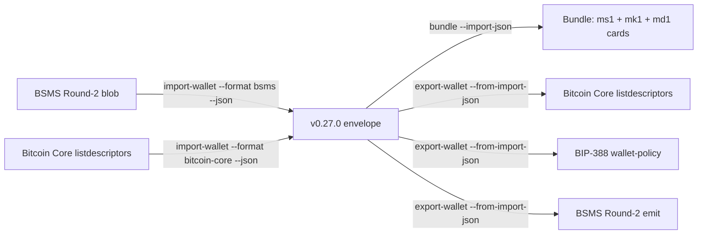

# Cross-format wallet conversion (v0.27.0)

Imagine a hardware-wallet coordinator hands you a BSMS Round-2 blob
describing a 2-of-3 multisig wallet, but the watch-only tool you want
to run is Bitcoin Core. Or you have a Bitcoin Core `listdescriptors`
JSON and you want to feed it to a Coldcard, or to your toolkit's own
`bundle` synthesizer to print fresh engraving cards from the watch-
only xpubs.

v0.27.0 makes this a single pipeline: any **source format** (BSMS or
Bitcoin Core, the two `import-wallet` formats) flows into the
toolkit's **canonical `BundleJson` envelope** via `import-wallet
--json`, and any **destination** (`bundle` synthesis or any
`export-wallet --format X`) consumes that envelope via
`--import-json` / `--from-import-json`. The envelope is the
inter-format mediator — wallet-format vendors don't need pairwise
adapters.



## Recipe 1 — BSMS Round-2 → Bitcoin Core listdescriptors

Goal: a coordinator-supplied BSMS Round-2 blob describes a 2-of-3
`sh(multi(2, ...))` wallet; you want a Bitcoin Core `importdescriptors`-
compatible JSON to feed `bitcoin-cli`.

```sh
mnemonic import-wallet --format bsms --blob coordinator.bsms.txt --json \
  | mnemonic export-wallet --from-import-json - --format bitcoin-core \
  > core-import.json
```

Then on Bitcoin Core:

```sh
bitcoin-cli createwallet "from-coordinator" true true "" false true
bitcoin-cli -rpcwallet=from-coordinator importdescriptors "$(cat core-import.json)"
```

The output JSON carries two descriptors — receive (`/0/*`) and change
(`/1/*`) — both flagged `active: true`. Bitcoin Core's
`importdescriptors` accepts the array as-is and provisions the wallet.

## Recipe 2 — Bitcoin Core listdescriptors → fresh m-format bundle

Goal: an existing Bitcoin Core `listdescriptors` JSON describes a
single-sig BIP-84 wallet (`wpkh(...)`); you want to materialize the
canonical m-format `ms1` / `mk1` / `md1` engraving cards.

The Bitcoin Core JSON is descriptor-mode; `bundle --import-json` reads
it and synthesizes the toolkit's canonical cards via
`synthesize_descriptor`:

```sh
bitcoin-cli -rpcwallet=mywallet listdescriptors > wallet.json

# Filter to active-receive only (drops the parallel `/1/*` change
# descriptor — same wallet, just the change chain).
mnemonic import-wallet --format bitcoin-core --blob wallet.json \
  --select-descriptor active-receive --json \
  > envelope.json

# Synthesize ms1/mk1/md1 cards from the envelope.
mnemonic bundle --network mainnet --import-json envelope.json
```

The result is a watch-only bundle (`mode: "watch-only"`,
`ms1: [""]`) carrying the wallet's xpub via `mk1` and the descriptor
via `md1`. To attach a seed for the single cosigner (e.g., the wallet
owner's BIP-39 phrase), supply `--slot @0.phrase=...`:

```sh
mnemonic bundle --network mainnet \
  --import-json envelope.json \
  --slot @0.phrase="abandon abandon abandon abandon abandon abandon abandon abandon abandon abandon abandon about"
```

The bundle synthesizer re-derives the xpub from the supplied phrase at
the envelope's `m/84'/0'/0'` origin path and asserts equality against
the blob's xpub. Mismatch returns exit 4 (`ImportWalletSeedMismatch`).

## Recipe 3 — BSMS Round-2 → BIP-388 wallet-policy

For wallets that consume BIP-388 wallet-policy JSON (the format
specified for "self-custodied multisig"), the same pipeline applies:

```sh
mnemonic import-wallet --format bsms --blob multisig.bsms --json \
  | mnemonic export-wallet --from-import-json - --format bip388 \
  > policy.json
```

The output carries the canonical `description_template` (e.g.,
`sh(multi(2,@0/**,@1/**,@2/**))`) and `keys_info` array with the three
cosigner xpubs prefixed by their `[fingerprint/path]` origin
annotations.

## Multi-entry envelope handling

Bitcoin Core `listdescriptors` emits 2–4 descriptors per wallet
(receive + change × script type). The envelope wire-shape is a top-
level JSON array, one entry per descriptor:

```sh
mnemonic import-wallet --format bitcoin-core --blob wallet.json --json
# → [{schema_version,bundle:{...},...}, {...}, {...}, {...}]
```

`bundle --import-json` and `export-wallet --from-import-json`
require `--import-json-index N` (or `--from-import-json-index N`) to
disambiguate which entry to consume — passing a multi-entry envelope
without an index is `BadInput` exit 2 (intentional footgun guard;
silently picking entry 0 would discard the others).

## Supported destinations

| Destination | `export-wallet --format` | Notes |
|---|---|---|
| Bitcoin Core | `bitcoin-core` | Descriptor-passthrough; works on all envelopes |
| BIP-388 wallet-policy | `bip388` | Descriptor-passthrough; canonical multisig + singlesig |
| BSMS Round-2 emit | `bsms` (v0.27.0) | 4-line BIP-129-canonical default; `--bsms-form 2-line` for lenient |
| Sparrow | `sparrow` | **Requires `--template`**; refuses `--from-import-json` (descriptor-mode) |
| Jade | `jade` | **Requires `--template`** |
| Coldcard | `coldcard` | **Requires `--template`** |
| Electrum | `electrum` | **Requires `--template`** |

Template-only destinations refuse `--from-import-json` with a clean
`--format <X> requires --template` error. The v0.27.0 envelope is
always descriptor-mode (`template: null`); to emit to a template-only
format, supply the originating BIP-39 phrase + `--template` flag to
`export-wallet` directly (skipping the envelope mediator).

## End-to-end round-trip verification

The cross-format integration cell
`cross_format_bsms_to_bitcoin_core_to_import_round_trip` in
`crates/mnemonic-toolkit/tests/cli_export_wallet_from_import_json.rs`
pins the verbatim preservation invariant: starting from a BSMS blob,
through the envelope, out to Bitcoin Core, every cosigner xpub +
fingerprint + origin path appears byte-identical in the destination.

To round-trip verify a synthesized bundle:

```sh
# Synthesize via bundle --import-json --json into bundle.json
mnemonic bundle --network mainnet --import-json envelope.json --json \
  > bundle.json

# Verify-bundle round-trip via --bundle-json (template-mode path)
mnemonic verify-bundle \
  --network mainnet --template wsh-sortedmulti \
  --multisig-path-family bip48 --threshold 2 \
  --slot @0.xpub=<xpub0> --slot @0.fingerprint=<fp0> \
  --slot @1.xpub=<xpub1> --slot @1.fingerprint=<fp1> \
  --slot @2.xpub=<xpub2> --slot @2.fingerprint=<fp2> \
  --bundle-json bundle.json --json
# → {"result": "ok", ...}
```

A `result: "mismatch"` here indicates the round-trip is lossy — file
a bug.

## Related

- [Wallet exports](#exporting-to-bitcoin-core-bip-388-vendor-formats)
  — original (template / descriptor) export-wallet flows
- [`mnemonic import-wallet`](../40-cli-reference/41-mnemonic.md#mnemonic-import-wallet)
  — full flag reference for the source side
- [`mnemonic bundle`](../40-cli-reference/41-mnemonic.md#mnemonic-bundle)
  — `--import-json` flag reference
- [`mnemonic export-wallet`](../40-cli-reference/41-mnemonic.md#mnemonic-export-wallet)
  — `--from-import-json` flag reference
