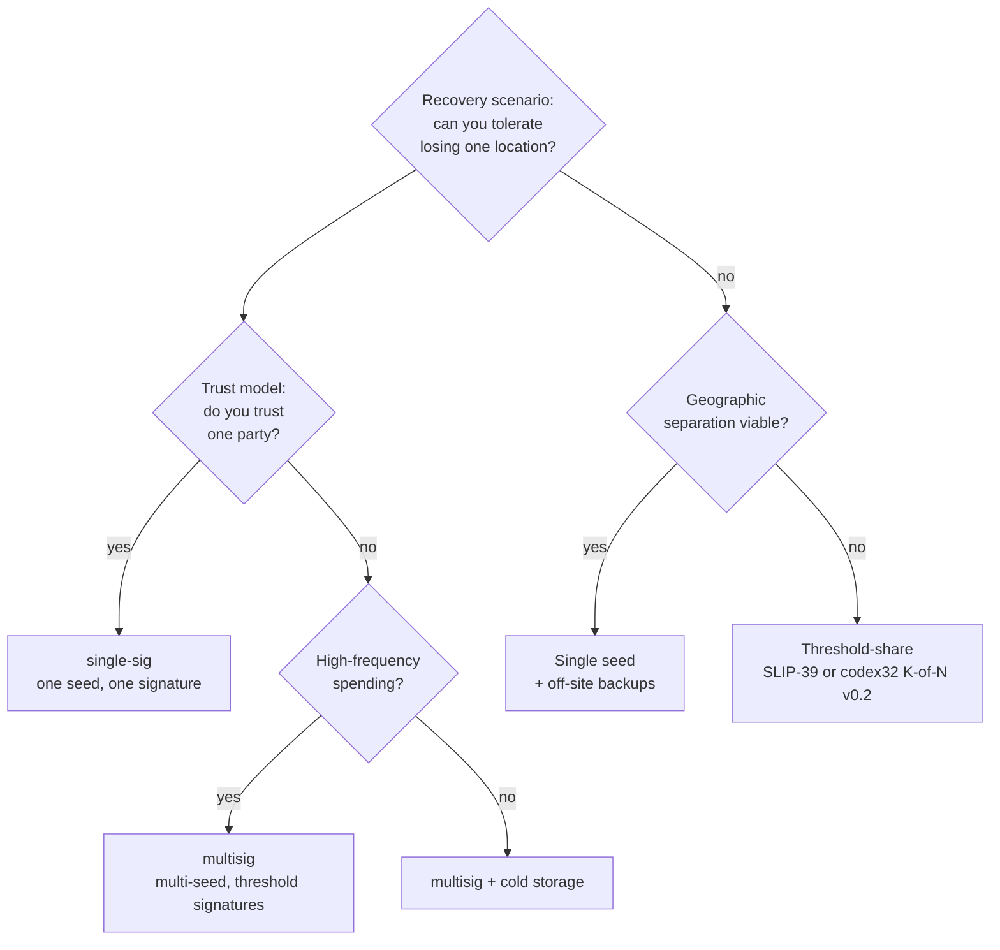

# Single-sig vs multisig vs threshold-secret decision tree

Three orthogonal axes for backing up Bitcoin: how many *seeds* are
involved (single vs many), how many *signatures* are needed (single
vs threshold), and how the *secret material itself* is split
(monolithic vs share-split). The m-format constellation supports all three
combinations; choosing wrong is operationally expensive.

## Decision tree

## The three axes

| Axis | Single | Multi |
|---|---|---|
| **Number of seeds** | one BIP-39 phrase | several phrases, one per cosigner |
| **Number of signatures** | one (single-sig) | K of N (multisig threshold) |
| **Secret material structure** | monolithic phrase or ms1 | share-split (SLIP-39 / codex32 K-of-N) |

Most production setups pick on each axis independently. The m-format
star covers:

- **single-sig + monolithic** — single ms1 + single mk1 + md1 — the
  simplest case (chapter 31).
- **multisig + monolithic** — multiple ms1s + multiple mk1s + shared
  md1 — the headline use case (chapter 32).
- **single-sig + share-split** — planned for ms-codec v0.2 (codex32
  K-of-N).
- **multisig + share-split** — composable post-v0.2: each cosigner's
  ms1 can itself be share-split.

## When single-sig is enough

- The wallet's value is below the operational complexity threshold of
  multisig (each operator's risk tolerance differs; pick a number).
- Recovery training and ongoing operations are constrained by a
  single human's discipline.
- The seed will be backed up by physical separation alone, not
  cryptographic threshold.

A well-engraved single-sig steel backup *with* an m-format bundle
(adding BCH error correction and policy binding) often beats a
multisig setup whose cosigners aren't disciplined about ceremony.

## When multisig earns its complexity

- The wallet's value justifies recurring operational cost (each
  cosigner runs through verify-bundle when receiving the bundle,
  participates in PSBTs, etc.).
- The threat model includes single-point seed compromise (theft,
  coercion, key-logger).
- The cosigners are independent humans / locations / devices.

A 2-of-3 multisig is the canonical starting point: tolerates one
cosigner unavailability without bricking the wallet.

## When threshold-secret-splitting is the right axis

- The threat is *single-point physical-medium loss*, not single-point
  human compromise.
- The wallet is single-sig (or each cosigner of a multisig wants
  their own share-split).
- The recipients of the shares are trusted parties / locations
  but not multisig cosigners.

Until ms-codec v0.2 lands, threshold-secret-splitting in the
m-format ecosystem is via SLIP-39 (engineering effort to
interoperate) or via standalone codex32 K-of-N (rust-codex32
exposes share modes); the upcoming v0.2 of ms-codec will surface
this through `mnemonic` directly.

## Anti-patterns

- **Multisig used as "split single-sig"** — engraving each seed of
  a multi-seed setup but storing all seeds in one location defeats
  multisig's purpose. Geographic separation is non-optional.
- **Single-sig with the seed engraved on multiple plates** — the
  attacker who finds *one* plate compromises everything. Use
  threshold-secret-splitting (SLIP-39 / codex32 v0.2) or single-
  cosigner with off-site backups, not duplicated full plates.
- **Multisig at a threshold that requires every cosigner** (K=N) —
  loses multisig's recovery property. Always pick K < N for any
  K > 1; if you genuinely need K=N, single-sig with stricter
  ceremony is operationally simpler.
