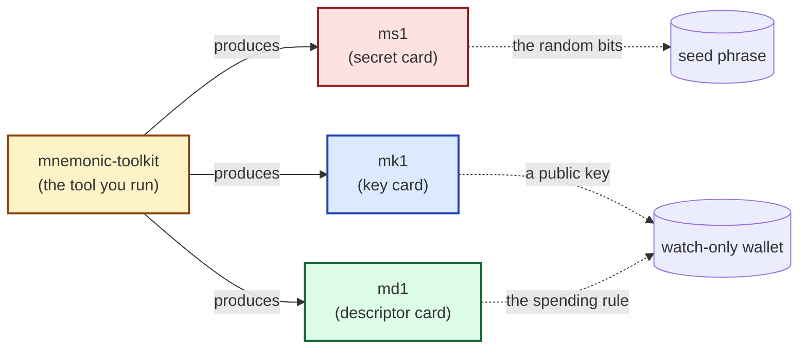

# What you're building

## The problem in one paragraph

Self-custodied Bitcoin starts with a *seed phrase* — a sequence of
12 to 24 English words from which every key in your wallet is
derived. People engrave seed phrases on steel so a house fire or
flood does not destroy the backup. But a plain seed phrase on steel
has no built-in error detection: a single mis-stamped letter can
silently produce a valid-looking but *different* phrase, and you
might not notice until you try to recover. Worse, a seed phrase
alone is not enough to recover a multisig wallet — you also need
to remember the wallet's spending rule and your cosigners' public
keys.

## The m-format answer in one paragraph

The m-format star splits the backup into **three independently
checksummed cards**, each engraved on its own steel plate:

- a **secret card** (`ms1`) carrying the random bits behind your
  seed phrase,
- a **key card** (`mk1`) carrying a public key (an *xpub*),
- a **descriptor card** (`md1`) carrying the wallet's spending rule.

Each card has its own error-correcting checksum, so a stamping
mistake is detectable and locatable. A fourth piece — the
`mnemonic-toolkit` command-line tool — synthesizes all three from
your inputs and verifies they belong together.

## The four pieces

The toolkit is what you run on your computer. It does not engrave
itself onto steel; the three cards do. You produce all three from
the toolkit, engrave them, and store them — together for a single-
signature wallet, or distributed across cosigners for multisig.

## What this guide covers

- **Part II (single-sig).** Generate a seed, produce all three
  cards, verify them, engrave them, then practice recovery.
- **Part III (multisig).** Build a 2-of-3 multisig: three
  cosigners each contribute their own key, and the toolkit binds
  them together into a coherent backup.
- **Part IV (watch-only).** Import either of the above into wallet
  software that watches the addresses without holding the secret.
- **Part V (next steps).** Pointers into the reference manual for
  the topics this Quick Start does not cover: taproot multisig,
  BIP-85 children, advanced recovery, and more.

Onward: a 30-second Bitcoin orientation that fills in the few
terms used above.
