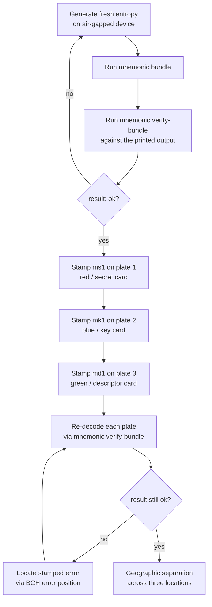

# Stamping the steel plates

Engraving turns three card strings on a screen into three steel
plates that survive fire, flood, and time. The discipline is
short: stamp one plate, re-decode it, then move on.

## Ceremony at a glance

The chapters before this one cover the first three boxes
(entropy → bundle → verify). This chapter covers the rest.

## Stamping discipline

- **Pick the right steel.** Use a plate rated for the heat of the
  worst fire you're insuring against — most products advertise the
  rating in degrees Celsius. The toolkit's character set is
  deliberately limited to letters and digits that stamp cleanly,
  so almost any modern engraving plate works.
- **Use a magnifier.** The codec alphabet excludes visually-similar
  characters (no `0`/`O`, no `1`/`l`), but stamping artefacts can
  still mimic the wrong character at a glance. A 5x loupe pays for
  itself the first time it catches a misaligned strike.
- **Re-decode after each plate.** Don't trust your own typing or
  your own striking. After each plate is stamped, read the
  characters off the steel and run `mnemonic verify-bundle` with
  the just-stamped strings. If `result: ok`, that plate is done; if
  a sub-check fails (e.g. `mk1_decode: error at position 47`), the
  diagnostic names the position so you know which character to
  inspect.

## Where each plate goes

The convention is colour-keyed. The `mnemonic-toolkit` engraving-
card emission uses red for ms1, blue for mk1, green for md1:

| Plate | Card | Strings to stamp | What it carries |
|---|---|---|---|
| **Red** | ms1 | 1 | BIP-39 entropy |
| **Blue** | mk1 | 2 | xpub + origin (master fingerprint, BIP path) |
| **Green** | md1 | 3 | wallet policy + bound xpub |

Use the *chunked* form (`ms10e ntrsq qqqqq qqqqq qqqqq qqqqq qqqqq qqcj9 sxraq 34v7f`)
as the engraving guide — five-character groups separated by spaces
align with the printed engraving cards.

## Geographic separation

Once all three plates verify, store them in three independent
locations. A common arrangement:

- **Red (ms1)** — primary safe, on-site, fireproof.
- **Blue (mk1)** — bank safe-deposit box.
- **Green (md1)** — trusted family member, attorney, or off-site
  vault.

The cross-binding via `policy_id_stub` means an attacker who finds
only one plate cannot derive the wallet alone — the mk1 and md1
together are watch-only, and the ms1 alone leaves recovery
software to *guess* the spending rule. Distribute the three plates
across people, jurisdictions, and threat models.

For taproot variants, `--privacy-preserving`, and the long version
of this ceremony, see the reference manual's
**Single-sig steel-engraved backup** workflow chapter.

Onward: practice recovery from the engraved plates.
