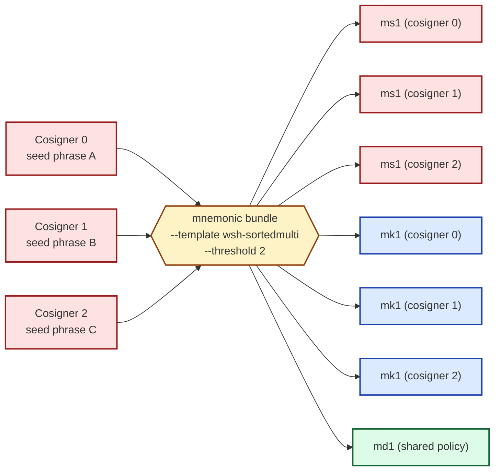

# Producing a 2-of-3 bundle

This chapter produces the full seven-card bundle for a 2-of-3
segwit multisig wallet on mainnet. Three cosigners contribute one
phrase each; the toolkit emits three ms1 cards (one per cosigner),
three mk1 cards (one per cosigner), and one shared md1 card.

## What you build



Three phrases in, **seven cards out**: 3 × ms1 + 3 × mk1 + 1 × md1.
Each cosigner's personal engraving set is *their own* ms1 plus all
three mk1s plus the one shared md1 — five plates per cosigner,
seven plates total across the wallet.

## The command

:::danger
The phrases below are **public BIP-39 test vectors**. They appear
verbatim in the BIP-39 specification, so chain watchers have indexed
every wallet ever derived from them and sweep funds within seconds
of receiving any. **Never engrave or fund a wallet built from these
phrases.** For a real bundle, generate three fresh seeds — one per
cosigner, on three separate air-gapped devices — using the same
discipline as [Generating entropy safely](../20-singlesig/22-generate-entropy.md).
:::

```sh
mnemonic bundle \
  --network mainnet \
  --template wsh-sortedmulti \
  --threshold 2 \
  --slot @0.phrase="abandon abandon abandon abandon abandon abandon abandon abandon abandon abandon abandon about" \
  --slot @1.phrase="legal winner thank year wave sausage worth useful legal winner thank yellow" \
  --slot @2.phrase="letter advice cage absurd amount doctor acoustic avoid letter advice cage above" \
  --self-check
```

Four flags carry the multisig-specific work:

- **`--template wsh-sortedmulti`** — the wallet's spending rule.
  `wsh-sortedmulti` is BIP-67-sorted segwit multisig; the emitted
  descriptor is `wsh(sortedmulti(2,@0,@1,@2))`. The "sorted" part
  matters during recovery: BIP-67 fixes a canonical cosigner order
  so losing track of "who was @0?" doesn't brick the wallet. Other
  multisig templates exist (`wsh-multi` unsorted, `sh-wsh-…`
  nested-segwit, `tr-…` taproot); `wsh-sortedmulti` is the
  conventional choice for new wallets.
- **`--threshold 2`** — the K of K-of-N. Required for any multisig
  template; ignored for single-sig. The toolkit enforces
  `1 ≤ K ≤ N ≤ 16`.
- **`--slot @N.phrase=…`** repeated three times — one slot per
  cosigner, indexed `@0` through `@2`. The slot index becomes the
  cosigner index in the BIP-388 wallet policy. Single-sig used only
  `@0`; multisig adds `@1`, `@2`, etc.
- **`--self-check`** — re-parses the emitted bundle and verifies it
  round-trips. A built-in sanity check that catches encode/decode
  drift before the cards reach steel.

## Output

The toolkit emits seven cards on stdout, grouped by card type, plus
a metadata summary at the end. The structure mirrors the single-sig
bundle from [chapter 23](../20-singlesig/23-bundle.md), with an
added `# === Cosigner N ===` separator preceding each cosigner's
ms1/mk1 strings. (Exact strings are deterministic for the test
phrases above and are spelled out in the manual's full multisig
chapter; see the cross-reference at the end of this chapter.)

| Card | Count | What it carries |
|---|---|---|
| **ms1** | 3 (one per cosigner) | BIP-39 entropy for that cosigner's seed |
| **mk1** | 3 (one per cosigner) | xpub + origin for that cosigner |
| **md1** | 1 (shared) | wallet policy `wsh(sortedmulti(2,…))` + bound xpubs |

The trailing metadata block lists each cosigner's master
fingerprint and origin path, plus the wallet's `policy_id_stub` —
the cross-binding hash that every mk1 and the md1 carry, so mixing
cards from different bundles is caught at verification time.

The same `warning: stdout carries private key material` reminder from the
single-sig chapter applies, three times over: each cosigner's ms1
contains their seed in encoded form. For a real bundle, redirect to
a file (`> bundle.txt`) and either delete the file after engraving
or pipe through `age -e` to encrypt at rest.

## What's next

The companion `mnemonic verify-bundle` step (mirroring
[chapter 24](../20-singlesig/24-verify.md)) takes the same four
re-derivation flags plus one repetition per *string* in the
output: three `--ms1` (3 cosigner secrets, 1 string each), six
`--mk1` (3 mk1 cards, 2 strings each), and four `--md1` (1 md1
card, ~4 strings for the longer wsh-sortedmulti descriptor). The
flag-count tracks the chunked-string emission, not the seven-plate
card count.

The full air-gapped variant — where each cosigner produces their
own ms1 + xpub locally and the coordinator only ever sees public
xpubs — is in [Part IV — watch-only multisig](../40-watch-only/42-multisig-watch-only.md).

Onward: stamp the per-cosigner plate sets and learn the recovery
table.
