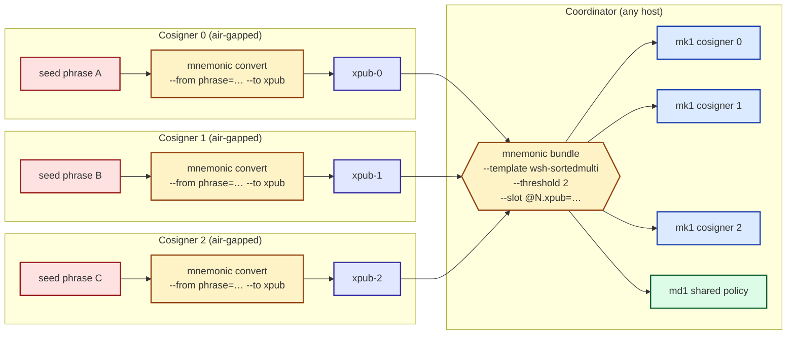

# Watch-only multisig (air-gapped)

[Chapter 32](../30-multisig/32-bundle.md) walked the *coordinated*
multisig flow — one laptop briefly sees all three phrases. This
chapter walks the **air-gapped** variant: each cosigner derives their
own xpub on their own machine, only xpubs cross to the coordinator,
and the coordinator builds a watch-only bundle. No seed ever leaves
its origin machine.

## Air-gapped synthesis



The boundary that matters: only xpubs cross from the cosigner
machines to the coordinator. The coordinator never holds enough
material to spend.

## Step 1 — each cosigner derives their xpub locally

On each cosigner's air-gapped machine, derive the xpub from that
cosigner's own seed:

```sh
mnemonic convert \
  --from phrase="<this cosigner's phrase>" \
  --to xpub --to fingerprint \
  --template wsh-sortedmulti \
  --network mainnet
```

The cosigner writes down the xpub plus master fingerprint and
hand-carries them (paper, QR, USB) to the coordinator. The phrase
stays on the air-gapped machine.

For BIP-87 paths (the default `--multisig-path-family` for the
toolkit's multisig templates), the path is `m/87'/0'/0'`; for
Coldcard / SeedSigner / older-Sparrow compatibility add
`--multisig-path-family bip48` and the path becomes `m/48'/0'/0'/2'`.

## Step 2 — coordinator builds the watch-only bundle

Once the coordinator has all three xpubs, build the bundle from
xpubs only:

```sh
mnemonic bundle \
  --network mainnet \
  --template wsh-sortedmulti \
  --threshold 2 \
  --slot @0.xpub=<xpub-cosigner-0> \
  --slot @1.xpub=<xpub-cosigner-1> \
  --slot @2.xpub=<xpub-cosigner-2>
```

The output is **4 cards**: 3 mk1 (one per cosigner's xpub + origin)
and 1 md1 (the shared wallet policy `wsh(sortedmulti(2,@0,@1,@2))`).
No ms1 cards — no secret material was passed.

For coordinator-side bundles that fan out to many cosigners and
should not reveal each cosigner's master fingerprint, add
`--privacy-preserving`; mk1s emit a zero-fingerprint placeholder
that recovery software re-derives at import time.

## Step 3 — each cosigner separately derives their own ms1

The watch-only bundle is the public-side artifact. To be able to
sign, each cosigner separately derives their *own* ms1 on their own
air-gapped machine:

```sh
# On cosigner N's air-gapped machine
mnemonic convert \
  --from phrase="<cosigner N's phrase>" \
  --to ms1
```

Each cosigner stamps their own ms1 plate alongside copies of the
3 mk1 plates and the shared md1 plate. The result is identical to
the [chapter 33](../30-multisig/33-stamp-and-recover.md) per-cosigner
plate set — same five plates each, same recovery quick-table —
but produced without ever exposing more than one seed to any single
machine.

## What's next

The coordinator now holds a 4-card watch-only bundle (3 mk1 + 1 md1)
suitable for monitoring the wallet. To turn it into a Bitcoin Core
`importdescriptors` JSON or a BIP-388 wallet policy, pass the same
slot inputs to `mnemonic export-wallet` — same flag shape, different
output format. See the manual's
[Multisig 2-of-3 walkthrough](../../../manual/src/30-workflows/32-multisig-2of3.md)
for the canonical full air-gapped procedure (including signing
ceremonies and PSBT-routing across the coordinator boundary).

Onward: pointers into the reference manual for going deeper.
