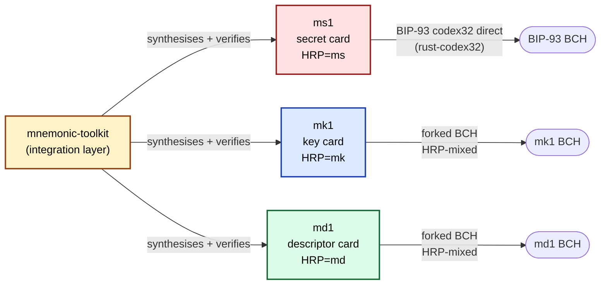

# The m-format Star

The constellation comprises four sibling artifacts in a star topology with the `mnemonic-toolkit` at the centre:

The toolkit is the *integration layer*; the three cards are the *backup substrate*. The toolkit reads end-user inputs (seed phrases, xpubs, fingerprints, paths), synthesises the three card strings, and verifies cross-card coherence on recovery. The toolkit does not engrave its own card — its outputs are the three card strings plus a printable engraving-card layout per card.

## Format responsibilities

Each format encodes a single piece of recovery information:

| Format | Encodes | Length envelope (typical) | Crate | CLI |
|---|---|---|---|---|
| **ms1** | BIP-39 entropy (12–24 words) or BIP-32 master seed; future: K-of-N shares | one short-code card (≤93 chars) for 24-word seed | `ms-codec` | `ms` |
| **mk1** | xpub + master fingerprint + BIP-32 origin path | one short- or long-code card per xpub | `mk-codec` | `mk` |
| **md1** | BIP-388 wallet-policy template; optionally Fingerprints / OriginPaths TLVs; in self-custody mode also one bound xpub per `@N` placeholder | one or more cards (chunked when the policy is too large for a single card) | `md-codec` | `md` |
| **mnemonic-toolkit** | Composes the three cards into a coherent bundle; verifies cross-card invariants | — | `mnemonic-toolkit` | `mnemonic` |

For a single-sig BIP-84 wallet, a bundle is three cards: one ms1 with the seed entropy, one mk1 with the account xpub, and one md1 with the `wpkh(@0/<0;1>/*)` template plus the bound xpub. For a 2-of-3 BIP-388 multisig, a bundle is up to seven cards: one ms1, three mk1 (one xpub per cosigner), and one (or more, if chunked) md1 carrying the `wsh(sortedmulti(2,@0,@1,@2))` template plus all three xpubs.

## The forked-BCH boundary

The four formats share *concept* but not *crate*. Two divergent paths are visible in the diagram above:

- **ms1 → BIP-93 codex32 direct.** The `ms-codec` crate consumes [`rust-codex32`](https://docs.rs/rust-codex32) verbatim and stamps the canonical codex32 BCH polynomial into ms1 strings. There is no forking; ms1's checksum is byte-for-byte identical to what BIP-93 would compute for the same payload + HRP.
- **md1 + mk1 → forked BCH.** The `md-codec` and `mk-codec` crates use the same BIP-93 BCH generator polynomial as codex32, but each format pins a **distinct non-zero target residue** that the verifier compares against. The HRP (`md` or `mk`) is mixed in via standard BIP-173 HRP expansion (prepended to the polymod input). Two consequences:
  1. A decoder applying the wrong format's target-residue check to a sibling-format string fails the comparison, so cards cannot be confused across formats even if a transcription error happens to land on a sibling format's character set.
  2. Phrases that round-trip under `md` will not round-trip if fed to `mk`, even ignoring payload content, because the polymod output is compared against a different constant per format.

The forked-vs-direct split is a deliberate design choice, not an accident of history. The rationale (briefly): ms1 benefits from BIP-93's existing K-of-N share specification (planned for ms-codec v0.2), so adopting codex32 directly is value-aligned. md1 and mk1 carry payloads outside BIP-93's intended domain (descriptors and xpubs respectively, not "secrets"), and the HRP-mixed polynomial gives each format an independent error-detection space without the cross-format ambiguity that would arise if all three formats shared one polynomial. The pattern is documented in each format's BIP draft; this manual takes it as given.

## Cross-card binding

The three cards are *individually* recoverable from their own BCH plus the human-readable string, but their *coherence* — "these three cards belong to the same wallet" — is enforced by an explicit cross-binding:

- The **`policy_id_stub`** is a 4-byte stub of `SHA-256(canonical wallet-policy preimage)` over the md1 wallet-policy template + bound xpubs.
- Each mk1 card carries `policy_id_stub` as a TLV field.
- The md1 card carries enough information (the template + the bound xpubs) for `mnemonic verify-bundle` to recompute `policy_id_stub` and compare against each mk1 card.

A bundle is *coherent* iff every mk1's carried `policy_id_stub` matches the recomputed value from the md1. A bundle assembled from cards belonging to different wallets fails this check at verify time. Part IV §IV.2 documents the full invariant set including the multiset `md1_xpub_match` rule, the four-case ms1 short-circuit table, and the BIP-388 distinct-key enforcement.

## Versioning model

Each format is versioned independently in its own repo. Wire-format breaks bump the second-component (`0.X`) version per the pre-1.0 SemVer convention; non-wire-format-affecting changes bump the patch version (`0.X.Y`). Cross-format breaks (where, say, an md1 change requires a corresponding mk1 change) are coordinated through cross-repo FOLLOWUPS entries with `Companion:` cross-citations; both repos tag in lockstep.

Wire-format versions are visible:

- md1 carries its wire-format version in a 4-bit header field (see §II.1.1). Current value: 4 (= v0.30). Decoders reject other values via `Error::WireVersionMismatch`.
- mk1 carries its wire-format version in the same position. Current value: see §II.2.
- ms1 inherits BIP-93 codex32 versioning; its current encoding is the BIP-93 baseline.

## Future formats

A fifth point on the star (`mf` or similar) has been discussed for FROST threshold-signature share material — see the project memory for the analysis. FROST shares are random DKG outputs (not derivable from a BIP-32 seed) and would require a different backup model than the current three formats. No work is in flight; tracked in each repo's `FOLLOWUPS.md` as a v1+ research item.
