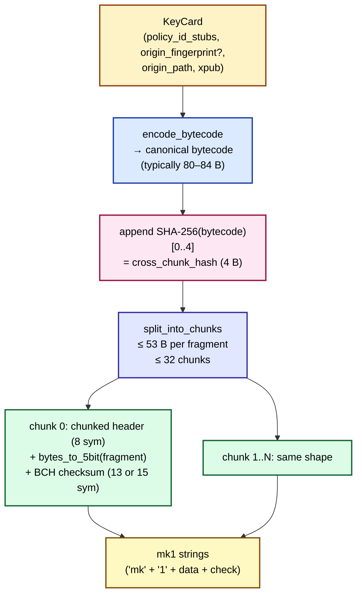
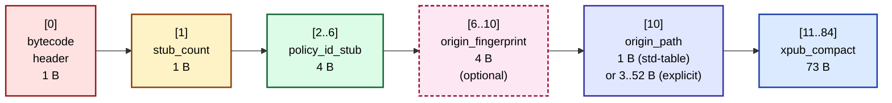

# mk1 Wire Format

This chapter documents mk1's current wire format at bit-level depth. The format is **v0.1** (all ten v0.1 open questions Q-1..Q-10 closed 2026-04-29; reference implementation at `mk-codec` v0.2.2). For the normative spec, see `bg002h/mnemonic-key/bip/bip-mnemonic-key.mediawiki` §"Specification" and `bg002h/mnemonic-key/design/SPEC_mk_v0_1.md`. The reference implementation is in `bg002h/mnemonic-key/crates/mk-codec/src/`; this chapter cites specific source files where they pin a wire-format decision.

mk1\index{mk1} encodes one BIP 32 extended public key (xpub) plus its origin metadata, in a codex32-derived BCH-checksummed string designed to engrave alongside md1 policy cards for foreign-xpub multisig recovery. One cosigner backs up their xpub on its own card; the card carries one or more 4-byte `policy_id_stub`\index{policy\_id\_stub}s that index against the md1 policy template(s) the xpub serves.

## Layer model

mk1 has two layers (BIP draft §"Format overview"):

- **Encoding layer.** Wraps a byte-aligned canonical bytecode payload in a codex32-style envelope: HRP `mk` + separator `1` + payload + BCH checksum. The encoding layer is responsible for character-level error correction, single-vs-chunked dispatch, and cross-chunk integrity (the `chunk_set_id` plus the `cross_chunk_hash`).
- **Bytecode layer.** The payload itself: a **byte-aligned** record (not bit-packed) carrying — in fixed field order — the bytecode header, stub count, policy-ID stubs, optional origin fingerprint, origin path, and a 73-byte compact xpub. Unlike md1's bit-packed operator tree, mk1's bytecode is a flat record with byte-granular cursor reads; the only sub-byte fields are the four flag bits in the 1-byte bytecode header.

The encoding layer wraps the bytecode in either a single string (`SingleString`, wire-defined but unreachable in v0.1 — see "Length envelope" below) or a chunked sequence (`Chunked`, used for every conforming v0.1 card). The two layers compose: the encoder serializes a `KeyCard` to canonical bytecode, then the encoding layer frames the bytecode into one or more cards.

## Encoding-layer framing

### Card structure

Every mk1 chunk-string is the concatenation:

```text
<HRP> <separator> <data part>            <checksum>
   mk         1   header + payload       13 or 15 codex32 symbols
                  (5-bit codex32 symbols)
```

The HRP is the literal two bytes `mk` (the BCH check is over `hrp_expand("mk") || data || checksum`; see §I.3 for the polymod path). The data part is a sequence of 5-bit codex32 symbols carrying the chunk's string-layer header followed by the chunk's fragment payload bytes (re-packed into 5-bit symbols). The checksum is 13 symbols (regular code, BCH(93,80,8)) or 15 symbols (long code, BCH(108,93,8)); each chunk's BCH variant is auto-selected by the data-part length per BIP 93. Data-part lengths 94–95 are reserved-invalid and decoders MUST reject (`crates/mk-codec/src/string_layer/bch.rs::bch_code_for_length`).

### NUMS-derived target constants

mk1 reuses BIP 93's generator polynomials verbatim (per `design/DECISIONS.md` D-10) but ships its own per-format target residue constants for cross-format domain separation (BIP draft §"Why new target constants?"; `crates/mk-codec/src/consts.rs:18,21`):

```text
domain_string    = b"shibbolethnumskey"   (17 bytes ASCII)
MK_REGULAR_CONST = 0x1062435f91072fa5c    (top 65 bits of SHA-256(domain))
MK_LONG_CONST    = 0x41890d7e441cbe97273  (top 75 bits of SHA-256(domain))
```

\index{MK\_REGULAR\_CONST}\index{MK\_LONG\_CONST}

The constants are NUMS-derived ("Nothing Up My Sleeve"): the domain string is the audit trail; any reader can recompute the SHA-256 digest and verify that the constants follow. Cross-check: applying the same procedure to `b"shibbolethnums"` reproduces md1's `T_REGULAR = 0x0815c07747a3392e7` and `T_LONG = 0x205701dd1e8ce4b9f47`. The codex32 (BIP 93) family thus exhibits a three-domain partition under HRP-mixing + per-format target residue: codex32, md1, mk1. See §I.3 for the polymod algorithm and the HRP-mixing convention.

### String-layer header\index{string-layer header (mk1)}

mk1's string-layer header lives at the 5-bit symbol layer (closure Q-5; `crates/mk-codec/src/string_layer/header.rs`). Two variants:

**Single-string header** (2 symbols):

```text
| 5:version | 5:type=0x00 |
```

**Chunked header** (8 symbols):

```text
| 5:version | 5:type=0x01 | 20:chunk_set_id | 5:total_chunks | 5:chunk_index |
```

- `version`: 5-bit format version. `0` in v0.1; decoders MUST reject unknown values with `Error::UnsupportedVersion`\index{Error::UnsupportedVersion}.
- `type`: 5-bit chunk-type byte. `0x00` = `SingleString`, `0x01` = `Chunked`. Reserved range `0x02..=0x1F` MUST be rejected with `Error::UnsupportedCardType`\index{Error::UnsupportedCardType} (the 5-bit field has no spillover space).
- `chunk_set_id`\index{chunk\_set\_id (mk1)}: 20-bit per-encoding tag, packed into four 5-bit symbols big-endian — bits 19..15 in symbol 2, 14..10 in symbol 3, 9..5 in symbol 4, 4..0 in symbol 5. Opaque; mismatch across chunks is rejected at reassembly with `Error::ChunkSetIdMismatch`. Encoders MAY draw it from the system CSPRNG (mk-codec's default — `crates/mk-codec/src/string_layer/pipeline.rs::fresh_chunk_set_id`) or derive it deterministically from the leading 20 bits of `policy_id_stub[0]` (BIP draft §"String-layer header"); both choices are interop-equivalent.
- `total_chunks`: 5-bit field carrying `count − 1`. Semantic range `1..=32`; wire range `0..=31`. Decoders MUST add 1 after reading (`crates/mk-codec/src/string_layer/header.rs:146`).
- `chunk_index`: 5-bit zero-based index. `chunk_index >= total_chunks` is rejected as `Error::ChunkedHeaderMalformed`\index{Error::ChunkedHeaderMalformed}.

### Length envelope

Capacity numbers (`crates/mk-codec/src/consts.rs:30,33,36,39,42,45`):

```text
single-string regular code:    48 bytes payload   (SINGLE_STRING_REGULAR_BYTES)
single-string long code:       56 bytes payload   (SINGLE_STRING_LONG_BYTES)
chunked-fragment regular code: 45 bytes per fragment
chunked-fragment long code:    53 bytes per fragment
max chunks per card:           32                  (MAX_CHUNKS)
cross-chunk integrity hash:    4 bytes
```

The smallest valid v0.1 mk1 bytecode is 80 bytes (`1` header + `1` stub-count + `4` single-stub + `1` std-table path indicator + `73` compact-xpub, fingerprint omitted) — already above the 56-byte single-string long-code ceiling. **Every conforming v0.1 mk1 card therefore encodes as a chunked card.** The `SingleString` chunk-type variant is wire-defined for forward compatibility (future format extensions whose bytecode could shrink below 56 bytes — the reserved Compact-65 mode discussed in `design/SPEC_mk_v0_1.md` §3.7 is one candidate) but unreachable for v0.1 encoders.

With up to 32 long-code chunks, an mk1 card can encode up to `32 × 53 − 4 = 1692` bytes of canonical bytecode — vastly above any plausible mk1 payload. Excess sizes surface as `Error::CardPayloadTooLarge`.

### Chunking and cross-chunk integrity

The encoder appends a 4-byte `cross_chunk_hash`\index{cross\_chunk\_hash} = `SHA-256(canonical_bytecode)[0..4]` to the canonical bytecode, then splits the resulting `bytecode || hash` stream into chunks of at most 53 bytes per fragment (long-code target; the trailing chunk may be shorter and falls back to regular-code BCH). Each chunk's string carries the 8-symbol chunked header plus its fragment bytes re-packed into 5-bit symbols, then the BCH checksum (`crates/mk-codec/src/string_layer/chunk.rs::split_into_chunks`).

Reassembly: the decoder collects N chunks, verifies all share the same `chunk_set_id` and `total_chunks`, places each fragment in slot `chunk_index`, concatenates in order, then verifies the trailing 4 bytes match `SHA-256(reassembled_bytecode_without_hash)[0..4]`. Mismatch surfaces as `Error::CrossChunkHashMismatch`\index{Error::CrossChunkHashMismatch}. Out-of-order, duplicate, missing, or `SingleString`-mixed-with-`Chunked` chunks are all caught (`crates/mk-codec/src/string_layer/chunk.rs::reassemble_from_chunks` + `crates/mk-codec/src/string_layer/pipeline.rs::decode`).

Cross-format note: md1 derives `chunk_set_id` from `SHA-256(canonical_bytecode)[0..20 bits]`, so the same md1 content always re-encodes to the same `chunk_set_id` (content-identity + reassembly-mismatch in 20 bits). mk1's `chunk_set_id` is **opaque** (CSPRNG by default; deterministic-from-stub also permitted per BIP draft §"String-layer header"), and content integrity is enforced separately by the explicit 4-byte `cross_chunk_hash`. The two designs solve the same problem with different bit budgets.

The encode pipeline composes the bytecode + string layers as follows:



## Bytecode layer

The bytecode is a **byte-aligned** record. After chunk reassembly the decoder reads fields in fixed order via byte-granular cursor advances (`crates/mk-codec/src/bytecode/decode.rs::decode_bytecode`). Sub-byte addressing appears only inside the 1-byte bytecode header.

### Bytecode header\index{bytecode header (mk1)}

The first byte is the bytecode header (`crates/mk-codec/src/bytecode/header.rs`; BIP draft §"Bytecode header"):

```text
| 4:version | 1:reserved | 1:fingerprint_flag | 1:reserved | 1:reserved |
  bit 7..4    bit 3        bit 2                bit 1        bit 0
```

- Bits 7..4 — `version`. `0` in v0.1. Decoder rejects non-zero with `Error::UnsupportedVersion`.
- Bit 3 — reserved (MUST be 0; `Error::ReservedBitsSet`\index{Error::ReservedBitsSet}).
- Bit 2 — `fingerprint_flag`\index{fingerprint\_flag} (closure Q-8). `1` if `origin_fingerprint` is present in the payload; `0` if omitted (privacy-preserving mode\index{privacy-preserving mode}).
- Bits 1, 0 — reserved (MUST be 0).

Valid v0.1 header bytes are exactly `0x00` (no fingerprint) and `0x04` (fingerprint present). The bit-2 fingerprint-flag convention is shape-shared with md1's bytecode header (BIP draft §"Bytecode header — bit allocation"; the formats' bit-3 allocations diverged when md1 v0.10 reclaimed bit 3 as its `OriginPaths` flag).

### Payload field order

After the bytecode header, the bytecode encodes the following fields, in this order (closure Q-6; `crates/mk-codec/src/bytecode/encode.rs::encode_bytecode`):

```text
[bytecode_header    : 1  B]
[stub_count         : 1  B; MUST be ≥ 1]
[policy_id_stubs    : 4N B]      ← stub_count × 4-byte stub
[origin_fingerprint : 4  B]      ← present iff bytecode_header bit 2 set
[origin_path        : 1 B std-table indicator OR 0xFE + 1 B count + 1..=10 LEB128 components]
[xpub_compact       : 73 B]
```

The typical 1-stub mainnet card with std-table indicator and fingerprint present is `1 + 1 + 4 + 4 + 1 + 73 = 84` bytes. Rationale for the ordering (closure-locked): stubs first lets a recovery tool fast-filter many cards by Policy ID before parsing the rest; fingerprint + path next matches BIP 380 origin notation `[fp/path]` reading order; xpub last keeps the largest field at a known offset for streaming parsers.

The typical 84-byte layout (with byte offsets):



The dashed `origin_fingerprint` box marks the only conditionally-present field; when bit 2 of the bytecode header is `0` (privacy-preserving mode), the field is omitted entirely and downstream offsets shift down by 4. With omitted fingerprint, the minimum 1-stub-with-std-table-indicator card is `1 + 1 + 4 + 1 + 73 = 80` bytes.

### Policy ID stub

Each stub\index{policy\_id\_stub} is the top 4 bytes of an md1 policy template's `SHA-256(canonical_bytecode)` (closure Q-2; BIP draft §"Policy ID stub format"). The stub is an **indexing aid**, not a cryptographic primitive: birthday-bound collision probability among 50 stubs at 32 bits is approximately `2.85 × 10⁻⁷`, effectively zero. The cryptographic check happens at recovery time when the assembled descriptor's **Wallet Instance ID**\index{Wallet Instance ID} = `SHA-256(canonical_bytecode || canonical_xpub_serialization)[0..16]` is recomputed and compared against an externally-anchored expected value (BIP draft §"Linkage to MD" step 4).

`stub_count` is a single byte, so 1–255 stubs are wire-permitted. `stub_count == 0` is rejected with `Error::InvalidPolicyIdStubCount`. Practical limit is set by chunk capacity, not the count field.

### Origin path

mk1's origin path uses a 1-byte standard-table indicator\index{standard-path table (mk1)} with a `0xFE` explicit-path escape hatch (`crates/mk-codec/src/bytecode/path.rs`; BIP draft §"Origin path encoding"). Two cases:

**Case A — standard-table indicator** (1 byte total). 14 entries as of mk-codec v0.2.0:

| Indicator | Path | Indicator | Path |
|---|---|---|---|
| `0x01` | `m/44'/0'/0'` | `0x11` | `m/44'/1'/0'` |
| `0x02` | `m/49'/0'/0'` | `0x12` | `m/49'/1'/0'` |
| `0x03` | `m/84'/0'/0'` | `0x13` | `m/84'/1'/0'` |
| `0x04` | `m/86'/0'/0'` | `0x14` | `m/86'/1'/0'` |
| `0x05` | `m/48'/0'/0'/2'` | `0x15` | `m/48'/1'/0'/2'` |
| `0x06` | `m/48'/0'/0'/1'` | `0x16` | `m/48'/1'/0'/1'` |
| `0x07` | `m/87'/0'/0'` | `0x17` | `m/87'/1'/0'` |

Indicators `0x00`, `0x08..=0x10`, `0x18..=0xFD`, and `0xFF` are reserved (`Error::InvalidPathIndicator`\index{Error::InvalidPathIndicator}). The 14-entry table is mk1-internal as of mk-codec v0.2.2; see the history note at the end of this chapter.

**Case B — explicit-path escape** (`0xFE` indicator):

```text
[0xFE]
[count : 1 B; MUST be in 1..=10]
[component_1 .. component_N : each LEB128 u32, 1..=5 bytes]
```

Each component is a LEB128\index{LEB128}-encoded u32 BIP 32 child number with the hardened-marker in the high bit (per BIP 32 convention; bit 31 of the u32). Hardened components require the full 5-byte LEB128 form (any u32 ≥ 2²⁸ uses 5 bytes); a 4-component all-hardened explicit path therefore encodes to `1 + 1 + 4×5 = 22` bytes. Decoders reject `count == 0` or `count > 10` with `Error::PathTooDeep`, and LEB128-overflow or 6th-continuation-byte with `Error::InvalidPathComponent`.

The component cap is 10 (closure Q-3). Real BIP-style derivations top out at 6 (BIP 48 multisig is 4); the cap bounds chunk-size attacks without locking out any plausibly real path.

### Origin fingerprint

The 4-byte BIP 32 master fingerprint\index{BIP 32 master fingerprint}, verbatim from BIP 380 origin notation `[fp/...]`. **Present only if bytecode-header bit 2 is set**; otherwise omitted entirely from the payload (closure Q-8). The privacy-preserving mode (bit 2 = 0; no fingerprint on wire) lets cosigners who don't need master-seed identification on the card omit those 4 bytes from the engraving.

The fingerprint-flag↔presence consistency is an **encoder-side invariant**: a decoder follows the flag verbatim (`crates/mk-codec/src/bytecode/decode.rs:35`). A hand-crafted bytecode that violates the invariant decodes to a wrong-but-internally-consistent `KeyCard`; detection happens at the Wallet Instance ID check.

### Xpub compact-73\index{compact-73}

mk1 encodes xpubs in a 73-byte compact form (closure Q-7; `crates/mk-codec/src/bytecode/xpub_compact.rs`):

```text
[xpub.version           : 4  B]   — network-specific (mainnet xpub = 0x0488B21E)
[xpub.parent_fingerprint: 4  B]
[xpub.chain_code        : 32 B]
[xpub.public_key        : 33 B]   — compressed secp256k1
                          ────
                          73 B
```

The fields `xpub.depth` and `xpub.child_number` are absent from the wire and reconstructed at decode time from `origin_path` (`crates/mk-codec/src/bytecode/xpub_compact.rs::reconstruct_xpub`):

```text
depth         := component_count(origin_path)
child_number  := last_component(origin_path) including hardened-bit encoding
```

The compact-73 form is **lossless** — both dropped fields are reconstructible from the path — and saves 5 bytes per card (roughly one row of typical hand-engraving). The drift class that would arise from carrying both `depth`/`child_number` *and* `origin_path` independently is impossible by construction.

A consequent **limit-of-detection note** (closure Q-7 → SPEC §6 normative): an operator who picks the wrong standard-table indicator while engraving the correct xpub bytes produces a card that decodes without error but reconstructs an xpub claiming the wrong derivation path. The card's chain_code and public_key are still correct (addresses derive correctly), but the BIP 32 serialization embeds the wrong path. Detection happens only at the Wallet Instance ID check. The BIP draft §"Privacy" recommends an out-of-band first-address verification before moving funds in single-wallet recoveries without an external wallet-identity anchor.

### Network detection

`xpub.version` selects the network (`crates/mk-codec/src/bytecode/xpub_compact.rs::version_to_network`):

- `0x0488B21E` → mainnet\index{mainnet} `xpub` prefix.
- `0x043587CF` → testnet\index{testnet} `tpub` prefix.

Other values surface as `Error::InvalidXpubVersion`\index{Error::InvalidXpubVersion}. Network awareness here lets mk1 cards cross-validate against the network implied by the standard-table indicator at recovery time (e.g., a mainnet `0x05` indicator paired with a testnet `tpub` would be diagnosed at the recovery orchestrator, not by the per-card decoder).

## Canonicality and validity rules

A decoder MUST reject mk1 bytecode whose state matches any of the following (BIP draft §"Decoder validity rules"; `crates/mk-codec/src/error.rs` variants; `design/SPEC_mk_v0_1.md` §4):

| # | Condition | Error variant |
|---|---|---|
| 1 | Bytecode-header version ≠ 0 in v0.1 | `UnsupportedVersion` |
| 2 | Any reserved bit set in v0.1 (bits 0, 1, 3) | `ReservedBitsSet` |
| 3 | `stub_count == 0` | `InvalidPolicyIdStubCount` |
| 4 | Origin-path indicator outside the standard table | `InvalidPathIndicator` |
| 5 | Explicit path with `count == 0` or `count > 10` | `PathTooDeep` |
| 6 | LEB128 overflow / 6th continuation byte | `InvalidPathComponent` |
| 7 | xpub version bytes ≠ known network prefix | `InvalidXpubVersion` |
| 8 | xpub public_key not a valid compressed secp256k1\index{secp256k1} point | `InvalidXpubPublicKey` |
| 9 | Decoder hit end-of-stream mid-field | `UnexpectedEnd` |
| 10 | Trailing bytes after xpub_compact | `TrailingBytes` |
| 11 | Chunks disagree on `chunk_set_id` | `ChunkSetIdMismatch` |
| 12 | Bad `chunk_index`, gaps, duplicates, `total_chunks` disagreement | `ChunkedHeaderMalformed` |
| 13 | Reassembled trailing 4 bytes ≠ `SHA-256(reassembled bytecode)[0..4]` | `CrossChunkHashMismatch` |
| 14 | Trailing 5-bit symbol pad bits non-zero after BCH | `MalformedPayloadPadding` |
| 15 | Mixed `SingleString` + `Chunked` headers in one input list | `MixedHeaderTypes` |
| 16 | Chunked card declares total > `MAX_CHUNKS = 32` | `ChunkedHeaderMalformed` |
| 17 | Chunked-string reserved type byte `0x02..=0x1F` | `UnsupportedCardType` |
| 18 | Mixed ASCII case in input data part | `MixedCase` |
| 19 | Data-part length in reserved gap `94..=95` or out of range | `InvalidStringLength` |

Rules 1–10 are bytecode-layer (post-reassembly); rules 11–19 are string-layer (pre- or during-reassembly). Each variant maps to at least one named negative test vector at pre-BIP-submission audit time (`design/FOLLOWUPS.md` tier `pre-bip-submission`).

Note: the v0 spec sketch's `XpubDepthMismatch` rule is **not** present in v0.1 — compact-73 removed `xpub.depth` from the wire, so drift between the depth field and the path is impossible by construction.

## Authority precedence (mk1 ↔ md1 path information)

When both an mk1 card and an md1 card with per-`@N` paths (v0.10+ `Tag::OriginPaths`) participate in recovery for the same wallet, **mk1's `origin_path` is authoritative** for the xpub's derivation (`design/SPEC_mk_v0_1.md` §5.1). md1's per-`@N` path is the policy's expected path (descriptive, sanity-check role). Mismatch MUST cause the recovery orchestrator to reject the assembly with a precise error identifying both the policy-side expected path and the key-side actual path.

Per-format decoders are not required to be cross-format-aware; the consistency check belongs to the orchestrator layer (mnemonic-toolkit's `bundle` / `verify-bundle` flow; §IV.2 covers the cross-card invariants in detail).

## History note: mk1-internal path dictionary

The 14-entry standard-path table at §"Origin path" is **mk1-internal** as of mk-codec v0.2.2. Earlier mk-codec releases (≤ v0.2.1) described the table as mirroring md1's `Tag::SharedPath` table byte-for-byte. md-codec v0.10.0 carried a compatible `Tag::OriginPaths` table at the same byte-for-byte tip, then md-codec v0.11 dropped path dictionaries from md1 entirely as part of the v0.11 wire-format cleanup (cited verbatim from `bg002h/descriptor-mnemonic/design/SPEC_v0_11_wire_format.md` §1.4: "Wire-layer dictionaries (path, use-site-path, shape). Considered and rejected for architectural cleanliness").

mk-codec v0.2.2 retired the prose mirror invariant in lockstep. Future entries to mk1's standard-path table are an mk1-side decision with no md1 counterpart. The retirement record is in `bg002h/descriptor-mnemonic/CLAUDE.md` and in `bg002h/mnemonic-key/design/FOLLOWUPS.md::path-dictionary-mirror-stewardship`.

## Worked encode: `xpub6Den8YwXbKQvk...` at `m/48'/0'/0'/2'` with fingerprint (vector `V1_bip48_mainnet_1_stub_with_fp`)

Input: `xpub6Den8YwXbKQvkwukmx7Uukicw4qDgMEPuuUkhMp3Rn557YSN2uVQnCMQNSfgDtennU9nES3Wbbmz1LAPBydhNpED8NU4mf1SFF41hM7vFrc`, mainnet, BIP 48 segwit-v0 multisig (`m/48'/0'/0'/2'`), `origin_fingerprint = aabbccdd`, one stub `11223344`, `chunk_set_id = 0x12345` (pinned for reproducibility).

This vector is `V1` in the SHA-pinned corpus emitted by `mk vectors`; the canonical bytecode and the two emitted strings are reproduced byte-for-byte by `mk-codec` v0.2.2 from the inputs above.

Encoder bytecode steps (`crates/mk-codec/src/bytecode/encode.rs`):

1. **Bytecode header** byte: `version = 0`, `fingerprint_flag = 1` → `0x04`.
2. **stub_count**: `0x01`.
3. **policy_id_stubs**: `11 22 33 44`.
4. **origin_fingerprint**: `aa bb cc dd`.
5. **origin_path**: `m/48'/0'/0'/2'` matches std-table entry `0x05` (BIP 48 mainnet segwit multisig) → 1 byte `0x05`.
6. **xpub_compact** (73 bytes): version `04 88 b2 1e` + parent_fingerprint `10 20 30 01` + chain_code (32 bytes of `ab`) + public_key (33 bytes starting `03 1b 84 c5...`).

Total canonical bytecode = `1 + 1 + 4 + 4 + 1 + 73 = 84` bytes:

```text
04 01 11 22 33 44 aa bb cc dd 05 04 88 b2 1e 10 20 30 01
ab ab ab ab ab ab ab ab ab ab ab ab ab ab ab ab ab ab ab ab ab ab ab ab ab ab ab ab ab ab ab ab
03 1b 84 c5 56 7b 12 64 40 99 5d 3e d5 aa ba 05 65 d7 1e 18 34 60 48 19 ff 9c 17 f5 e9 d5 dd 07 8f
```

Encoder string-layer steps (`crates/mk-codec/src/string_layer/pipeline.rs`):

1. **Cross-chunk hash**: `SHA-256(bytecode)[0..4] = 83 bb 26 2d`. Append to bytecode → 88-byte stream.
2. **Chunk split** at fragment size 53: chunk 0 = bytes `0..53`, chunk 1 = bytes `53..88` (= 31 bytecode bytes + the 4-byte trailing hash).
3. **Per-chunk string** = HRP `mk` + separator `1` + 8-symbol chunked header + `bytes_to_5bit(fragment)` + BCH checksum. The BCH variant is auto-selected from the eventual data-part length: regular-code if `pre_checksum + 13 ∈ [14, 93]`; otherwise long-code if `pre_checksum + 15 ∈ [96, 108]` (`crates/mk-codec/src/string_layer/bch.rs::encode_5bit_to_string`).
   - Chunk 0 fragment 53 bytes → `⌈53 × 8 / 5⌉ = 85` symbols (424 data bits + 1 zero pad bit = 425 bits in 85 symbols). Pre-checksum data = `8 + 85 = 93` symbols. With a 13-symbol regular-code checksum the total would be `106` (out of regular range 14..=93); with a 15-symbol long-code checksum the total is `108` (in long range 96..=108). Variant: **long-code**. Total string length `3 (HRP+sep) + 108 = 111` characters.
   - Chunk 1 fragment 35 bytes → `35 × 8 / 5 = 56` symbols (280 bits / 5 = 56, no pad). Pre-checksum data = `8 + 56 = 64` symbols. Regular-code total = `77` (in regular range); long-code total = `79` (out of long range). Variant: **regular-code**. Total string length `3 + 77 = 80` characters.
4. **Resulting strings** (matching corpus vector `V1_bip48_mainnet_1_stub_with_fp`):

```text
mk1qpzg69pqqsq3zg3ngj4thnxaq5zg3vs7zqsrqqdt4w46h2at4w46h2at4w46h2at4w46h2at4w46h2at4w46h2at4vp3kx98j76m4mjlwphf
mk1qpzg69ppsnz4v7cjv3qfjhf76k4t5pt96u0psdrqfqvll8qh7h5athg837pmkf3dpug2mmjtfel6x
```

The 8-symbol chunked header decodes to `version=0`, `type=0x01` (Chunked), `chunk_set_id=0x12345`, `total_chunks-wire=1` → semantic 2, `chunk_index=0` (chunk 0) or `1` (chunk 1). For the bit-by-bit polymod walk of the 13-symbol regular-code BCH checksum on chunk 1, see §I.3.

## Worked decode: `xpub6BmeGmSNQzwjs...` at `m/84'/0'/0'`, privacy-preserving (vector `V4_bip84_mainnet_1_stub_no_fp`)

Input: a privacy-preserving BIP 84 mainnet card (no fingerprint on wire), `policy_id_stub = abcdef01`. Two chunks: `mk1qpg4nc…` and `mk1qpg4nc…` (corpus vector `V4`, `chunk_set_id = 0x45678`).

Decoder string-layer steps (`crates/mk-codec/src/string_layer/pipeline.rs::decode`):

1. **HRP + BCH** (per chunk). Verify `polymod(hrp_expand("mk") || data_5bit || check_5bit) == MK_LONG_CONST` for the 111-char chunk 0 (108-char data part + 3-char HRP+sep, long-code); same with `MK_REGULAR_CONST` for the 74-char chunk 1 (71-char data part + 3-char HRP+sep, regular-code). Pass.
2. **Chunked header parse** (per chunk, 8 5-bit symbols). Chunk 0: `version=0`, `type=0x01`, `chunk_set_id=0x45678`, `total_chunks-wire=1 → 2`, `chunk_index=0`. Chunk 1: same `chunk_set_id`, `chunk_index=1`.
3. **Fragment recovery** (per chunk). Chunk 0: 85 symbols → 53 bytes; chunk 1: 50 symbols → 31 bytes (pad bits zero).
4. **Reassembly**. Concatenate fragments → 84-byte stream = 80-byte bytecode + 4-byte trailing hash.
5. **Cross-chunk hash check**: `SHA-256(bytecode[0..80])[0..4] == stream[80..84]`. Pass.

Decoder bytecode-layer steps (`crates/mk-codec/src/bytecode/decode.rs`):

1. **Bytecode header** byte `0x00`: `version=0`, `fingerprint_flag=0`. Privacy-preserving mode → no fingerprint on wire.
2. **stub_count**: `0x01`. One stub follows.
3. **policy_id_stubs**: `ab cd ef 01`.
4. **origin_path**: indicator `0x03` → std-table dereferences to `m/84'/0'/0'` (BIP 84 mainnet single-sig).
5. **xpub_compact** (73 bytes). Version `04 88 b2 1e` (mainnet xpub) → reconstruct `Xpub` with `depth = 3` (path component count) and `child_number = 0h` (last path component).
6. **Trailing bytes check**: cursor empty. Pass.

The decoded `KeyCard` round-trips through `mk decode` to the human-readable form shown in the transcript at `transcripts/mk1-decode-bip84-no-fingerprint.{cmd,out}`.

## Cross-references

- §I.2 covers the four-format constellation and the forked-BCH boundary between md1 and mk1.
- §I.3 covers the BCH plumbing (the codex32 generator polynomials, HRP-mixing, and the polymod algorithm). The per-format target residues `MK_REGULAR_CONST` / `MK_LONG_CONST` differ from md1's; the polynomials are identical.
- §II.1 covers md1's wire format. The cross-card stub linkage (mk1's `policy_id_stub` → md1's `Policy ID`) and the path-information authority-precedence rule are documented there for the md1 side.
- §IV.1 + §IV.2 cover bundle formation and the orchestrator-layer Wallet Instance ID check that consumes mk1's `policy_id_stub` and `origin_path` against md1's policy template.
- §V.2 covers the `mk-codec` Rust API surface.

The reference implementation:

- `crates/mk-codec/src/key_card.rs` — `KeyCard`\index{KeyCard} struct + public `encode` / `decode` / `encode_with_chunk_set_id` entry points.
- `crates/mk-codec/src/bytecode/encode.rs`, `decode.rs` — byte-aligned bytecode codec.
- `crates/mk-codec/src/bytecode/header.rs` — 1-byte bytecode header parse / serialize.
- `crates/mk-codec/src/bytecode/path.rs` — standard-table dictionary + `0xFE` explicit-path codec.
- `crates/mk-codec/src/bytecode/xpub_compact.rs` — 73-byte compact xpub + `reconstruct_xpub`.
- `crates/mk-codec/src/string_layer/header.rs` — 5-bit-symbol-aligned string-layer header (SingleString + Chunked).
- `crates/mk-codec/src/string_layer/chunk.rs` — chunk split + cross-chunk hash + reassembly.
- `crates/mk-codec/src/string_layer/pipeline.rs` — public encode/decode entry that wires the layers.
- `crates/mk-codec/src/string_layer/bch.rs` — forked BCH primitives (BIP 93 polynomials with mk1's per-format target residues).
- `crates/mk-codec/src/bin/gen_mk_vectors.rs` + `mk vectors` — SHA-pinned reproducible test-vector corpus.
