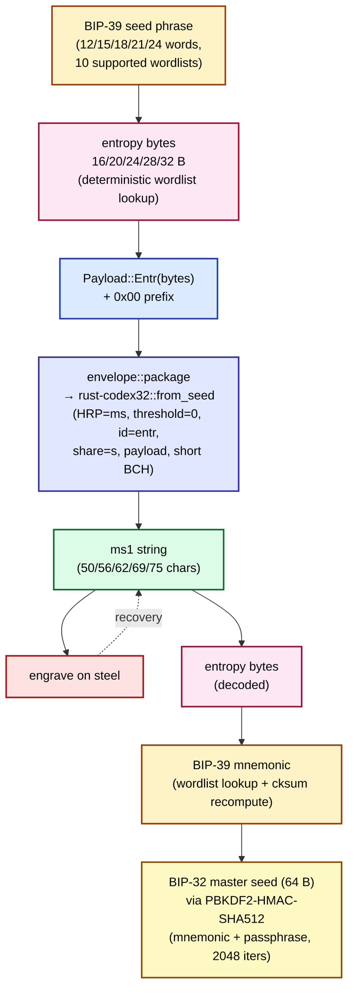

# ms1 Wire Format

This chapter documents ms1's current wire format at bit-level depth. The format is **v0.1** (wire format locked 2026-05-03 after the r6 amendment that narrowed payloads to BIP-39 entropy only; reference implementation at `ms-codec` v0.1.1). For the normative spec, see `bg002h/mnemonic-secret/design/SPEC_ms_v0_1.md`. ms1 does not yet ship a BIP draft (the closest sibling, mk1, is at Pre-Draft; ms1 is reference-implementation-only for v0.1).

ms1\index{ms1} encodes **secret material** for Bitcoin self-custody backups — specifically, the BIP-39 entropy\index{BIP-39 entropy} that re-derives a wallet's master seed via PBKDF2\index{PBKDF2-HMAC-SHA512}. ms1 is designed to engrave alongside mk1 (xpub) and md1 (descriptor / wallet template) cards as a coherent restoration bundle.

Unlike md1 and mk1 — which fork BIP-93 BCH plumbing locally with HRP-mixed per-format target residues — **ms1 is BIP-93 codex32 used directly** via Andrew Poelstra's `rust-codex32`\index{rust-codex32} `= "=0.1.0"` crate (CC0). The "spec" is therefore mostly: which BIP-93 wire fields carry which payload semantics, what the v0.1 → v0.2 migration contract is, and what an implementer must do to avoid drifting from BIP-93 itself.

## Layer model

ms1 has two layers, with a sharper boundary than md1/mk1:

- **Encoding layer.** BIP-93 codex32 verbatim. HRP `ms` + separator `1` + threshold + id + share-index + payload + BCH checksum. The encoding layer is responsible for character-level error correction (up to 8 substitutions detected, 4 correctable per BIP-93 §"Error Correction"), HRP-mixed BCH polymod, and the strict short-code framing. **`ms-codec` does not implement, fork, or vendor any BCH polynomial** — all encoding-layer work is delegated to `rust-codex32`.
- **Payload layer.** A byte-aligned record carrying — in fixed order — a single reserved-prefix byte (`0x00` in v0.1) followed by the raw BIP-39 entropy bytes. Payload semantics are layered atop BIP-93's `id` field (used as the type tag in v0.1) and the codex32 `payload` field (used for the prefix byte + entropy).

The two layers compose at one module boundary: `crates/ms-codec/src/envelope.rs` is the only file that contacts `rust-codex32`. This isolation is intentional — when K-of-N share encoding ships in v0.2, only this module changes.

The full encode + recovery pipeline (application layer → wire → recovery):



The diagram emphasizes two boundaries: `entropy → payload → envelope` is the codec boundary (in scope for this chapter); `phrase ↔ entropy` and `entropy → mnemonic → seed` are the application layer (in scope for the end-user manual, and for `mnemonic-toolkit`'s bundle / verify-bundle flows; §IV.1).

## Encoding-layer framing

### Card structure

Every v0.1 ms1 string is the BIP-93 codex32 concatenation:

```text
<HRP> <sep> <threshold> <id>    <share-index> <data>            <checksum>
   ms     1   0           entr   s             N payload syms   13 codex32 syms
   2ch    1ch 1ch         4ch    1ch
```

The HRP is `ms` (lowercase, 2 chars; SPEC §2.1 — this is BIP-93 codex32's HRP, not a new one). The separator is BIP 173's `1`. The threshold, id (4-char type tag), and share-index together form a 6-char fixed prefix per BIP-93 §"Specification". Then comes the variable-length payload, then a 13-character short-code BCH checksum.

ms1 v0.1 emits and accepts only the **short codex32 checksum** (13 chars). The long checksum (15 chars) is unused because the v0.1 emit-tag (`entr`, 16–32 B + 1-B reserved prefix) always fits the short bracket. v0.1 decoders MUST also reject long-checksum strings (rule 9 below; `crates/ms-codec/src/consts.rs::VALID_STR_LENGTHS`).

### BIP-93 wire fields

ms1 v0.1 fixes every BIP-93 codex32 field to a specific value (SPEC §2.5):

| BIP-93 field | v0.1 ms1 value | Wire position |
|---|---|---|
| HRP | `ms` (lowercase) | chars 0..2 |
| separator | `1` | char 2 |
| threshold | `0` (digit zero) | char 3 |
| id | the type tag — `entr` in v0.1 | chars 4..8 |
| share-index | `s` (denoting "unshared secret" per BIP-93) | char 8 |
| payload | `0x00` reserved-prefix byte ‖ entropy (16/20/24/28/32 B) | chars 9..(len−13) |
| checksum | BCH(short) — 13 codex32 chars | chars (len−13).. |

The `threshold = 0` + `share-index = 's'` choice is the BIP-93 "Unshared Secret"\index{Unshared Secret form} form (BIP-93 §"Unshared Secret"). v0.1 decoders reject `threshold ≠ '0'` with `Error::ThresholdNotZero`\index{Error::ThresholdNotZero} and `share-index ≠ 's'` with `Error::ShareIndexNotSecret`\index{Error::ShareIndexNotSecret} (`crates/ms-codec/src/envelope.rs::discriminate`). The latter is also enforced upstream by `rust-codex32 v0.1.0`'s parse, but `ms-codec` re-checks for defense-in-depth and to surface a domain-typed error to its callers.

### NUMS-derived target constants

ms1 inherits BIP-93's target residue constants directly — there is no per-format NUMS string and no HRP-mixed fork. The polynomial is BIP-93's `MS32_CONST` (regular code) and `MS32_LONG_CONST` (long code, unused in v0.1) verbatim. Cross-format domain separation against md1 and mk1 is by HRP alone: a damaged md1 / mk1 string transcribed with the wrong HRP into `ms`-shape would still fail BIP-93 checksum verification with overwhelming probability, because BIP-93's polymod folds the HRP into the residue.

See §I.3 for the codex32 polynomial details and the HRP-mixing algorithm.

### Length envelope (5 valid v0.1 lengths)

v0.1 ms1 strings ride only BIP-93's **short code** bracket. The total string length is determined precisely by the entropy byte count, per the SPEC §2.4 table:

| BIP-39 word count | entropy bytes | data bits (incl. prefix) | payload symbols | pad bits | total string length |
|---|---|---|---|---|---|
| 12 | 16 | 136 | 28 | 4 | 50 |
| 15 | 20 | 168 | 34 | 2 | 56 |
| 18 | 24 | 200 | 40 | 0 | 62 |
| 21 | 28 | 232 | 47 | 3 | 69 |
| 24 | 32 | 264 | 53 | 1 | 75 |

Formula: total = `3 (HRP+sep) + 1 (threshold) + 4 (id) + 1 (share-index) + N (payload) + 13 (cksum) = 22 + N`. The payload symbol count is `⌈(entropy_bytes + 1) × 8 / 5⌉`. The bijection is sanity-tested in `crates/ms-codec/src/consts.rs::tests::valid_str_lengths_match_entr_lengths_via_bijection`.

v0.1 decoders MUST reject any total length outside `{50, 56, 62, 69, 75}` with `Error::UnexpectedStringLength`\index{Error::UnexpectedStringLength} (`crates/ms-codec/src/decode.rs::decode`). This single rule rejects, in particular, every BIP-93 long-code string (total 99–111 chars for HRP=ms — data-part length 96..=108 plus 3 chars of HRP+separator) without needing a separate "long codex32" rejection path.

### Pad bits in the final payload symbol

When the payload's total bit-length is not a multiple of 5, the final 5-bit codex32 symbol carries `5 − (data_bits mod 5)` padding bits at the low end. Per BIP-93 §"Unshared Secret" (line 155, quoted verbatim from `bip-0093.mediawiki`):

> we do NOT require that the incomplete group be all zeros.

Encoders MAY emit any pad-bit value and decoders MUST ignore them. The pad-bit counts per entropy length are `{4, 2, 0, 3, 1}` for 16/20/24/28/32-B entropy respectively (the table column above). Unlike md1 / mk1 — which reject non-zero pad bits at the bytecode-layer boundary with `Error::MalformedPayloadPadding` — ms1 follows BIP-93's permissive rule. The upstream `rust-codex32 v0.1.0`'s `Parts::data()` discards them silently.

## Payload layer

The payload (the bytes returned by `Parts::data()` after BIP-93 codex32 parsing) is a **byte-aligned** record:

```text
[reserved_prefix_byte : 1 B; MUST be 0x00 in v0.1]
[entropy_bytes        : 16, 20, 24, 28, or 32 B]
```

### The `0x00` reserved-prefix byte

Every v0.1 ms1 payload begins with a single byte of value `0x00`\index{reserved-prefix byte (ms1)}. In v0.1 this byte is reserved (decoder MUST reject any non-zero value with `Error::ReservedPrefixViolation`\index{Error::ReservedPrefixViolation}; `crates/ms-codec/src/envelope.rs::dispatch_payload`). In v0.2 it is **promoted to a type discriminator**, which makes the v0.2 share-encoding migration non-breaking for v0.1 strings — a v0.2 decoder seeing prefix `0x00` falls back to v0.1's "type tag is in BIP-93 `id` field" interpretation. See "v0.1 → v0.2 migration contract" below.

The reservation is unique to ms1 among the four m-format formats. md1 / mk1 use their own bytecode-header bytes for version + flag bits; ms1 has no bytecode header (BIP-93's `id` field carries the type tag and BIP-93 guarantees the parsing structure). The single reserved byte is the entire forward-compatibility budget for v0.1.

### Tag type

A `Tag`\index{Tag (ms1)} (`crates/ms-codec/src/tag.rs`) is a 4-byte value where each byte is a codex32-alphabet character (`qpzry9x8gf2tvdw0s3jn54khce6mua7l`). Construction validates the alphabet at construction; out-of-alphabet bytes return `Error::TagInvalidAlphabet`\index{Error::TagInvalidAlphabet}. A `Tag` value that is structurally valid but not a member of `RESERVED_TAG_TABLE` returns `Error::UnknownTag`\index{Error::UnknownTag} at decode time.

v0.1's public API exposes exactly one `Tag` constant:

```rust
pub const ENTR: Tag = Tag(*b"entr");
```

v0.1 deliberately does **not** expose `pub const SEED` or `pub const XPRV` constants. Those 4-byte values are members of `RESERVED_TAG_TABLE` (decoder rejects them with `Error::ReservedTagNotEmittedInV01`), but exposing them as public constants would invite encoder misuse — the only callable `Tag` values in v0.1 should be those an encoder may legitimately emit (SPEC §3.2).

### `RESERVED_TAG_TABLE`

The full 5-entry table is curated to ms1's actual purpose (secret material, not metadata or certificates). The table grows by SemVer-minor only (SPEC §3.3; `crates/ms-codec/src/consts.rs::RESERVED_ID_BLOCKLIST`):

| Tag | Meaning | v0.1 emit | v0.1 accept |
|---|---|---|---|
| `entr`\index{Tag::ENTR} | BIP-39 entropy (128/160/192/224/256 b = 16/20/24/28/32 B) | yes | yes |
| `seed` | BIP-32 master seed (64 B) | no — overflows BIP-93 long bracket with prefix byte | reject (`Error::ReservedTagNotEmittedInV01`\index{Error::ReservedTagNotEmittedInV01}) |
| `xprv` | serialized BIP-32 xpriv (78 B stripped of Base58Check) | no — outside BIP-93 brackets at any length | reject (`Error::ReservedTagNotEmittedInV01`) |
| `mnem` | reserved for future "entropy + wordlist-language hint" payload | no | reject (`Error::ReservedTagNotEmittedInV01`) |
| `prvk` | reserved for future raw secp256k1 32-B private key | no | reject (`Error::ReservedTagNotEmittedInV01`) |

Tags structurally valid (alphabet-conforming) but not in the table cause `Error::UnknownTag` (`crates/ms-codec/src/decode.rs::decode`). The reservation policy applies at **both** sides: SPEC §3.5.1 mandates that the encoder also rejects reserved-not-emitted tags with the same `Error::ReservedTagNotEmittedInV01` variant, preventing an asymmetry where a v0.1 ms-codec could emit a string the v0.1 ms-codec itself cannot decode.

### `Payload::Entr`\index{Payload::Entr} and entropy-length validation

```rust
#[non_exhaustive]
pub enum Payload {
    Entr(Vec<u8>),    // 16/20/24/28/32 B (BIP-39 entropy)
}
```

Encoder MUST reject `Payload::Entr(data)` with `data.len() ∉ {16, 20, 24, 28, 32}` (`Error::PayloadLengthMismatch`\index{Error::PayloadLengthMismatch} `{ tag: Tag::ENTR, expected: <set>, got }`; `crates/ms-codec/src/payload.rs`). Decoder applies the same check after extracting the payload bytes following the prefix byte (`decode.rs::decode`). The set `{16, 20, 24, 28, 32}` corresponds bijectively to BIP-39 word counts `{12, 15, 18, 21, 24}`. **ms-codec does not separately carry the word count on the wire**; the byte length is the unambiguous discriminator.

The `#[non_exhaustive]` attribute is permanent from v0.1.0 onward; future variants (e.g., `Mnem`, `Seed`, `Xprv` once their framing is settled) are semver-minor additions. Removing `#[non_exhaustive]` would be semver-major and is not contemplated (SPEC §10.3).

### Caller responsibility for entropy quality

`ms-codec` does **not** check the statistical quality of bytes passed to `Payload::Entr`. Callers are responsible for sourcing entropy from a vetted CSPRNG (or from a BIP-39 mnemonic the user already trusts). FIPS-style entropy-quality checks at the codec boundary would slow encoding and provide false assurance — they cannot detect an attacker-supplied "pseudo-random" seed crafted to pass standard randomness tests (SPEC §3.6).

## Recovery routing — BIP-39 entropy as the master-seed payload

A user who possesses a BIP-39 seed phrase recovers their BIP-32 master seed without needing direct `seed` payload support (SPEC §1.2). The application-layer recovery chain is:

```text
BIP-39 seed phrase  →  entropy bytes (16/20/24/28/32 B; BIP-39 wordlist lookup, deterministic)
                    →  ms1 encode entr  →  ms1 string  →  engrave

ms1 string  →  ms1 decode entr  →  entropy bytes
            →  BIP-39 mnemonic (wordlist lookup + 4-bit checksum recompute)
            →  PBKDF2-HMAC-SHA512(mnemonic + passphrase, "mnemonic" + passphrase, 2048)
            →  64-B BIP-32 master seed
            →  BIP-32 derivation
```

The recovery chain re-derives the BIP-32 master seed from the entropy + (optional) passphrase. The `mnemonic-toolkit` crate at the repo root wraps this routing as a transparent CLI surface; see §IV.1 for bundle-formation details.

**Engraving justification.** A 24-word BIP-39 mnemonic engraved on steel with its 4-bit BIP-39 checksum is too weak to localize transcription errors. The same 32 B of entropy encoded as `ms1 entr` carries a 13-character BCH checksum that detects up to 8 character substitutions and corrects up to 4. The user can reconstruct the entropy from a partially-corroded card, then re-derive the mnemonic deterministically (SPEC §6.1).

### BIP-39 wordlist\index{BIP-39 wordlist} language — recovery hazard

BIP-39 entropy → mnemonic\index{BIP-39 mnemonic} conversion depends on the wordlist language (English, Japanese, Korean, Spanish, Chinese Simplified, Chinese Traditional, French, Italian, Czech, Portuguese — 10 BIP-39-defined languages, fitting in 4 bits). The wordlist is **not carried on the v0.1 ms1 wire**. A user whose original wallet used a non-English wordlist who recovers via English-defaulted wallet software will silently derive a different 64-B BIP-32 master seed → different addresses → empty wallet. This is exactly the concern raised in BIP-93 §"Not BIP-0039 Entropy" (SPEC §6.3).

Informational recommendations (not enforced by the format):

- Users MUST record their BIP-39 wordlist language alongside the engraved `ms1 entr` card. Plain text on the back of the steel plate is sufficient.
- Wallet software decoding `ms1 entr` SHOULD expose a wordlist-language selector and SHOULD warn when defaulting to English. The reference `ms decode` does this — its stderr and the `language` line on stdout both carry an explicit "DEFAULT" annotation when `--language` is not supplied.
- A future v0.2+ payload kind `mnem` (reserved tag, currently rejected in v0.1) is allocated for an "entropy + 4-bit-encoded wordlist-language hint" payload that addresses this on the wire.

## Validity rules

A v0.1 ms-codec decoder MUST reject input that meets any of the following conditions (`crates/ms-codec/src/error.rs` variants; `crates/ms-codec/src/decode.rs` + `envelope.rs`):

| # | Condition | Error variant |
|---|---|---|
| 1 | Upstream BIP-93 codex32 parse failure (bad checksum, bad character, mixed case, length out of BIP-93 brackets, …) | `Codex32(<inner>)` |
| 2 | HRP ≠ `ms` | `WrongHrp` |
| 3 | Threshold byte ≠ `'0'` | `ThresholdNotZero` |
| 4 | Share-index byte ≠ `'s'` | `ShareIndexNotSecret` |
| 5 | id-field bytes not in codex32 alphabet (defensive; unreachable after BIP-93 parse) | `TagInvalidAlphabet` |
| 6 | id is a structurally valid 4-byte tag but not in `RESERVED_TAG_TABLE` | `UnknownTag` |
| 7 | id is in `RESERVED_TAG_TABLE` but reserved-not-emitted in v0.1 (currently `seed`, `xprv`, `mnem`, `prvk`)\index{RESERVED\_TAG\_TABLE} | `ReservedTagNotEmittedInV01` |
| 8 | Payload prefix byte ≠ `0x00` | `ReservedPrefixViolation` |
| 9 | Total string length ∉ `{50, 56, 62, 69, 75}` | `UnexpectedStringLength` |
| 10 | After stripping prefix byte, payload length ∉ `{16, 20, 24, 28, 32}` for tag `entr` | `PayloadLengthMismatch` |

Rule 1 is delegated; rules 2–4 + 8 are wire-invariant checks in `envelope::discriminate`; rules 5–7 + 10 are tag-and-payload-layer checks in `decode::decode`; rule 9 is the v0.1-emittable-length gate at the very front of `decode::decode`. Rules 7 + 10 are reachable through hand-constructed inputs only; rule 9 rejects most long-checksum inputs before the upstream parser runs.

Trailing pad bits of the final 5-bit codex32 symbol may be any value; the decoder ignores them (BIP-93 §"Unshared Secret" line 155). This differs from md1 / mk1's pad-rejection semantics.

## v0.1 → v0.2 migration contract

ms1's wire format is designed to enable K-of-N share encoding for `entr` in v0.2 without breaking v0.1 strings. The full contract is four invariants (SPEC §5 + `MIGRATION.md`); the short version:

1. **Reserved-prefix byte = type discriminator in v0.2.** v0.1 emits `0x00`; v0.2 promotes the byte to a discriminator (`0x01 = entr-share`, `0x02..0xFF = unallocated, claim-via-PR`). v0.1 strings with prefix `0x00` remain forward-readable: a v0.2 decoder seeing `0x00` falls back to v0.1's "type tag is in BIP-93 `id` field" interpretation.
2. **Grouping invariant.** v0.2 readers MUST gate on the prefix byte *before* treating the BIP-93 `id` field as a share-set group key. Strings with prefix `0x00` are dispatched to the v0.1 single-string decode path immediately and never participate in share grouping.
3. **Encoder anti-collision.** v0.2 encoders MUST refuse to emit any random `id` value that is a member of v0.1's `RESERVED_TAG_TABLE` (re-roll on collision; deterministic-id derivation hard-errors).
4. **API back-compat.** v0.1's `encode(tag, payload)` signature is preserved unchanged in v0.2; a new `encode_shares(tag, threshold, payload_set)` overload is added.

The `0x00` reserved-prefix-byte rule has been enforced at the v0.1 decoder since day 1 (rule 8 above) precisely so the v0.2 migration is non-breaking from the wire side. SHA-pinned regressions on v0.1 outputs continue to pass after callers swap to `encode_shares` in v0.2.

## Worked encode: 12-word `abandon abandon ... about` canonical (BIP-39 [0; 16])

Input: the canonical BIP-39 12-word "abandon abandon abandon abandon abandon abandon abandon abandon abandon abandon abandon about" phrase, English wordlist. Entropy bytes: `00000000000000000000000000000000` (16 zero bytes — the smallest v0.1 entropy length).

Encoder steps (`crates/ms-codec/src/encode.rs` → `envelope::package` → `Codex32String::from_seed`):

1. **Validate payload length.** `Payload::Entr(data)` with `data.len() == 16` ∈ `{16, 20, 24, 28, 32}`. Pass.
2. **Construct codex32 data bytes.** Prefix `0x00` ‖ entropy (16 zero bytes) → 17 zero bytes. Bits: `17 × 8 = 136`. Symbols: `⌈136 / 5⌉ = 28`. Pad bits: `28 × 5 − 136 = 4` (low bits of the final symbol; SPEC permits any value; encoder emits zero).
3. **Build BIP-93 fields.** HRP `ms`, threshold `0`, id `entr`, share-index `s`. Delegate to `Codex32String::from_seed(HRP, 0, "entr", Fe::S, &data)`.
4. **BCH polymod.** `rust-codex32` runs the short-code polymod over `hrp_expand("ms") || data_5bit || [0; 13]` and produces 13 checksum symbols. The fixed-prefix data part (threshold+id+share = `0entrs`) is folded into the polymod input by `Codex32String::from_seed` before the payload symbols (BIP-93 §"Specification").
5. **Compose total string length.** `3 (HRP+sep) + 1 (threshold) + 4 (id) + 1 (share-index) + 28 (payload) + 13 (cksum) = 50` characters.

Resulting card (matches SHA-pinned vector 1 in `ms vectors`):

```{.text include="ms1-encode-12word-abandon-unbroken.out" lines="1-1"}
ms10entrsqqqqqqqqqqqqqqqqqqqqqqqqqqqqcj9sxraq34v7f
```

Character-by-character decomposition (verified against the `qpzry9x8gf2tvdw0s3jn54khce6mua7l` alphabet):

- `ms` — HRP (chars 0..2).
- `1` — separator (char 2).
- `0` — threshold (char 3; codex32 alphabet value `15`, but the BIP-93 specification treats threshold positionally as a decimal digit; v0.1 ms1 emits literal `'0'`).
- `entr` — id / type tag (chars 4..8).
- `s` — share-index (char 8; codex32 alphabet value `16`, denoting unshared secret).
- `qqqqqqqqqqqqqqqqqqqqqqqqqqqq` — 28 payload symbols (chars 9..37; 28 × `q` = 28 × value-`0` = 17 zero bytes with 4 zero trailing pad bits, packed MSB-first).
- `cj9sxraq34v7f` — 13-symbol BCH short-code checksum (chars 37..50).

The encoded card carries no padding bits with non-zero values; non-zero pad bits would still decode under BIP-93's permissive rule but are discarded by `Parts::data()`.

## Worked decode: 12-word abandon canonical

Input: `ms10entrsqqqqqqqqqqqqqqqqqqqqqqqqqqqqcj9sxraq34v7f` (50 chars). The captured transcript at `transcripts/ms1-decode-12word-abandon.{cmd,out}` reproduces the steps below end-to-end against the HEAD `ms` binary.

Decoder steps (`crates/ms-codec/src/decode.rs::decode`):

1. **Length gate** (rule 9). `s.len() == 50` ∈ `{50, 56, 62, 69, 75}`. Pass.
2. **BIP-93 codex32 parse** (rule 1). Delegate to `Codex32String::from_string(s)`. The upstream parser verifies HRP-mixed polymod against BIP-93's short-code target residue and reports success. The parse exposes `Parts::data() → vec![0x00; 17]` (17 zero bytes = prefix + 16 entropy).
3. **Wire-position re-parse** (`envelope::extract_wire_fields`). Locate the last `1` separator at index 2; read fixed-position fields:
   - `hrp = s[0..2] = "ms"` (rule 2 check: pass).
   - `threshold = s[3] = '0'` (rule 3 check: pass).
   - `id = s[4..8] = "entr"` (4-char tag).
   - `share-index = s[8] = 's'` (rule 4 check: pass).
4. **Tag alphabet check** (rule 5; `Tag::try_new("entr")`). Pass.
5. **Reserved-prefix check** (rule 8). `Parts::data()[0] == 0x00`. Pass.
6. **Reserved-not-emitted check** (rule 7). `entr` ∉ `{seed, xprv, mnem, prvk}`. Pass.
7. **Tag accept check** (rule 6). `entr` ∈ v0.1 accept set. Build `Payload::Entr(data[1..].to_vec())` = `Payload::Entr(vec![0u8; 16])`.
8. **Payload length validation** (rule 10). `data[1..].len() == 16` ∈ `{16, 20, 24, 28, 32}`. Pass.
9. **Application layer** (CLI, not the codec). `ms decode` re-derives the BIP-39 mnemonic from the entropy via the English wordlist (default) + BIP-39 4-bit-checksum recomputation, surfacing a `language` line with the "DEFAULT" annotation per SPEC §6.3.

The decoded output (verified by `verify-examples.sh` against HEAD `ms-cli`) reports the entropy, the reconstructed BIP-39 phrase, the wordlist language (with default-annotation), and the wordlist-language hazard reminder.

## Cross-references

- §I.2 covers the m-format constellation; ms1 is the BIP-93-direct member, distinguished from md1 and mk1's forked-BCH approach by the boundary diagram.
- §I.3 covers the BCH plumbing (BIP-93 codex32 polymod and HRP-mixing). ms1 uses BIP-93's short-code target residue directly; md1 and mk1 use their own NUMS-derived per-format constants.
- §II.1 (md1) and §II.2 (mk1) cover the sibling wire formats. The four-format restoration bundle (ms1 + mk1 + md1 + toolkit) is documented in §IV.1.
- §V.3 covers the `ms-codec` Rust API surface (encoder + decoder + inspect + `Tag` + `Payload`).

The reference implementation:

- `crates/ms-codec/src/lib.rs` — public re-exports (`encode`, `decode`, `inspect`, `Tag`, `Payload`).
- `crates/ms-codec/src/consts.rs` — locked constants (HRP `"ms"`, threshold byte `b'0'`, share-index `b's'`, reserved prefix `0x00`, valid string lengths `{50, 56, 62, 69, 75}`, valid entr lengths `{16, 20, 24, 28, 32}`).
- `crates/ms-codec/src/envelope.rs` — the v0.2-migration seam. The only module that contacts `rust-codex32`. Wire-position re-parse + `discriminate` (decode) + `package` (encode).
- `crates/ms-codec/src/encode.rs`, `decode.rs` — public entry points.
- `crates/ms-codec/src/tag.rs`, `payload.rs` — `Tag` + `Payload` types + alphabet + length validation.
- `crates/ms-codec/src/error.rs` — `Error` enum mirroring the 10 validity rules + the upstream `Codex32` wrapping.
- `crates/ms-codec/src/inspect.rs` — structural dump used by `ms inspect` (the `InspectReport` shape is `#[non_exhaustive]` from day 1).
