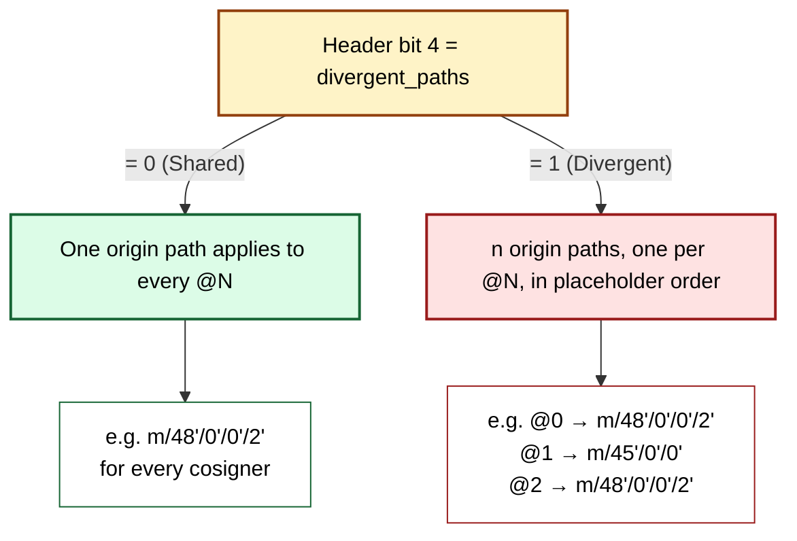

# Descriptor to Miniscript to Address

md1 stores a **template**, not an address. This chapter explains the three tiers that turn that template into a usable bitcoin address: the wallet-policy template, the per-key derivation, and the rust-miniscript address rendering. Shape coverage (every BIP-388-parseable shape that survives the round-trip) is the subject of §III.2; network and SLIP-0132 prefix interactions are §III.3.

The reference implementation entry point is `Descriptor::derive_address` at `descriptor-mnemonic/crates/md-codec/src/derive.rs:92-132`; the AST-to-rust-miniscript converter is `to_miniscript_descriptor` at `descriptor-mnemonic/crates/md-codec/src/to_miniscript.rs:54-64`. Both are gated behind the `derive` Cargo feature (default-on; pure-codec consumers can opt out via `default-features = false`).

## The three-tier model

Address derivation crosses three layers, each adding one piece of information the previous layer was missing:


**Tier 1 — Template.**\index{template (md1)} The md1 card carries the BIP-388\index{BIP-388} wallet policy: a typed AST plus the use-site path (multipath\index{multipath} alternatives + wildcard\index{wildcard (BIP-389)}). Placeholders `@0..@N-1`\index{placeholder (@N)} stand in for cosigner keys; the template knows the *shape* but not the *keys*. A template alone resolves nothing.

**Tier 2 — Derivation.**\index{derivation (md1)} For each `@N`, an xpub is supplied (inline in the `Pubkeys` TLV\index{Pubkeys TLV} `0x02`, or out-of-band via mk1 sibling cards or `md address --key @N=...`). The use-site path's multipath\index{multipath alternative} alt selector (the `chain` parameter — `0` = receive, `1` = change for the canonical `<0;1>/*`) and the wildcard child number (`index`) are combined with each xpub to produce one definite secp256k1 pubkey per `@N`. Hardened steps are rejected pre-flight (BIP-32\index{BIP-32} forbids hardened public derivation).

**Tier 3 — Script + Address.**\index{script (BIP-388)}\index{address derivation} The md1 AST is converted to a `miniscript::Descriptor<DescriptorPublicKey>` by `to_miniscript_descriptor` and the address is rendered by `miniscript::Descriptor::at_derivation_index(index).address(network)`. This is the point at which the descriptor *type* (`wpkh`, `wsh(sortedmulti(...))`, `tr(...)`, ...) determines the script shape and the network parameter selects the encoding (mainnet bech32 vs. testnet `tb1`, etc.).

### What each tier cannot know in isolation

- **Tier 1 alone cannot derive an address.** Every `@N` is a placeholder; without xpubs there are no public keys, and without public keys there is no script.
- **Tier 2 with xpubs alone is not enough.** The same xpub at the same `(chain, index)` produces different scripts depending on whether the template is `wpkh`, `wsh(sortedmulti(...))`, or `tr(...)`. Address derivation is a *joint* function of the AST and the keys.
- **Tier 3 with a `miniscript::Descriptor` still needs the network.** The script bytes don't change across mainnet/testnet/regtest/signet, but the human-readable address does (different HRPs, different version-prefix bytes for legacy networks).

## BIP-388 wallet-policy framing

The split between Tier 1 (on-card template) and Tier 2 (separately-supplied xpubs) is the BIP-388 wallet-policy framing. BIP-388 §"Specification" separates the *template* (a descriptor expression using `@i` placeholders and a key-information vector) from the *key information* (the concrete xpubs, fingerprints, and origin paths that fill those placeholders). md1's wire format carries the template by default and admits the key information either inline (TLV `0x02` `Pubkeys`\index{Pubkeys TLV}; TLV `0x01` `Fingerprints`\index{Fingerprints TLV}) or as derivation context supplied at address-derivation time.

The engraving use case typically engraves the template on md1 alone and the xpubs on mk1 sibling cards. The self-custody short-circuit (single-sig wpkh/tr with an inline xpub) keeps everything on one md1 card. Either way, `Descriptor::derive_address` requires every `@N` to resolve to an xpub at call time: a missing `@N` surfaces as `Error::MissingPubkey { idx }`\index{Error::MissingPubkey} (generated at `to_miniscript.rs:73`).

## Origin path vs. use-site path

md1 carries **two** path concepts. Both look like `m/...`-style BIP-32 paths but they describe different segments and are used by different layers.

| Path | What it describes | Where it sits | Wire location | Used by address derivation? |
|---|---|---|---|---|
| **Origin path**\index{origin path} | Master seed → xpub | Prefix metadata for each `@N` | Inline path-decl block (header bit 4 selects Shared vs. Divergent); sparse overrides via TLV `0x03` | **No** — origin is metadata for signing (PSBT key-source) |
| **Use-site path**\index{use-site path} | xpub → wildcard leaf (multipath alt + `/*`) | Suffix applied at the placeholder | Inline use-site-path block; per-`@N` sparse overrides via TLV `0x00` | **Yes** — selected by `chain` + `index` |

The doc-comment at `derive.rs:14-19` makes the asymmetry explicit:

> Origin path is not consulted. Origin is the path *to* the xpub from the master seed; address derivation starts at the xpub.

A consequence: a Tier-2 xpub supplied via `md address --key @0=<xpub>` is sufficient for address derivation without any origin metadata; only signing flows (PSBT construction) consult the origin record.

### Shared and Divergent origin-path modes

The origin path is encoded inline (bit-packed, dense) immediately after the 5-bit header. Header bit 4 — the `divergent_paths`\index{divergent\_paths} flag in §II.1's terminology, persisted on the wire as that single bit — chooses between two payload shapes:



The Shared form is dominant: single-signer wallets (BIP-44\index{BIP-44}/49\index{BIP-49}/84\index{BIP-84}/86\index{BIP-86}) trivially share a path with themselves (`n = 1`), and conventional multisig wallets where every cosigner uses the BIP-48\index{BIP-48} account path `m/48'/0'/0'/2'` collapse to one shared path. The Divergent form is reserved for the legitimate case where cosigners chose different account paths.

Path-modification overrides (TLV `0x03` `OriginPathOverrides`\index{OriginPathOverrides TLV}, sparse) are an orthogonal mechanism for replacing a single `@N`'s origin path after the inline path-decl block is written. The data structures are `PathDecl` + `PathDeclPaths::{Shared, Divergent}` at `crates/md-codec/src/origin_path.rs:82-96`; the read/write code at `:110-146` and the wire layout at `:1-12`.

(Pre-v0.11 wire formats had an in-bytecode `Tag::OriginPaths = 0x36` for dictionary-style path lookups; that tag was retired with the v0.11 wire-format cleanup and **does not** exist in v0.30. See §II.1 §"History note: retired wire-layer dictionaries".)

## Pre-flight validation

`Descriptor::derive_address` (`derive.rs:92-132`) rejects four impossible-by-construction inputs before invoking the converter:

- **Hardened wildcard.** `use_site_path.wildcard_hardened = 1` would require hardened public derivation from an xpub — forbidden by BIP-32. Returns `Error::HardenedPublicDerivation`\index{Error::HardenedPublicDerivation}.
- **Chain index out of range (multipath case).** When the use-site has a multipath group, `chain` must select an existing alternative; for `<0;1>/*`, `chain ∈ {0, 1}`. Out-of-range returns `Error::ChainIndexOutOfRange { chain, alt_count }`\index{Error::ChainIndexOutOfRange}.
- **Hardened multipath alternative.** The selected `alts[chain]` cannot be hardened. Returns `Error::HardenedPublicDerivation`.
- **No-multipath chain ≠ 0.** When the use-site has no multipath group (bare `/*`), only `chain = 0` is valid; any other value returns `Error::ChainIndexOutOfRange { chain, alt_count: 0 }` (`derive.rs:113-118`).

After these pre-flights the descriptor is handed to `to_miniscript_descriptor`, then to rust-miniscript's `at_derivation_index(index).address(network)`. Any failure downstream (type-check, context error, unsupported fragment, network mismatch) is wrapped as `Error::AddressDerivationFailed { detail }`\index{Error::AddressDerivationFailed} (`to_miniscript.rs:474-476`). The exhaustive shape catalogue is §III.2; the network-by-network surface is §III.3.

## Worked example — BIP-84 single-sig

Take the canonical BIP-84 test vector: mnemonic `abandon abandon abandon abandon abandon abandon abandon abandon abandon abandon abandon about`\index{abandon test mnemonic}, account path `m/84'/0'/0'`, descriptor `wpkh(@0/<0;1>/*)`, expected receive-0 address `bc1qcr8te4kr609gcawutmrza0j4xv80jy8z306fyu` (BIP-84\index{BIP-84} §"Test vectors").

**Tier 1 — Template.** The md1 AST is (see §II.1's worked encode of `wpkh(@0/<0;1>/*)` for the wire-format walk of the same shape):

```text
Descriptor {
  n: 1,
  path_decl: PathDecl { n: 1, paths: Shared(m/84'/0'/0') },
  use_site_path: UseSitePath { multipath: [0, 1], wildcard_hardened: false },
  tree: Wpkh @0,
  tlv.pubkeys: [(0, <abandon xpub bytes>)],
}
```

The template plus the inline xpub fully specifies the wallet. The wire form for this exact shape (without the xpub — just the template) appears in §II.1's worked encode as the 24-character `md1yqpqqxqq8xtwhw4xwn4qh`.

**Tier 2 — Derivation.** With `chain = 0` and `index = 0`, the use-site path resolves to the suffix `/0/0`; combined with the abandon account xpub `xpub6CatWdiZiodmUeTDp8LT5or8nmbKNcuyvz7WyksVFkKB4RHwCD3XyuvPEbvqAQY3rAPshWcMLoP2fMFMKHPJ4ZeZXYVUhLv1VMrjPC7PW6V` (derivable from the mnemonic via `mnemonic convert --from "phrase=..." --to xpub --template bip84`), CKDpub\index{CKDpub} produces a definite secp256k1 pubkey for the receive-0 leaf. The origin record `m/84'/0'/0'` is *not consulted* here; only the chain-code and pubkey bytes of the xpub matter for CKDpub.

**Tier 3 — Script + Address.** `to_miniscript_descriptor` produces a `wpkh(...)` `miniscript::Descriptor` over that definite key; `miniscript::Descriptor::address(Network::Bitcoin)` produces `bc1qcr8te4kr609gcawutmrza0j4xv80jy8z306fyu`.

The end-to-end invocation against the `md` CLI is captured at `transcripts/md1-address-bip84-receive0.cmd`/`.out` and re-runs via `tests/verify-examples.sh`.

## Source pointers

- `descriptor-mnemonic/crates/md-codec/src/derive.rs:92-132` — `Descriptor::derive_address` entry point.
- `descriptor-mnemonic/crates/md-codec/src/derive.rs:14-19` — origin-path-not-consulted invariant.
- `descriptor-mnemonic/crates/md-codec/src/to_miniscript.rs:54-64` — `to_miniscript_descriptor`.
- `descriptor-mnemonic/crates/md-codec/src/to_miniscript.rs:130-168` — top-level AST dispatch (`node_to_descriptor`).
- `descriptor-mnemonic/crates/md-codec/src/origin_path.rs:82-146` — `PathDecl` / `PathDeclPaths` data structures and read/write.
- `descriptor-mnemonic/crates/md-codec/src/use_site_path.rs:47-96` — `UseSitePath` data structure and encoder.
- BIP-388 §"Specification" — the wallet-policy framing (template + key information separation).
- BIP-389\index{BIP-389} §"Specification" — multipath alt syntax.
- BIP-380\index{BIP-380} — output script descriptors.
- BIP-32 §"Public parent key → public child key" — CKDpub; forbids hardened derivation from an xpub.
