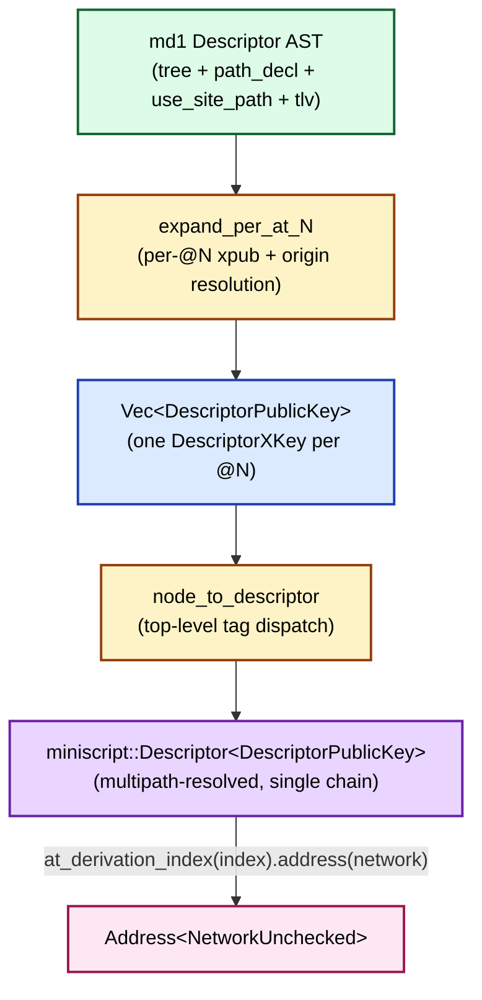

# Shape Coverage

§III.1 framed the three-tier model in the abstract; this chapter enumerates **every BIP-388-parseable shape** the v0.32 converter handles. The pre-v0.32 implementation (md-codec v0.14 through v0.31) carried a hand-rolled allow-list of five shapes; v0.32 replaced that with a generic AST-to-`miniscript::Descriptor` converter that delegates rendering to rust-miniscript. Any policy that round-trips through md1's wire format and parses as BIP-388 derives.

The converter entry point is `to_miniscript::to_miniscript_descriptor`\index{to\_miniscript\_descriptor} at `descriptor-mnemonic/crates/md-codec/src/to_miniscript.rs::to_miniscript_descriptor`. It is feature-gated behind `derive` (default-on).

## Converter pipeline



`expand_per_at_N` (`descriptor-mnemonic/crates/md-codec/src/canonicalize.rs`) resolves each `@N` to an xpub\index{xpub} (inline `Pubkeys` TLV `0x02`, else `Error::MissingPubkey`), an optional master fingerprint (`Fingerprints` TLV `0x01`), and an origin path (the inline path-decl block, with `OriginPathOverrides` TLV `0x03` applied per-`@N`). For each `@N` the converter then constructs a `DescriptorPublicKey::XPub`\index{DescriptorPublicKey} `{ origin, xkey, derivation_path, wildcard: Unhardened }` (`to_miniscript.rs::build_descriptor_public_key`), where `derivation_path` is the use-site multipath alt selected by `chain`.

`node_to_descriptor`\index{node\_to\_descriptor} (`to_miniscript.rs::node_to_descriptor`) maps the top-level tag onto a rust-miniscript constructor:

| Top-level tag | Body shape | rust-miniscript constructor |
|---|---|---|
| `Tag::Pkh` | `Body::KeyArg { index }` | `Descriptor::new_pkh(pk)` |
| `Tag::Wpkh` | `Body::KeyArg { index }` | `Descriptor::new_wpkh(pk)` |
| `Tag::Sh` | `Body::Children([inner])` | `sh_inner_to_descriptor` dispatch |
| `Tag::Wsh` | `Body::Children([inner])` | `wsh_inner_to_descriptor` dispatch |
| `Tag::Tr` | `Body::Tr { is_nums, key_index, tree }` | `Descriptor::new_tr(internal, script_tree)` |

Anything outside this top-level set is `Error::AddressDerivationFailed { detail: "unsupported top-level tag ..." }` (`to_miniscript.rs::node_to_descriptor`). The `Sh` and `Wsh` dispatches branch further by inner tag (multi-family vs. miniscript fragment); the `Tr` dispatch optionally recurses into a tap-script tree.

## The seven BIP-388-parseable buckets

The remainder of this chapter walks each shape. Every worked-address example is grounded in the paired tests at `descriptor-mnemonic/crates/md-codec/tests/address_derivation.rs`, which assert byte-identical agreement between `Descriptor::derive_address` and an independent `miniscript::Descriptor::from_str(...)` derivation — drift between md1 and upstream rust-miniscript would surface as a paired-test failure.

### Bucket 1 — `wpkh(@0)` / `pkh(@0)` / `sh(wpkh(@0))` single-key wrappers\index{wpkh}\index{pkh}\index{sh(wpkh)}

The single-key wrappers are the simplest shape: one `@N`, no inner tree. The converter maps `Tag::Wpkh` / `Tag::Pkh` / `Tag::Sh{Body::Children([Tag::Wpkh])}` directly to `Descriptor::new_wpkh` / `new_pkh` / `new_sh_wpkh` (`to_miniscript.rs::node_to_descriptor`, `::sh_inner_to_descriptor`).

| Variant | BIP path | Template | Abandon-mnemonic test vector | Test |
|---|---|---|---|---|
| `wpkh` | BIP-84 m/84'/0'/0' | `wpkh(@0/<0;1>/*)` | `bc1qcr8te4kr609gcawutmrza0j4xv80jy8z306fyu` | `address_derivation.rs::bip84_wpkh_receive_address_zero` |
| `pkh` | BIP-44 m/44'/0'/0' | `pkh(@0/<0;1>/*)` | `1LqBGSKuX5yYUonjxT5qGfpUsXKYYWeabA` | `address_derivation.rs::bip44_pkh_receive_address_zero` |
| `sh(wpkh)` | BIP-49 m/49'/0'/0' | `sh(wpkh(@0/<0;1>/*))` | converter shape covered at `to_miniscript.rs::sh_inner_to_descriptor`; no standalone abandon-mnemonic test (CLI invocation requires annotated origin metadata) | — |

The BIP-44 `pkh` and BIP-84 `wpkh` worked invocations against `md address` are captured at `transcripts/md1-address-bip44-receive0.{cmd,out}` and `transcripts/md1-address-bip84-receive0.{cmd,out}` (the latter from §III.1) and re-run on every `verify-examples.sh` pass.

### Bucket 2 — `tr(@0)` key-path-only taproot\index{tr (key-path)}

`Tag::Tr` with `Body::Tr { is_nums: false, key_index, tree: None }` produces a `Descriptor::new_tr(internal_key, None)` — a BIP-86\index{BIP-86} single-key taproot output where only the key-path-spend is reachable (`to_miniscript.rs::node_to_descriptor`). The internal key is the xpub at `keys[key_index]`.

| BIP path | Template | Abandon-mnemonic test vector | Test |
|---|---|---|---|
| BIP-86 m/86'/0'/0' | `tr(@0/<0;1>/*)` | `bc1p5cyxnuxmeuwuvkwfem96lqzszd02n6xdcjrs20cac6yqjjwudpxqkedrcr` | `address_derivation.rs::bip86_tr_keypath_only_receive_address_zero` |

Network parameter changes flip the output HRP without touching the underlying script: the same descriptor on `Network::Testnet` produces a `tb1p…` address (covered for `wpkh` in `address_derivation.rs::bip84_wpkh_testnet_address`; the taproot case is structurally identical). §III.3 walks the network surface.

### Bucket 3 — `tr(NUMS, {script_tree})` script-path-only taproot\index{tr (NUMS)}\index{NUMS H-point}

`Tag::Tr` with `Body::Tr { is_nums: true, tree: Some(...) }` substitutes the BIP-341 NUMS H-point for the internal key, making the key-path-spend provably unspendable. The H-point is the constant

```text
50929b74c1a04954b78b4b6035e97a5e078a5a0f28ec96d547bfee9ace803ac0
```

(BIP-341 §"Constructing and spending Taproot outputs"; pinned in `to_miniscript.rs::NUMS_H_POINT_X_ONLY_HEX` as `NUMS_H_POINT_X_ONLY_HEX`). `build_nums_internal_key` (`to_miniscript.rs::build_nums_internal_key`) constructs a `DescriptorPublicKey::Single { origin: None, key: SinglePubKey::XOnly(H) }` — no origin, no path, no wildcard.

The in-memory `Body::Tr` struct keeps the `key_index: u8` Rust field populated even when `is_nums = true`, but the kiw-bit `key_index` wire field is **suppressed on the wire** when `is_nums = 1`: the v0.30 layout is `Tag::Tr(6) | is_nums(1) | key_index(kiw, present iff !is_nums) | has_tree(1) | [tree if has_tree]` (`design/SPEC_v0_30_wire_format.md §7.2`; see §II.1 §"NUMS encoding for tr()" for the bit-level form). The mandatory `tree` arm carries the script-path leaves.

| Shape | Template | Test |
|---|---|---|
| `tr(NUMS, pk(@0))` | `tr(NUMS_H,pk(@0/<0;1>/*))` | `address_derivation.rs::tr_nums_single_pk_leaf_address` |

### Bucket 4 — `tr(@0, <leaf>)` single-leaf taproot\index{tr (single-leaf)}\index{tap-leaf miniscript}

`Tag::Tr` with `tree: Some(<single Node>)` where the node is **not** `Tag::TapTree` triggers the v0.30 single-leaf wire optimization: the bare leaf node is wrapped in a `TapTree::leaf(Arc::new(ms))` without an enclosing `Tag::TapTree` (`to_miniscript.rs::tree_to_taptree`). This saves the bits of a `Tag::TapTree` header for the (very common) single-leaf case.

Any miniscript fragment that types-checks under the `Tap`\index{Tap (script context)} script context is valid as the leaf body. The converter routes the leaf through `node_to_miniscript`\index{node\_to\_miniscript}`::<Tap>` (`to_miniscript.rs::node_to_miniscript`); rust-miniscript's `check_global_consensus_validity` enforces context-appropriateness (e.g., rejects `multi` inside `Tap`).

| Shape | Template | Test |
|---|---|---|
| `tr(@0, pk(@1))` | `tr(@0/<0;1>/*,pk(@1/<0;1>/*))` | `address_derivation.rs::tr_single_pk_leaf_address` |
| `tr(@0, multi_a(2,@1,@2,@3))` | `tr(@0/<0;1>/*,multi_a(2,...))` | `address_derivation.rs::tr_multi_a_2_of_3_leaf_address` |

### Bucket 5 — `tr(@0, {leaf_a, leaf_b, ...})` multi-leaf taproot\index{tr (multi-leaf)}\index{TapTree}

`Tag::Tr` with `tree: Some(node)` where the node is a `Tag::TapTree` (`Body::Children([left, right])`) recursively combines the two subtrees via `TapTree::combine` (`to_miniscript.rs::tree_to_taptree`). Each subtree may itself be a `Tag::TapTree` (deeper branching) or a bare miniscript leaf node. Leaves are wrapped in `TapTree::leaf(Arc::new(node_to_miniscript::<Tap>(...)))`.

Mixed-leaf taproots — a `pk(...)` leaf and a `multi_a(...)` leaf — combine via the same `combine` call. The tap-tree shape (left vs. right placement, nesting depth) propagates verbatim into the BIP-341 merkle hash that defines the taproot output key tweak.

| Shape | Template | Test |
|---|---|---|
| `tr(@0, {pk(@1), pk(@2)})` | `tr(@0,{pk(@1),pk(@2)})` | `address_derivation.rs::tr_branching_two_leaf_address` |
| `tr(@0, {pk(@1), multi_a(2,@2,@3)})` | `tr(@0,{pk(@1),multi_a(2,...)})` | `address_derivation.rs::tr_branching_with_multi_a_address` |

### Bucket 6 — `sh(<multi or miniscript>)` legacy P2SH\index{sh(multi)}\index{sh (legacy)}

`sh_inner_to_descriptor` (`to_miniscript.rs::sh_inner_to_descriptor`) dispatches the inner tag:

- `Tag::SortedMulti` with `Body::MultiKeys { k, indices }` → `Descriptor::new_sh_sortedmulti` (BIP-45-style legacy multisig).
- `Tag::Wpkh` → `Descriptor::new_sh_wpkh` (already counted in Bucket 1).
- `Tag::Wsh` with a single `Tag::SortedMulti` grandchild → `Descriptor::new_sh_wsh_sortedmulti` (BIP-48 type-1 nested-segwit multisig).
- `Tag::Wsh` with arbitrary inner miniscript → `Descriptor::new_sh_wsh(ms)` (nested-segwit wrapping a miniscript fragment).
- Anything else → `Descriptor::new_sh(ms)` where `ms` is type-checked under the `Legacy`\index{Legacy (script context)} script context (`to_miniscript.rs::sh_inner_to_descriptor`).

| Shape | Template | Test |
|---|---|---|
| `sh(sortedmulti(2,@0,@1,@2))` BIP-45 | `sh(sortedmulti(2,...))` (3-of-N with `n ≤ 15` for legacy script-size limits) | `address_derivation.rs::sh_sortedmulti_2_of_3_address` |
| `sh(wsh(sortedmulti(2,@0,@1,@2)))` BIP-48 type-1 | `sh(wsh(sortedmulti(2,...)))` | `address_derivation.rs::sh_wsh_sortedmulti_2_of_3_address` |

### Bucket 7 — `wsh(<miniscript>)` arbitrary segwit-v0 miniscript\index{wsh (miniscript)}

`wsh_inner_to_descriptor` (`to_miniscript.rs::wsh_inner_to_descriptor`) first short-circuits the `sortedmulti` case (→ `Descriptor::new_wsh_sortedmulti`); any other inner shape is passed through `node_to_miniscript::<Segwitv0>`\index{Segwitv0 (script context)} and wrapped via `Descriptor::new_wsh(ms)`. The full miniscript fragment surface is supported:

- Boolean / threshold combinators: `and_v`, `and_b`, `andor`, `or_b`, `or_c`, `or_d`, `or_i`, `thresh`.
- Time-lock operators: `after` (`Tag::After`, `Body::Timelock(v)`), `older` (`Tag::Older`).
- Hash leaves: `sha256`, `hash256`, `ripemd160`, `hash160` (`Tag::Sha256` / `Tag::Hash256` / `Tag::Ripemd160` / `Tag::Hash160` with `Body::Hash256Body` / `Body::Hash160Body`).
- Wrapper combinators: `c:`, `v:`, `s:`, `a:`, `d:`, `j:`, `n:` (Phase E walker normalization re-applies the implicit `c:` over bare `pk_k` / `pk_h` leaves at the conversion site — `to_miniscript.rs::node_to_miniscript`).
- Key references inside the fragment: `pk_k`, `pk_h`, `multi`.

| Shape | Template | Test |
|---|---|---|
| `wsh(pk(@0))` | `wsh(pk(@0/<0;1>/*))` | `address_derivation.rs::wsh_check_pk_k_address` |
| `wsh(sortedmulti(2,@0,@1,@2))` BIP-48 | `wsh(sortedmulti(...))` | `address_derivation.rs::wsh_sortedmulti_2_of_3_address` |
| `wsh(and_v(v:pk(@0),older(144)))` | timelock-gated single-signer | `address_derivation.rs::wsh_and_v_address` |
| `wsh(thresh(2,pk(@0),s:pk(@1),s:pk(@2)))` | canonical-`thresh` k-of-N | `address_derivation.rs::wsh_thresh_address` |

The unsorted `wsh(multi(...))` variant routes through the same `wsh_inner_to_descriptor` fall-through path that handles arbitrary miniscript bodies — `node_to_miniscript::<Segwitv0>` reaches the `Terminal::Multi`\index{Terminal::Multi} arm at `to_miniscript.rs::node_to_miniscript` and rust-miniscript's `check_global_consensus_validity` accepts it under `Segwitv0`. The integration suite currently exercises only the `sortedmulti` form (`address_derivation.rs::wsh_sortedmulti_2_of_3_address`); a paired-derivation test for unsorted `wsh(multi(...))` is filed as a FOLLOWUP for the md1 repo.

The hash-leaf fragments (`Tag::Sha256` / `Tag::Hash256` / `Tag::Ripemd160` / `Tag::Hash160`) are constructed via `sha256_from_bytes` / `hash256_from_bytes` / `ripemd160_from_bytes` / `hash160_from_bytes` (`to_miniscript.rs::sha256_from_bytes`) — round-tripping the 32-byte (or 20-byte) hash payload to the rust-miniscript hash newtype. `Tag::RawPkH` is explicitly rejected at the converter (`to_miniscript.rs::node_to_miniscript`) because rust-miniscript's public API has no `RawPkH` constructor; only `pk_h(<pubkey>)` is reachable.

## Off-limits shapes

A small handful of structurally-valid md1 ASTs cannot derive an address through this pipeline:

- **Hardened public derivation.** Any use-site path with `wildcard_hardened = true` is rejected at the `derive_address` pre-flight (§III.1's first pre-flight bullet). Similarly, hardened multipath alts are rejected when selected via `chain`.
- **`Tag::RawPkH`.** Constructible at the wire layer (per the v0.30 tag space) but not constructible through rust-miniscript's public surface (`to_miniscript.rs::node_to_miniscript`). A walker that produces `RawPkH` at the canonicalization layer would round-trip through the wire format but refuse to derive an address.
- **`Tag::SortedMultiA`.** Constructible at the wire layer but not as a `Terminal` fragment in rust-miniscript v13 — the converter rejects it explicitly (`to_miniscript.rs::node_to_miniscript`).
- **Top-level wrappers inside a miniscript context.** `Tag::Tr` / `Tag::Wsh` / `Tag::Sh` / `Tag::Wpkh` / `Tag::Pkh` appearing as a child of a miniscript-fragment dispatch site is structurally impossible by BIP-388 wallet-policy grammar but is defended at `to_miniscript.rs::node_to_miniscript` for defense-in-depth.

These rejections are part of the converter's contract: any AST that satisfies the constructor preconditions derives; any AST that violates them surfaces a specific `Error::AddressDerivationFailed { detail }` variant pinpointing the rejected position.

## Worked-example transcripts

§III.1 captured the BIP-84 `wpkh` walk. §III.2 adds one more CLI-runnable transcript:

- `transcripts/md1-address-bip44-receive0.{cmd,out}` — BIP-44 `pkh(@0/<0;1>/*)` derives to `1LqBGSKuX5yYUonjxT5qGfpUsXKYYWeabA` against the abandon mnemonic's `m/44'/0'/0'` xpub. Cross-checked against Electrum / Sparrow / BlueWallet (per the integration test comment at `address_derivation.rs::bip44_pkh_receive_address_zero`).

The remaining shapes (taproot, multisig, miniscript-with-timelock, threshold) all require BIP-388-style annotated origin metadata (`[fingerprint/86'/0'/0'/N']xpub...`) in the `md address --key` argument, plus xpubs at depth 4 (BIP-48 path level). Engineering those inputs from the abandon mnemonic is beyond the scope of this manual; the end-user manual's `md` chapter (`docs/manual/src/40-cli-reference/42-md.md` §"address") covers the full input surface. For the technical-manual reader, the integration test at `descriptor-mnemonic/crates/md-codec/tests/address_derivation.rs` is the authoritative cross-validation harness — each test pairs `md_codec::Descriptor::derive_address` against an independent `miniscript::Descriptor::<DescriptorPublicKey>::from_str(...)` derivation and asserts byte-identical addresses.

## Source pointers

- `descriptor-mnemonic/crates/md-codec/src/to_miniscript.rs` — full converter.
  - `::to_miniscript_descriptor` — `to_miniscript_descriptor` entry point.
  - `::node_to_descriptor` — `node_to_descriptor` top-level dispatch.
  - `::build_nums_internal_key` — NUMS internal-key construction.
  - `::wsh_inner_to_descriptor` — `wsh_inner_to_descriptor` dispatch.
  - `::sh_inner_to_descriptor` — `sh_inner_to_descriptor` dispatch.
  - `::tree_to_taptree` — `tree_to_taptree` recursion + single-leaf optimization.
  - `::node_to_miniscript` — `node_to_miniscript` (full fragment dispatch).
  - `::sha256_from_bytes` — hash-leaf construction.
- `descriptor-mnemonic/crates/md-codec/tests/address_derivation.rs` — paired-derivation test suite covering all seven buckets.
- BIP-86 §"Test vectors" — taproot single-key golden vectors.
- BIP-44 / BIP-49 / BIP-84 — published single-key test vectors used by `address_derivation.rs`'s wpkh/pkh/sh-wpkh tests.
- BIP-341 §"Constructing and spending Taproot outputs" — NUMS H-point construction.
- BIP-388 §"Specification" — wallet-policy template + key-information separation.
