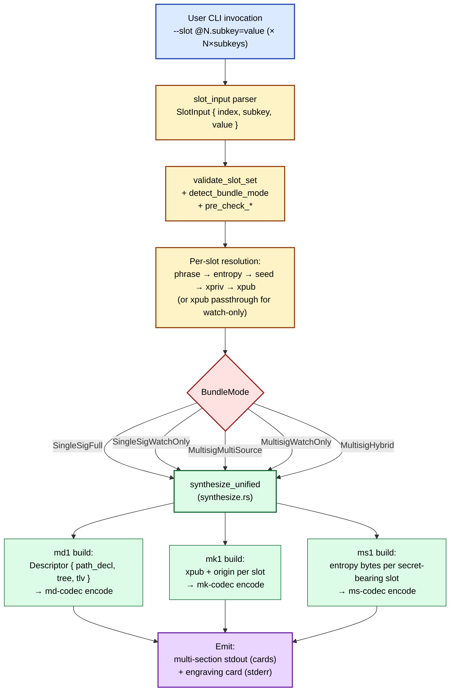
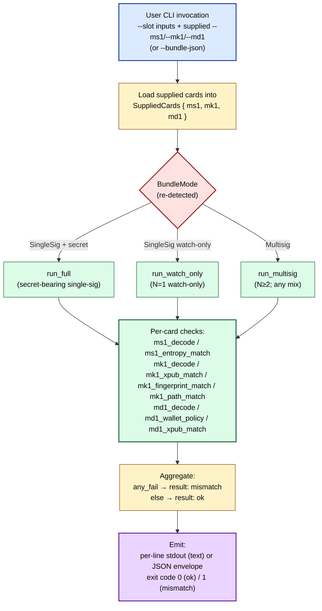

# Bundle Anatomy

A **bundle**\index{bundle} is the toolkit's unit of engraving. It binds three sibling card formats — md1, mk1, ms1 — together as one wallet's permanent backup. This chapter walks the three-card layout, the five bundle modes, the JSON envelope shape, and the engraving-card layout. Anti-collision invariants that police bundle integrity are §IV.2; the future K-of-N share layer is §IV.3.

The synthesis entry point is `synthesize_unified` at `mnemonic-toolkit/crates/mnemonic-toolkit/src/synthesize.rs::synthesize_unified`; the verification entry point is `cmd::verify_bundle::run` at `mnemonic-toolkit/crates/mnemonic-toolkit/src/cmd/verify_bundle.rs::run`. The unified bundle envelope dispatch and pre-check ladder live at `mnemonic-toolkit/crates/mnemonic-toolkit/src/bundle_unified.rs`. Output formatting (multi-section stdout, JSON envelope, engraving card) lives at `mnemonic-toolkit/crates/mnemonic-toolkit/src/format.rs`; slot-input parsing at `mnemonic-toolkit/crates/mnemonic-toolkit/src/slot_input.rs`. Subsequent references to these five files within this chapter use bare filenames.

## The three-card layout

A bundle carries **three orthogonal pieces of state** across three card formats:

| Card | What it carries | Logical cardinality | Wire format | Reference |
|---|---|---|---|---|
| **md1**\index{md1} | Wallet policy (BIP-388 template + use-site path + cosigner placeholders) | Exactly one record per bundle (split into 1+ chunked-string cards on the wire) | §II.1 | `descriptor-mnemonic/crates/md-codec/` |
| **mk1**\index{mk1} | One xpub plus origin metadata per cosigner | One record per cosigner — N total (each split into 1+ chunked-string cards) | §II.2 | `mnemonic-key/crates/mk-codec/` |
| **ms1**\index{ms1} | Secret material (BIP-39 entropy / xprv / wif) per secret-bearing slot | Zero, one, or up to N records (single-string in v0.1; chunked v0.2-shares planned) | §II.3 | `mnemonic-secret/crates/ms-codec/` |

The three formats are deliberately separable. **md1 alone** describes the wallet (template + placeholders) and is sufficient for address derivation once xpubs are supplied. **mk1 alone** carries one cosigner's public-key material without revealing what wallet it joins. **ms1 alone** carries one secret without revealing what wallet it backs. A reader who recovers any one card learns strictly less than they would from any two; the cards' geographic-separation safety model is built on that.

\index{bundle envelope}The bundle envelope at toolkit v0.5+ is **emergent**, not a separate format: the envelope *is* the set `{md1, mk1[0..N], ms1[0..N]}` plus the rules that bind them. The `Bundle` Rust struct at `synthesize.rs::Bundle` is the in-memory shape; the JSON envelope (next section) is the serialized shape; the engraving card (later) is the human-readable index card.

### What lives where in a single bundle

For an N-cosigner bundle:

- **One md1 record** (1+ chunked-string cards) carries the template, the use-site path (`<0;1>/*` for receive/change wildcard), origin metadata for all N cosigners (in the Shared or Divergent payload of header bit 4 — §III.1), and either inline xpub TLVs (`Tag::Pubkeys = 0x02`) or no inline keys at all.
- **N mk1 records** (1+ chunked-string cards each), one per cosigner. Each carries that cosigner's xpub, master fingerprint (unless `--privacy-preserving`), and origin path.
- **0, 1, or N ms1 records** (single-string in v0.1), depending on bundle mode. Single-sig full has one; pure watch-only multisig has none; multi-source full multisig has N (one per slot); hybrid has between 1 and N-1.

## Bundle modes

\index{bundle mode}The `BundleMode` enum at `bundle_unified.rs::BundleMode` enumerates five mutually-exclusive modes; `detect_bundle_mode` (`bundle_unified.rs::detect_bundle_mode`) classifies a `--slot` vector into one of them by inspecting the per-slot subkey set:

| Mode | N | Secret-bearing slots | Watch-only slots | Example invocation |
|---|---|---|---|---|
| `SingleSigFull`\index{SingleSigFull} | 1 | 1 | 0 | `--slot @0.phrase=...` |
| `SingleSigWatchOnly`\index{SingleSigWatchOnly} | 1 | 0 | 1 | `--slot @0.xpub=...` |
| `MultisigMultiSource`\index{MultisigMultiSource} | ≥2 | N | 0 | `--slot @0.phrase=... --slot @1.entropy=...` |
| `MultisigWatchOnly`\index{MultisigWatchOnly} | ≥2 | 0 | N | `--slot @0.xpub=... --slot @1.xpub=...` |
| `MultisigHybrid`\index{MultisigHybrid} | ≥2 | 1..N-1 | 1..N-1 | one phrase slot + (N-1) xpub-only slots |

A slot's subkey set is **secret-bearing**\index{secret-bearing slot} iff it contains any of `phrase` / `entropy` / `xprv` / `wif` (the predicate is `SlotSubkey::is_secret_bearing` at `slot_input.rs::SlotSubkey::is_secret_bearing`). A slot with only `xpub`/`fingerprint`/`path` is **watch-only**\index{watch-only slot}. Mode detection counts secret-bearing vs. watch-only *slots*, not subkeys.

Two pre-checks gate the mode after detection. The threshold range check (`bundle_unified.rs::pre_check_threshold`) requires `1 ≤ threshold ≤ N` and rejects multisig templates without an explicit `--threshold`. The template/N compatibility check (`bundle_unified.rs::pre_check_template_n`) rejects single-sig templates with N>1 and multisig templates with N=1. Both surface as `ToolkitError::SlotInputViolation` with a stable `kind` for integration-test pinning.

## Bundle creation pipeline



The synthesis core (`synthesize_unified`) takes a `Vec<ResolvedSlot>` (one entry per slot, carrying `xpub`, `fingerprint`, typed `path`, and optional `entropy`; `synthesize.rs::ResolvedSlot`) and emits a `Bundle { ms1, mk1, md1 }`. The five bundle modes converge on the same synthesis core; mode-specific logic is confined to slot resolution (extracting an xpub from a phrase, or accepting an xpub verbatim) and to the dense `ms1` field's `""` empty-string sentinels for watch-only positions (`format.rs::MsField`).

## The bundle JSON envelope

\index{bundle JSON envelope}The `--json` output mode emits a single JSON object whose shape is **part of the schema** — field order, naming, and nullability are pinned to SPEC §5.3. The Rust shape is `BundleJson` at `mnemonic-toolkit/crates/mnemonic-toolkit/src/format.rs::BundleJson`:

| Field | Type | Notes |
|---|---|---|
| `schema_version` | `&'static str` | `"4"` at v0.5+; bumped on schema breaks (see `bundle.rs::emit_unified`) |
| `mode` | `&'static str` | `"full"` or `"watch-only"` (derived from `Bundle::any_secret_bearing`, `synthesize.rs::Bundle::any_secret_bearing`) |
| `network` | `&'static str` | `"mainnet"`/`"testnet"`/`"signet"`/`"regtest"`/`"testnet4"` |
| `template` | `Option<&'static str>` | `Some(name)` in template mode; `None` in descriptor mode (v0.3+) |
| `descriptor` | `Option<String>` | User-supplied descriptor verbatim; mutually exclusive with `template` |
| `account` | `u32` | BIP-32 account index; non-zero produces Divergent origin paths |
| `origin_path` | `Option<String>` | Single-sig OR shared-path multisig; `None` for Divergent |
| `origin_paths` | `Option<Vec<String>>` | Divergent-path multisig only; `None` otherwise |
| `master_fingerprint` | `Option<String>` | `None` for multisig OR `--privacy-preserving` |
| `ms1` | `Vec<String>` (`MsField`) | Dense length-N; `""` sentinels for watch-only slots |
| `mk1` | `MkField` (untagged) | Bare `Vec<String>` for single-sig; `Vec<Vec<String>>` for multisig |
| `md1` | `Vec<String>` | The chunked md1 card strings |
| `multisig` | `Option<MultisigInfo>` | Multisig metadata block (template, threshold, cosigner_count, path_family, cosigners) — `None` for single-sig |
| `privacy_preserving` | `bool` | Whether `--privacy-preserving` was requested |

\index{MkField}The `MkField` enum at `format.rs::MkField` is serialized with `#[serde(untagged)]`: the JSON output is a bare array (single-sig: `["mk1...", "mk1..."]`) or array-of-arrays (multisig: `[["mk1...", "..."], ["mk1...", "..."], ...]` with one outer entry per cosigner). The discriminator lives in the sibling `multisig` field — `None` → flat, `Some` → nested. Consumers MUST branch on `multisig` before deserializing `mk1`.

\index{ms1 dense layout}The `ms1` field's **dense length-N layout** (`format.rs::MsField`) is the v0.4 simplification: the slot index `i` in `ms1[i]` corresponds to `mk1[i]` and to the slot `@i` indexed in `BundleJson.multisig.cosigners`. An empty string at position `i` marks slot `@i` as watch-only; verify-bundle's `emit_verify_checks` discriminates on `expected.ms1.first().map(|s| s.is_empty())` in the single-sig arm (`verify_bundle.rs::emit_verify_checks`) and emits `passed: true, decode_error: Some("skipped: watch-only slot")` for both ms1 checks (`verify_bundle.rs::emit_verify_checks`). The per-cosigner indexed equivalent for multisig lives in `emit_multisig_checks`. Both `["ms1abc..."]` (single-sig full) and `[""]` (single-sig watch-only) are legal at N=1.

The `MultisigInfo`\index{MultisigInfo} block at `format.rs::MultisigInfo` is the lookup-table consumers use to reassemble a wallet from a JSON envelope: it carries the `template` name, the `threshold` K, `cosigner_count` N, the `path_family` string (`"bip48"` or `"bip87"`), and a `Vec<CosignerEntry>` (one entry per slot, holding `index`, `master_fingerprint` (None under privacy mode), `origin_path`, `xpub`). The `cosigners` ordering matches slot indices `@0..@N-1`.

## The engraving card

\index{engraving card}The engraving card is a stderr-only emission designed for physical alignment when stamping plates. Its shape is fixed (SPEC §5.5) and produced by `engraving_card_unified` at `format.rs::engraving_card_unified` from a `BundleInputForCard` (`format.rs::BundleInputForCard`). The card is **not** machine-readable; verify-bundle does not consume it. It is the human's index card to the physical bundle, identifying each plate by its `chunk_set_id` (4 hex chars for md1, 5 hex chars for mk1/ms1 — see the chunk_set_id paragraph below for the formatting asymmetry).

Anatomy of a multisig card (sections in the order they emit):

```text
# === Wallet bundle: wsh-sortedmulti, mainnet ===     ← header line
# Threshold: 2 of 3                                   ← multisig only
# Cosigners:                                          ← multisig only
#   @0: ms1:1c017,mk1:1c017 (73c5da0a @ 48'/0'/0'/2')
#   @1: ms1:abcd1,mk1:abcd1 (deadbeef @ 48'/0'/0'/2')
#   @2: (no ms1; watch-only),mk1:cafe2 (1234abcd @ 48'/0'/0'/2')
# Template: wsh-sortedmulti                           ← OR `# Descriptor: ...` in descriptor mode
# md1: 1c01                                           ← md1 chunk_set_id
# Recovery: any 2 of 3 signing keys + md1 (template card).
# Language: english                                   ← if not BIP-39 default
# Passphrase: USED — not engraved on any card; record separately.
```

The single-sig card collapses the cosigners block to up to four lines (`ms1`, `mk1`, `fingerprint`, `origin path`; `format.rs::engraving_card_unified`). The `fingerprint` line is suppressed under `--privacy-preserving` and the `origin path` line is suppressed when the slot carries no path; both fields are guarded by `if let Some(...)` at `format.rs::engraving_card_unified`. A taproot-multisig template (`tr-multi-a` / `tr-sortedmulti-a`) appends a hardware-wallet caveat block (`format.rs::engraving_card_unified`) flagging that signing-side support is nascent at v0.4.

The `chunk_set_id`\index{chunk\_set\_id} short-hashes printed inline (the **engraved** card identifiers) are the **bundle-level binding key**. The md1 engraved identifier is the first 2 bytes of the wallet `policy_id` rendered as 4 hex chars (`bundle.rs::build_unified_card`); the ms1/mk1 engraved identifier is the 20-bit value `derive_mk1_chunk_set_id` packs from the first 4 bytes of the same `policy_id` (`synthesize.rs::derive_mk1_chunk_set_id`), rendered as 5 hex chars. Both derive from the *same* policy_id, so the leading 16 bits agree across all three cards in one bundle — that shared prefix is the visible cross-card binding. (The md1 *wire* `chunk_set_id` carried in the chunked-string headers is a separate, `Md1EncodingId`-derived value — see §IV.2.) A separate helper `chunk_set_id_extract` (`format.rs::chunk_set_id_extract`) recovers an mk1 chunked-string's `chunk_set_id` from the wire string itself; verify-bundle uses that to group cosigner cards in multisig. Their cross-format meaning is the subject of §IV.2.

\index{descriptor truncation}Descriptor mode (toolkit v0.3+) prints the descriptor inline if it is ≤80 chars (`format.rs::engraving_card_unified` `DESCRIPTOR_MAX_INLINE = 80`); longer descriptors render as `<first 60 chars>... [md1: <chunk_set_id>] (<len> chars total)` and rely on the md1 card itself for the full descriptor body.

## Bundle verification pipeline

\index{verify-bundle}`verify-bundle` is the inverse direction: given a bundle (supplied via `--ms1`/`--mk1`/`--md1` flags OR `--bundle-json`) and the original input (`--slot @N.<subkey>=<value>` for full mode; `--xpub @N=...` for watch-only), it re-derives each card from the inputs, compares against the supplied cards, and emits a structured check log. The entry point at `verify_bundle.rs::run` dispatches on bundle mode, then per-card checks emit `VerifyCheck` rows (`format.rs::VerifyCheck`):



\index{VerifyCheck}A `VerifyCheck` row carries a `name` (e.g., `mk1_xpub_match`), a `passed: bool`, and a `detail` string. Failing checks populate forensic fields (`expected`, `actual`, `diff_byte_offset`, `decode_error`) for diagnosis; passing checks omit them via `#[serde(skip_serializing_if = "Option::is_none")]` (`format.rs::VerifyCheck`). The aggregated `result` field is `"ok"` iff every check passed.

Hybrid multisig (some slots secret-bearing, others watch-only) uses a **skip sentinel**: ms1 checks for watch-only slots emit `passed: true, decode_error: Some("skipped: <reason>")` so the JSON output remains structurally regular regardless of the per-slot mix.

The verify-bundle JSON schema (`VerifyBundleJson` at `format.rs::VerifyBundleJson`) uses `schema_version: "4"` (`verify_bundle.rs::run`); the two schemas (BundleJson and VerifyBundleJson) currently share the value but evolve independently and may diverge on future breaking changes.

## Worked example

A canonical BIP-84 single-sig bundle from the public abandon test mnemonic (`abandon abandon abandon abandon abandon abandon abandon abandon abandon abandon abandon about`)\index{abandon test mnemonic} produces a deterministic three-card bundle. The full invocation and combined stdout+stderr output are captured at `transcripts/mnemonic-bundle-bip84-abandon.cmd`/`.out` (the `2>&1` merge happens in `tests/verify-examples.sh` and is why the engraving-card stderr block sits alongside the stdout card strings in the `.out` file) and re-run by `tests/verify-examples.sh`.

Cross-card binding (verifiable from the captured transcripts):

- The engraving-card identifiers print as `# ms1: 1c017 / # mk1: 1c017 / # md1: 1c01`. The two formats use different bit-lengths of the same `policy_id` stub (md1 emits 16 bits = 4 hex; mk1/ms1 emit 20 bits = 5 hex, both via `bundle.rs::build_unified_card`), but the leading 16 bits `1c01` are shared across all three. That common prefix is the bundle-level binding — cards from a different bundle would not all share it.
- `mnemonic verify-bundle` against this triple, with the original `--slot @0.phrase=abandon...about`, produces the ten-line `ok` log at `transcripts/mnemonic-verify-bundle-bip84-abandon.cmd`/`.out`.

A reader who later wants to confirm a recovered set of cards belongs together re-runs the same `verify-bundle` invocation; the cross-binding (xpub, fingerprint, origin path, md1 wallet-policy) all surface as named checks, and the `result: ok` last line is the green light for spending.

## Source pointers

- `mnemonic-toolkit/crates/mnemonic-toolkit/src/synthesize.rs::Bundle` — the `Bundle` in-memory struct.
- `mnemonic-toolkit/crates/mnemonic-toolkit/src/synthesize.rs::synthesize_unified` — `synthesize_unified` synthesis core.
- `mnemonic-toolkit/crates/mnemonic-toolkit/src/bundle_unified.rs::BundleMode` — the `BundleMode` enum.
- `mnemonic-toolkit/crates/mnemonic-toolkit/src/bundle_unified.rs` — mode detection + pre-checks.
- `mnemonic-toolkit/crates/mnemonic-toolkit/src/format.rs::MsField` — `MsField` dense-layout contract.
- `mnemonic-toolkit/crates/mnemonic-toolkit/src/format.rs::MkField` — `MkField` discriminated union.
- `mnemonic-toolkit/crates/mnemonic-toolkit/src/format.rs::MultisigInfo` — `MultisigInfo` + `BundleJson` schema.
- `mnemonic-toolkit/crates/mnemonic-toolkit/src/format.rs` — `VerifyBundleJson` + `VerifyCheck` schema.
- `mnemonic-toolkit/crates/mnemonic-toolkit/src/format.rs::engraving_card_unified` — `engraving_card_unified` card layout.
- `mnemonic-toolkit/crates/mnemonic-toolkit/src/cmd/verify_bundle.rs::run` — `verify-bundle` dispatch.
- BIP-388 §"Specification" — wallet-policy framing (md1's basis).
- BIP-389\index{BIP-389} §"Specification" — multipath alt syntax.
- Toolkit SPEC §4.4 (ms1) / §4.5 (mk1) / §4.6 (md1) / §4.7 (cross-binding invariants) / §5.1 (multi-section stdout) / §5.2 (engraving card stderr) / §5.3 (bundle JSON schema) / §5.5 (engraving card layout) / §5.7 (verify-bundle checks) / §5.8 (schema-4 ms1 dense field).
